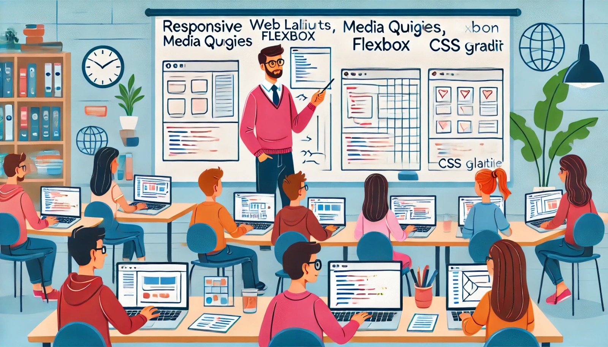

### Aula 41: Revisão de Desenvolvimento Responsivo (Media Queries, Flexbox, Grid)

#### Introdução

O desenvolvimento responsivo é uma abordagem essencial para garantir que uma página web seja visualizada adequadamente em qualquer dispositivo, seja ele um computador, tablet ou celular. Para criar layouts que se adaptem a diferentes tamanhos de tela, usamos técnicas como **media queries**, **Flexbox** e **Grid**. Cada uma dessas ferramentas oferece flexibilidade e controle na criação de interfaces modernas e adaptáveis.

---

### 1. O que é Desenvolvimento Responsivo?

Desenvolvimento responsivo é uma técnica que permite que uma página web ajuste automaticamente seu layout e conteúdo com base no tamanho e na orientação da tela do dispositivo. Essa adaptação é fundamental para melhorar a experiência do usuário, pois garante que a página seja funcional e visualmente agradável em dispositivos de diferentes tamanhos.

#### Por Que o Desenvolvimento Responsivo é Importante?

- **Experiência do Usuário**: Facilita a navegação e melhora a usabilidade em qualquer dispositivo.
- **SEO**: Sites responsivos são favorecidos nos resultados de busca.
- **Versatilidade**: Um design que funciona em qualquer tela reduz a necessidade de criar várias versões da mesma página.

---

### 2. Media Queries

**Media queries** são regras do CSS que permitem aplicar estilos diferentes a uma página web dependendo das características da tela, como largura, altura ou resolução.

#### Exemplo Básico de Media Query

```css
/* Aplica estilos para telas menores que 768px */
@media (max-width: 768px) {
    body {
        font-size: 16px;
    }
    .menu {
        display: none; /* Esconde o menu em telas pequenas */
    }
}
```

No exemplo acima, a media query ajusta o tamanho da fonte e esconde o menu em dispositivos com largura de tela menor que 768px (como celulares e tablets).

---

### 3. Flexbox

O **Flexbox** é um módulo do CSS que facilita a criação de layouts flexíveis. Ele é ideal para organizar elementos em linha ou em coluna e distribuir espaço entre eles, permitindo uma adaptação mais simples dos elementos em relação ao espaço disponível na tela.

#### Principais Propriedades do Flexbox

- **display: flex** – Define o contêiner flexível.
- **justify-content** – Alinha os itens ao longo do eixo principal (horizontal ou vertical).
- **align-items** – Alinha os itens ao longo do eixo cruzado (perpendicular ao principal).
- **flex-direction** – Define se os itens serão dispostos em linha (`row`) ou em coluna (`column`).

#### Exemplo de Flexbox

```css
.container {
    display: flex;
    justify-content: space-between; /* Distribui espaço entre os itens */
    align-items: center;            /* Alinha os itens no centro do contêiner */
}
```

Neste exemplo, `justify-content: space-between` distribui o espaço entre os itens igualmente, e `align-items: center` alinha os itens ao centro verticalmente.

---

### 4. CSS Grid

O **CSS Grid** é uma ferramenta de layout bidimensional que permite criar grades complexas. Ele é ideal para organizar elementos em linhas e colunas, oferecendo um controle detalhado sobre a disposição dos elementos.

#### Principais Propriedades do CSS Grid

- **display: grid** – Define o contêiner como um grid.
- **grid-template-columns** – Especifica o número e o tamanho das colunas.
- **grid-template-rows** – Define o número e o tamanho das linhas.
- **gap** – Define o espaço entre as colunas e linhas.

#### Exemplo de Grid

```css
.container {
    display: grid;
    grid-template-columns: 1fr 2fr; /* Define duas colunas: uma com 1 fração e outra com 2 frações */
    gap: 10px;                      /* Define o espaçamento entre os itens */
}
```

Neste exemplo, `grid-template-columns: 1fr 2fr` cria duas colunas com tamanhos proporcionais, onde a segunda coluna é duas vezes maior que a primeira.

---

### Combinação de Media Queries, Flexbox e Grid

Essas três técnicas podem ser combinadas para criar uma interface totalmente responsiva. Por exemplo:

```css
/* Layout de Desktop */
.container {
    display: grid;
    grid-template-columns: 1fr 3fr;
    gap: 20px;
}

/* Layout de Tablet */
@media (max-width: 768px) {
    .container {
        display: flex;
        flex-direction: column;
    }
}

/* Layout de Celular */
@media (max-width: 480px) {
    .container {
        display: block;
    }
}
```

Esse exemplo mostra como um layout pode ser configurado com Grid em telas grandes, Flexbox em tablets e um layout simples em blocos para telas menores, como celulares.

---

### Exercícios Práticos

1. **Prática com Media Queries**:
   - Crie uma página que ajuste o tamanho da fonte em diferentes tamanhos de tela.
   - Altere a cor de fundo para azul em telas com largura menor que 600px.

2. **Prática com Flexbox**:
   - Use Flexbox para criar um layout de três colunas em desktop.
   - Em telas menores, mude a disposição das colunas para uma coluna única (estilo de lista).

3. **Prática com Grid**:
   - Crie um layout de galeria de imagens com três colunas em desktop.
   - Use uma media query para que, em telas menores, a galeria tenha apenas uma coluna.

---

### Conclusão

Media Queries, Flexbox e Grid são as principais técnicas de CSS para criar layouts responsivos e adaptáveis. Ao aprender a combinar essas técnicas, você será capaz de criar sites flexíveis e acessíveis em qualquer dispositivo, proporcionando uma experiência de usuário consistente e agradável.

---

### Resolução dos Exercícios Práticos

#### Exercício 1: Prática com Media Queries

1. **Objetivo**: Criar uma página que ajuste o tamanho da fonte em diferentes tamanhos de tela e altere a cor de fundo para azul em telas com largura menor que 600px.

2. **Código CSS**:

   ```html
   <!DOCTYPE html>
   <html lang="pt-BR">
   <head>
       <meta charset="UTF-8">
       <meta name="viewport" content="width=device-width, initial-scale=1.0">
       <title>Exercício Media Query</title>
       <style>
           /* Estilos gerais */
           body {
               font-size: 18px;
               background-color: white;
               margin: 0;
               padding: 0;
               font-family: Arial, sans-serif;
               display: flex;
               align-items: center;
               justify-content: center;
               height: 100vh;
               text-align: center;
           }

           /* Ajuste de tamanho de fonte em telas maiores */
           @media (min-width: 768px) {
               body {
                   font-size: 24px;
               }
           }

           /* Mudança de cor de fundo em telas menores */
           @media (max-width: 600px) {
               body {
                   background-color: #007bff; /* Fundo azul */
                   color: white;
               }
           }
       </style>
   </head>
   <body>
       <p>Esta página ajusta a fonte e a cor de fundo com media queries.</p>
   </body>
   </html>
   ```

   Este código cria uma página com uma fonte maior em telas maiores que 768px e muda o fundo para azul em telas menores que 600px.

---

#### Exercício 2: Prática com Flexbox

1. **Objetivo**: Criar um layout com três colunas em desktop que se adapte para uma coluna única em telas menores.

2. **Código HTML e CSS**:

   ```html
   <!DOCTYPE html>
   <html lang="pt-BR">
   <head>
       <meta charset="UTF-8">
       <meta name="viewport" content="width=device-width, initial-scale=1.0">
       <title>Exercício Flexbox</title>
       <style>
           .container {
               display: flex;
               gap: 20px;
               padding: 20px;
           }

           .coluna {
               flex: 1;
               background-color: #f0f0f0;
               padding: 20px;
               border-radius: 5px;
               text-align: center;
           }

           /* Layout de uma coluna em telas menores */
           @media (max-width: 768px) {
               .container {
                   flex-direction: column;
               }
           }
       </style>
   </head>
   <body>
       <div class="container">
           <div class="coluna">Coluna 1</div>
           <div class="coluna">Coluna 2</div>
           <div class="coluna">Coluna 3</div>
       </div>
   </body>
   </html>
   ```

   Neste exemplo, o layout usa três colunas em telas grandes e se adapta para uma coluna única em telas menores que 768px.

---

#### Exercício 3: Prática com Grid

1. **Objetivo**: Criar uma galeria de imagens com três colunas em desktop, que se adapta para uma coluna em telas menores.

2. **Código HTML e CSS**:

   ```html
   <!DOCTYPE html>
   <html lang="pt-BR">
   <head>
       <meta charset="UTF-8">
       <meta name="viewport" content="width=device-width, initial-scale=1.0">
       <title>Exercício Grid</title>
       <style>
           .galeria {
               display: grid;
               grid-template-columns: repeat(3, 1fr);
               gap: 10px;
               padding: 20px;
           }

           .item {
               background-color: #ccc;
               padding: 40px;
               text-align: center;
               border-radius: 5px;
           }

           /* Layout de uma coluna em telas menores */
           @media (max-width: 768px) {
               .galeria {
                   grid-template-columns: 1fr;
               }
           }
       </style>
   </head>
   <body>
       <div class="galeria">
           <div class="item">Imagem 1</div>
           <div class="item">Imagem 2</div>
           <div class="item">Imagem 3</div>
           <div class="item">Imagem 4</div>
           <div class="item">Imagem 5</div>
           <div class="item">Imagem 6</div>
       </div>
   </body>
   </html>
   ```

   Neste exemplo, a galeria exibe três colunas de imagens em telas maiores e adapta para uma única coluna em telas menores que 768px.

---

Esses exemplos práticos aplicam media queries, Flexbox e Grid para criar layouts que se adaptam automaticamente a diferentes tamanhos de tela, proporcionando uma experiência responsiva e agradável ao usuário.