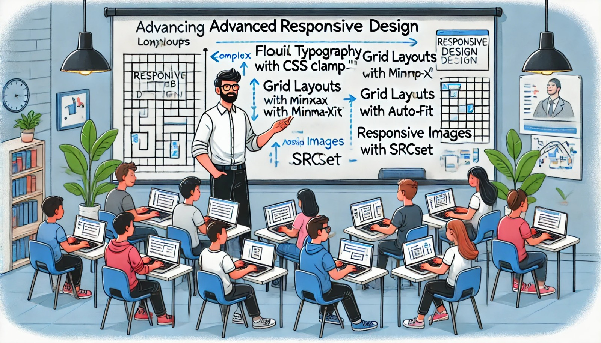

### Aula 42: Desenvolvimento Responsivo – Práticas Avançadas

#### Introdução

Nesta aula, vamos explorar técnicas avançadas de desenvolvimento responsivo que permitem criar layouts mais flexíveis e adaptáveis. Aprenderemos a lidar com desafios como conteúdo dinâmico, diferentes resoluções de tela, breakpoints fluídos e unidades CSS avançadas. Estas práticas avançadas são essenciais para garantir que sua aplicação ofereça uma experiência de usuário consistente e otimizada em qualquer dispositivo, seja ele um celular, tablet, laptop ou desktop.

---

### 1. Breakpoints Fluídos e Unidades Relativas

Breakpoints são os pontos em que o layout da página muda para se adaptar ao tamanho da tela. Em vez de breakpoints fixos, é possível utilizar breakpoints fluidos para criar uma transição mais suave entre tamanhos de tela.

- **Unidades Relativas**: Utilize unidades CSS como `em`, `rem`, `%` e `vw` (largura da viewport) para tornar os elementos responsivos e adaptáveis ao tamanho da tela.

#### Exemplo com Unidades `vw` e `vh`

```css
body {
    font-size: 2vw; /* Ajusta a fonte de acordo com a largura da viewport */
}

.container {
    width: 80vw;  /* Largura da página é 80% da viewport */
    height: 90vh; /* Altura da página é 90% da viewport */
}
```

Essas unidades permitem que o conteúdo se ajuste automaticamente à largura e à altura da tela.

---

### 2. Imagens e Mídias Responsivas

É importante que as imagens e vídeos também sejam responsivos para evitar que ocupem espaço desnecessário ou causem lentidão no carregamento.

#### Imagens Responsivas com `srcset`

O atributo `srcset` permite definir várias versões da mesma imagem, otimizando o carregamento conforme o tamanho da tela.

```html

```

O navegador escolhe a versão da imagem mais adequada ao tamanho da tela, economizando dados e melhorando a performance.

#### Vídeos e Embeds Responsivos

Use `max-width: 100%` para garantir que vídeos e outros elementos de mídia se ajustem automaticamente ao contêiner:

```css
iframe, video {
    max-width: 100%;
    height: auto;
}
```

---

### 3. Layout de Grid Avançado com `minmax()` e `auto-fit`

Para criar layouts de grade mais complexos, podemos usar a função `minmax()` junto com `auto-fit` ou `auto-fill`, que ajustam automaticamente o número de colunas dependendo do espaço disponível.

#### Exemplo de Layout com `minmax()` e `auto-fit`

```css
.galeria {
    display: grid;
    grid-template-columns: repeat(auto-fit, minmax(200px, 1fr));
    gap: 10px;
}
```

Este layout cria colunas flexíveis que se ajustam automaticamente, mantendo uma largura mínima de 200px para cada item e distribuindo o espaço disponível.

---

### 4. Tipografia e Espaçamento Responsivo

A tipografia e o espaçamento são elementos visuais importantes para a legibilidade e estética da página. A prática avançada é fazer com que esses elementos também se adaptem de forma fluida ao tamanho da tela.

#### Tipografia Fluida com `clamp()`

A função `clamp()` permite definir um tamanho mínimo, ideal e máximo para uma propriedade CSS, útil para criar fontes fluídas.

```css
h1 {
    font-size: clamp(1.5rem, 2vw + 1rem, 3rem);
}
```

No exemplo acima, o tamanho do `h1` varia de acordo com a largura da viewport, mas não será menor que `1.5rem` nem maior que `3rem`.

---

### 5. Ferramentas para Design Responsivo

- **CSS Variables**: Permitem armazenar valores que podem ser reutilizados, facilitando a adaptação responsiva. Por exemplo, defina uma variável para o espaçamento e ajuste-a nos breakpoints.
  
  ```css
  :root {
      --espacamento: 16px;
  }

  @media (max-width: 768px) {
      :root {
          --espacamento: 12px;
      }
  }

  .container {
      padding: var(--espacamento);
  }
  ```

- **Viewport Units**: Além de `vw` e `vh`, você pode usar `vmin` e `vmax`, que ajustam o tamanho com base na menor ou maior dimensão da viewport, respectivamente.

---

### Exercícios Práticos

1. **Prática com Tipografia Fluida**:
   - Crie uma página onde o título (`h1`) muda de tamanho de forma fluida, utilizando a função `clamp()` para manter o texto legível em qualquer dispositivo.

2. **Prática com Grid Avançado**:
   - Construa uma galeria de imagens usando Grid com `minmax()` e `auto-fit`, onde o número de colunas se ajuste conforme o tamanho da tela.

3. **Imagens Responsivas com `srcset`**:
   - Implemente uma imagem que carregue versões diferentes conforme o tamanho da tela usando o atributo `srcset` para economizar largura de banda em dispositivos menores.

---

### Conclusão

Essas práticas avançadas de desenvolvimento responsivo permitem criar interfaces mais flexíveis e adaptáveis, melhorando a experiência do usuário em dispositivos variados. Ao aplicar breakpoints fluídos, técnicas de tipografia avançada, imagens responsivas e layouts dinâmicos, você estará preparado para construir sites modernos e responsivos que atendem às expectativas de qualquer usuário.

---

### Resolução dos Exercícios Práticos

#### Exercício 1: Tipografia Fluida com `clamp()`

1. **Objetivo**: Criar uma página onde o título (`h1`) tenha tamanho de fonte fluido utilizando a função `clamp()` para ajustar o texto conforme o tamanho da tela, mantendo-o legível em qualquer dispositivo.

2. **Código HTML e CSS**:

   ```html
   <!DOCTYPE html>
   <html lang="pt-BR">
   <head>
       <meta charset="UTF-8">
       <meta name="viewport" content="width=device-width, initial-scale=1.0">
       <title>Tipografia Fluida</title>
       <style>
           body {
               font-family: Arial, sans-serif;
               display: flex;
               justify-content: center;
               align-items: center;
               height: 100vh;
               margin: 0;
           }

           h1 {
               font-size: clamp(1.5rem, 2vw + 1rem, 3rem);
               text-align: center;
           }
       </style>
   </head>
   <body>
       <h1>Texto com Tipografia Fluida</h1>
   </body>
   </html>
   ```

   Neste exemplo, o tamanho da fonte do `h1` varia de acordo com a largura da tela, mas sempre fica entre `1.5rem` e `3rem`, garantindo legibilidade em dispositivos de qualquer tamanho.

---

#### Exercício 2: Galeria com Grid Avançado usando `minmax()` e `auto-fit`

1. **Objetivo**: Construir uma galeria de imagens que utiliza o Grid CSS com `minmax()` e `auto-fit`, para que o número de colunas se ajuste automaticamente ao tamanho da tela.

2. **Código HTML e CSS**:

   ```html
   <!DOCTYPE html>
   <html lang="pt-BR">
   <head>
       <meta charset="UTF-8">
       <meta name="viewport" content="width=device-width, initial-scale=1.0">
       <title>Galeria Responsiva com Grid</title>
       <style>
           body {
               font-family: Arial, sans-serif;
               margin: 0;
               padding: 0;
               display: flex;
               justify-content: center;
               align-items: center;
           }

           .galeria {
               display: grid;
               grid-template-columns: repeat(auto-fit, minmax(200px, 1fr));
               gap: 10px;
               padding: 20px;
               max-width: 1000px;
           }

           .item {
               background-color: #ccc;
               padding: 20px;
               text-align: center;
               border-radius: 8px;
               font-size: 1.2rem;
           }
       </style>
   </head>
   <body>
       <div class="galeria">
           <div class="item">Imagem 1</div>
           <div class="item">Imagem 2</div>
           <div class="item">Imagem 3</div>
           <div class="item">Imagem 4</div>
           <div class="item">Imagem 5</div>
           <div class="item">Imagem 6</div>
       </div>
   </body>
   </html>
   ```

   Esse código cria uma galeria onde cada item tem uma largura mínima de 200px e o número de colunas se ajusta automaticamente ao tamanho da tela.

---

#### Exercício 3: Imagens Responsivas com `srcset`

1. **Objetivo**: Implementar uma imagem que carregue versões diferentes dependendo do tamanho da tela, utilizando o atributo `srcset` para otimizar o uso de largura de banda em dispositivos menores.

2. **Código HTML**:

   ```html
   <!DOCTYPE html>
   <html lang="pt-BR">
   <head>
       <meta charset="UTF-8">
       <meta name="viewport" content="width=device-width, initial-scale=1.0">
       <title>Imagem Responsiva com srcset</title>
       <style>
           body {
               font-family: Arial, sans-serif;
               display: flex;
               justify-content: center;
               align-items: center;
               height: 100vh;
               margin: 0;
           }

           img {
               max-width: 100%;
               height: auto;
               border-radius: 8px;
           }
       </style>
   </head>
   <body>
       
   </body>
   </html>
   ```

   No código acima, o navegador carrega a imagem apropriada dependendo da largura da tela:
   - **imagem-pequena.jpg** para telas até 480px
   - **imagem-media.jpg** para telas até 768px
   - **imagem-grande.jpg** para telas acima de 768px

   Essa técnica otimiza o carregamento da página ao usar imagens de tamanhos adequados para cada dispositivo.

---

Essas soluções aplicam práticas avançadas de desenvolvimento responsivo, como tipografia fluida, layout adaptativo com Grid e carregamento otimizado de imagens, para criar interfaces flexíveis e adaptáveis a diversos dispositivos e tamanhos de tela.
