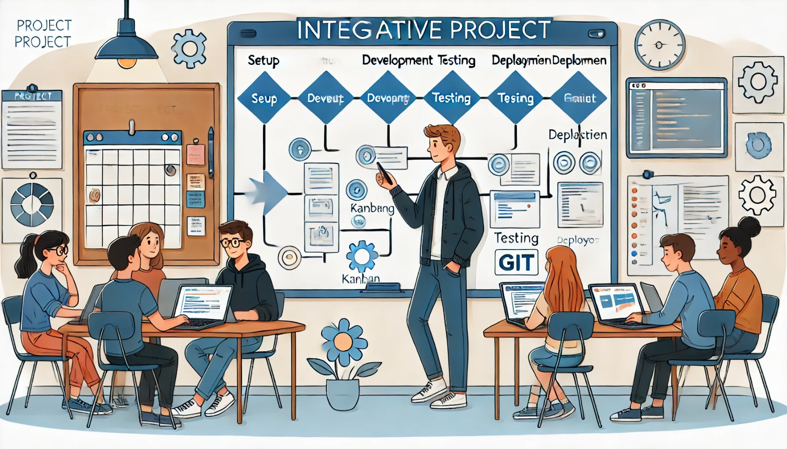

### Aula 44: Planejamento do Projeto Integrador – Definição de Tarefas e Cronograma

#### Introdução

Nesta etapa do Projeto Integrador, é essencial criar um plano de ação claro para orientar o desenvolvimento. Planejar o projeto envolve definir as principais tarefas, estabelecer um cronograma com prazos e distribuir as atividades de forma organizada. Um planejamento eficiente ajuda a manter o foco e a garantir que todos os componentes sejam implementados corretamente e dentro do prazo.

---

### 1. Definição de Tarefas

As tarefas representam as atividades específicas que precisam ser realizadas para completar o projeto. No Projeto Integrador, as tarefas devem ser organizadas em etapas principais, permitindo uma visão clara do que precisa ser feito. Abaixo estão as tarefas recomendadas:

#### 1.1 Tarefas de Configuração e Preparação

1. **Configuração do Ambiente de Desenvolvimento**:
   - Configurar o ambiente com Flask e PostgreSQL.
   - Configurar o sistema de controle de versão (Git e GitHub).

2. **Configuração do Banco de Dados**:
   - Criar o banco de dados PostgreSQL e definir tabelas principais, como `usuarios`, `vagas`, `pre_matriculas`.

3. **Estrutura Inicial do Projeto**:
   - Criar a estrutura de pastas e arquivos para o projeto Flask.
   - Definir o modelo MVC (Model-View-Controller) para o projeto.

#### 1.2 Tarefas de Desenvolvimento

1. **Funcionalidade de Cadastro e Login de Usuário**:
   - Criar as rotas para cadastro, login e logout.
   - Implementar a criptografia de senhas e a autenticação de usuários.

2. **Área de Pré-matrícula para Usuários**:
   - Desenvolver a interface para exibir vagas e realizar pré-matrículas.
   - Criar a lógica de envio de confirmação por e-mail para as pré-matrículas.

3. **Painel Administrativo**:
   - Implementar a funcionalidade para listar, adicionar, editar e remover vagas.
   - Criar uma interface para gerenciamento das pré-matrículas, permitindo aprovar ou recusar solicitações.

4. **Relatórios e Estatísticas**:
   - Desenvolver relatórios básicos para administradores, como o número de vagas ocupadas e pré-matrículas por instituição.

5. **Design Responsivo e Interface de Usuário**:
   - Utilizar CSS, Flexbox e Grid para criar uma interface responsiva.
   - Ajustar o layout para dispositivos móveis e desktops.

6. **Notificações por E-mail**:
   - Configurar o sistema de envio de e-mails para confirmar cadastro, pré-matrículas e status de solicitações.

#### 1.3 Tarefas de Teste e Validação

1. **Testes de Funcionalidade**:
   - Realizar testes das principais funcionalidades (cadastro, login, pré-matrícula, etc.) para garantir que tudo funciona como esperado.

2. **Testes de Interface**:
   - Verificar se a interface está adaptada para diferentes dispositivos e resoluções de tela.

3. **Revisão e Ajustes Finais**:
   - Revisar o código e otimizar o desempenho.
   - Corrigir possíveis bugs e ajustar detalhes de design e funcionalidade.

---

### 2. Cronograma do Projeto

Estabelecer um cronograma é importante para manter o projeto no prazo e garantir que todas as tarefas sejam concluídas em tempo hábil. Abaixo está um exemplo de cronograma para o Projeto Integrador, dividido em semanas:

| Semana | Tarefas                                                                                         |
|--------|-------------------------------------------------------------------------------------------------|
| 1      | Configuração do ambiente, instalação de dependências, estrutura inicial do projeto              |
| 2      | Configuração do banco de dados e criação de tabelas                                             |
| 3      | Desenvolvimento do cadastro e login de usuário                                                  |
| 4      | Implementação da área de pré-matrícula para usuários                                            |
| 5      | Criação do painel administrativo para gestão de vagas e pré-matrículas                          |
| 6      | Desenvolvimento de relatórios e estatísticas                                                    |
| 7      | Ajustes de design responsivo e desenvolvimento da interface de usuário                          |
| 8      | Implementação das notificações por e-mail                                                       |
| 9      | Testes de funcionalidade e interface, correção de bugs                                          |
| 10     | Revisão final do projeto, ajustes e preparação para a apresentação                              |

Esse cronograma é uma sugestão e pode ser ajustado conforme a necessidade, mas é importante definir prazos realistas para cada etapa.

---

### Ferramentas de Planejamento

Para gerenciar o projeto, você pode utilizar ferramentas de organização que ajudam a acompanhar o progresso e priorizar as tarefas:

- **Quadros Kanban**: Use ferramentas como Trello ou GitHub Projects para visualizar as tarefas e mover atividades de acordo com o progresso.
- **Controle de Versão**: Utilize Git para controlar o código e registrar alterações ao longo do desenvolvimento.
- **Documentação**: Documente cada funcionalidade e mantenha uma lista de pendências e melhorias.

---

### Boas Práticas no Planejamento

- **Dividir Tarefas Grandes em Subtarefas**: Isso facilita o acompanhamento do progresso e evita que tarefas fiquem complexas.
- **Estabelecer Prazos Realistas**: Tenha em mente o tempo necessário para cada tarefa, priorizando a qualidade.
- **Monitorar o Progresso**: Revise o cronograma semanalmente para ajustar prazos, se necessário, e manter o ritmo do desenvolvimento.

---

### Conclusão

O planejamento é a base de um projeto bem-sucedido. Ao dividir o Projeto Integrador em tarefas, criar um cronograma e definir as ferramentas de acompanhamento, você estará mais preparado para executar o projeto com eficiência e qualidade.