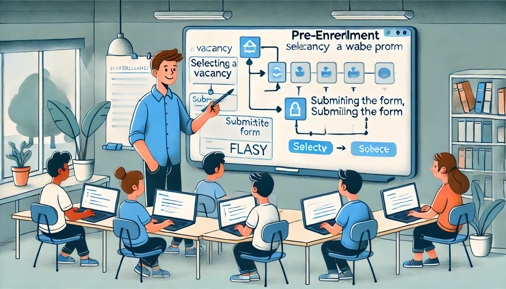

### Aula 52: Projeto Integrador – Sistema de Pré-Matrícula

#### Introdução

Nesta aula, vamos implementar o **sistema de pré-matrícula** no Projeto Integrador. Este sistema permitirá que os usuários selecionem uma vaga de uma instituição e registrem o interesse em matricular uma criança. A funcionalidade de pré-matrícula é essencial para organizar e gerenciar as solicitações de matrícula, facilitando o controle e o acompanhamento por parte dos administradores do sistema. Vamos construir as rotas, formulários e lógicas necessárias para registrar e exibir as pré-matrículas dos usuários.

---

### 1. Estrutura do Modelo de Pré-Matrícula

Para começar, vamos garantir que o modelo de **Pré-Matrícula** esteja configurado corretamente no banco de dados. Este modelo irá armazenar as informações da pré-matrícula de cada usuário, incluindo a vaga selecionada e o status do registro.

No arquivo `models.py`, vamos revisar e ajustar a estrutura do modelo de pré-matrícula, caso necessário.

```python
from app import db
from datetime import datetime

class PreMatricula(db.Model):
    __tablename__ = 'pre_matriculas'
    
    id = db.Column(db.Integer, primary_key=True)
    usuario_id = db.Column(db.Integer, db.ForeignKey('usuarios.id'), nullable=False)
    vaga_id = db.Column(db.Integer, db.ForeignKey('vagas.id'), nullable=False)
    data = db.Column(db.DateTime, nullable=False, default=datetime.utcnow)
    status = db.Column(db.String(20), nullable=False, default="pendente")

    usuario = db.relationship('Usuario', backref=db.backref('pre_matriculas', lazy=True))
    vaga = db.relationship('Vaga', backref=db.backref('pre_matriculas', lazy=True))
```

- **usuario_id**: Identifica o usuário que fez a pré-matrícula.
- **vaga_id**: Identifica a vaga para a qual a pré-matrícula foi realizada.
- **data**: Registra a data da pré-matrícula.
- **status**: Indica o estado da pré-matrícula, com valores como `"pendente"`, `"aprovado"`, ou `"recusado"`.

---

### 2. Rota e Formulário para Pré-Matrícula

Agora que o modelo está configurado, vamos criar a rota e o formulário que permitirão que os usuários realizem a pré-matrícula para uma vaga.

#### Criação do Formulário

Em `forms.py`, vamos definir o formulário de pré-matrícula. Esse formulário não precisa de muitos campos, pois os dados principais são obtidos do banco de dados.

```python
from flask_wtf import FlaskForm
from wtforms import SubmitField

class FormPreMatricula(FlaskForm):
    submit = SubmitField("Realizar Pré-Matrícula")
```

#### Criação da Rota

No arquivo `routes.py`, vamos criar a rota `pre_matricula` para que o usuário possa fazer a pré-matrícula para uma vaga específica.

```python
from flask import render_template, redirect, url_for, flash
from flask_login import current_user, login_required
from app import app, db
from app.models import PreMatricula, Vaga
from app.forms import FormPreMatricula

@app.route("/pre_matricula/<int:vaga_id>", methods=["GET", "POST"])
@login_required
def pre_matricula(vaga_id):
    form = FormPreMatricula()
    vaga = Vaga.query.get_or_404(vaga_id)

    # Verifica se a pré-matrícula já existe para o usuário e a vaga
    pre_matricula_existente = PreMatricula.query.filter_by(usuario_id=current_user.id, vaga_id=vaga_id).first()
    if pre_matricula_existente:
        flash("Você já possui uma pré-matrícula para essa vaga.", "info")
        return redirect(url_for("instituicoes"))

    if form.validate_on_submit():
        nova_pre_matricula = PreMatricula(usuario_id=current_user.id, vaga_id=vaga_id)
        db.session.add(nova_pre_matricula)
        db.session.commit()
        flash("Pré-matrícula realizada com sucesso! Aguarde aprovação.", "success")
        return redirect(url_for("instituicoes"))

    return render_template("pre_matricula.html", title="Pré-Matrícula", vaga=vaga, form=form)
```

Nesta rota:

- **Verificação de Pré-Matrícula Existente**: Antes de criar uma nova pré-matrícula, verificamos se o usuário já registrou interesse nessa vaga.
- **Criação de Pré-Matrícula**: Se não houver pré-matrícula anterior, criamos uma nova entrada no banco de dados com o `status` padrão como `"pendente"`.

---

### 3. Criação da Página de Pré-Matrícula

No diretório `templates`, crie o arquivo `pre_matricula.html` para exibir os detalhes da vaga e o botão de pré-matrícula.

```html



    <h2>Pré-Matrícula para a Vaga</h2>
    <h3>{{ vaga.descricao }}</h3>
    <p><strong>Faixa Etária:</strong> {{ vaga.faixa_etaria }}</p>
    <p><strong>Vagas Disponíveis:</strong> {{ vaga.vagas_disponiveis }}</p>
    
    <form method="POST">
        {{ form.hidden_tag() }}
        {{ form.submit(class="btn btn-primary") }}
    </form>

```

Esse template exibe os detalhes da vaga para que o usuário possa verificar antes de confirmar a pré-matrícula.

---

### 4. Listagem das Pré-Matrículas do Usuário

É importante que o usuário tenha uma página onde possa visualizar suas pré-matrículas e o status de cada uma.

#### Rota para Listagem de Pré-Matrículas

No `routes.py`, vamos adicionar uma rota para listar as pré-matrículas do usuário.

```python
@app.route("/minhas_pre_matriculas")
@login_required
def minhas_pre_matriculas():
    pre_matriculas = PreMatricula.query.filter_by(usuario_id=current_user.id).all()
    return render_template("minhas_pre_matriculas.html", pre_matriculas=pre_matriculas)
```

#### Template para Exibir as Pré-Matrículas

No diretório `templates`, crie o arquivo `minhas_pre_matriculas.html` para exibir a lista de pré-matrículas do usuário.

```html



    <h2>Minhas Pré-Matrículas</h2>
    <table>
        <thead>
            <tr>
                <th>Descrição da Vaga</th>
                <th>Data</th>
                <th>Status</th>
            </tr>
        </thead>
        <tbody>
            
                <tr>
                    <td>{{ pre_matricula.vaga.descricao }}</td>
                    <td>{{ pre_matricula.data.strftime('%d/%m/%Y') }}</td>
                    <td>{{ pre_matricula.status }}</td>
                </tr>
            
        </tbody>
    </table>

```

- **Exibição das Informações**: Mostramos a descrição da vaga, a data da pré-matrícula e o status de cada registro, facilitando o acompanhamento por parte do usuário.

---

### 5. Testando o Sistema de Pré-Matrícula

Para garantir que o sistema de pré-matrícula esteja funcionando corretamente, faça os seguintes testes:

1. **Registrar uma Pré-Matrícula**: Acesse uma vaga e tente registrar uma pré-matrícula.
2. **Verificar Pré-Matrícula Existente**: Tente realizar uma pré-matrícula para a mesma vaga novamente e verifique se o sistema impede a duplicidade.
3. **Listagem das Pré-Matrículas**: Acesse a página de pré-matrículas do usuário e verifique se todas as informações estão corretas.
4. **Atualizar o Status**: Se houver uma funcionalidade administrativa, teste a alteração do status da pré-matrícula para refletir aprovações e recusas.

---

### Conclusão

O sistema de pré-matrícula adiciona uma funcionalidade essencial ao Projeto Integrador, permitindo que os usuários registrem interesse em vagas específicas. Este sistema combina a utilização de formulários, gerenciamento de dados e exibição de status de forma clara e intuitiva. Com a implementação concluída, o Projeto Integrador oferece uma experiência completa de interação entre o usuário e o sistema de pré-matrículas, facilitando o acompanhamento e gerenciamento de vagas disponíveis.