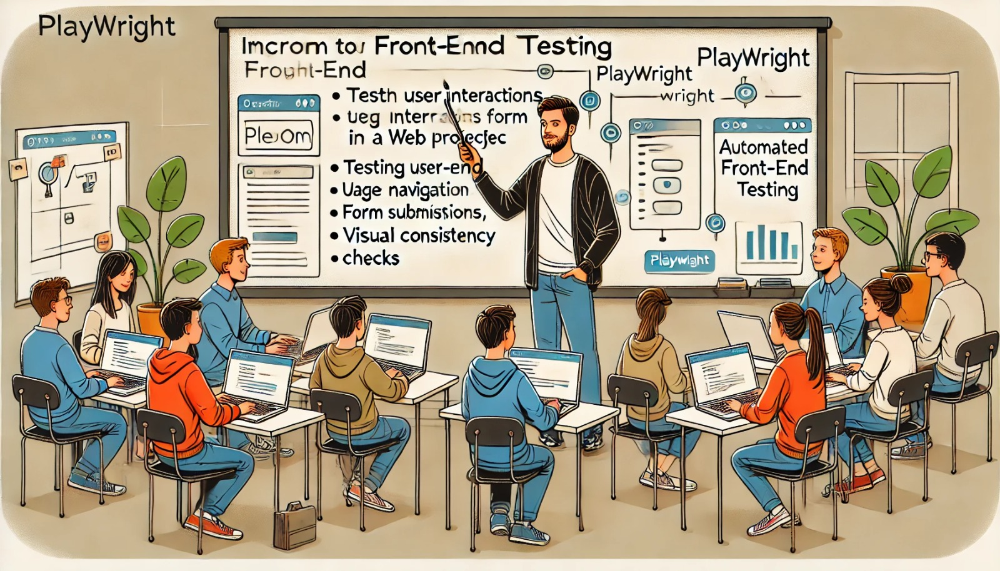

### Aula 57: Projeto Integrador – Testes de Front-End com Playwright

#### Introdução

Nesta aula, vamos aprender a realizar **testes de front-end** utilizando o **Playwright**. Testes de front-end são fundamentais para garantir que a interface da aplicação funcione como esperado, validando interações de usuário, layout, navegação, e comportamento visual dos elementos. O Playwright é uma ferramenta poderosa e moderna que facilita a automação de navegadores para testar aplicações web de forma confiável.

---

### 1. Configuração do Playwright

Antes de começar a escrever testes com Playwright, vamos configurar o ambiente para rodar os testes em nossa aplicação.

#### Passo 1: Instalação do Playwright

No terminal, execute o seguinte comando para instalar o Playwright e configurar os navegadores de teste:

```bash
pip install pytest-playwright
playwright install
```

#### Passo 2: Estrutura dos Testes de Front-End

Crie uma pasta chamada `tests` para armazenar todos os testes. Dentro dela, crie um arquivo chamado `test_frontend.py`, onde escreveremos os testes do front-end.

---

### 2. Estrutura de um Teste com Playwright

No Playwright, os testes seguem uma estrutura que permite simular interações do usuário, como cliques e preenchimento de formulários. Vamos ver um exemplo básico para entender como funciona.

```python
import pytest
from playwright.sync_api import Page

@pytest.fixture(scope="session")
def base_url():
    return "http://localhost:5000"

def test_home_page_loads(base_url, page: Page):
    page.goto(base_url)
    assert page.title() == "Título Esperado da Página Inicial"
```

Nesse exemplo:

- **base_url**: Define a URL base do projeto, facilitando o acesso às páginas sem repetir o endereço.
- **test_home_page_loads**: Este teste verifica se a página inicial carrega corretamente e se o título da página é o esperado.

---

### 3. Testando a Navegação e Interações do Usuário

Agora, vamos criar testes para verificar a navegação entre páginas e as interações do usuário, como login e preenchimento de formulários.

#### Exemplo 1: Testando o Login

O teste a seguir simula o processo de login, preenchendo o formulário com credenciais e verificando se o redirecionamento ocorre conforme o esperado.

```python
def test_login(base_url, page: Page):
    # Acessa a página de login
    page.goto(f"{base_url}/login")
    
    # Preenche o formulário de login
    page.fill("input[name='email']", "usuario@exemplo.com")
    page.fill("input[name='senha']", "senha123")
    
    # Submete o formulário
    page.click("button[type='submit']")
    
    # Verifica o redirecionamento após o login bem-sucedido
    assert page.url == f"{base_url}/home"
    assert "Bem-vindo" in page.text_content("h1")
```

Nesse teste:

- **goto**: Navega para a página de login.
- **fill**: Preenche os campos de e-mail e senha.
- **click**: Simula o clique no botão de login.
- **assert**: Verifica se o redirecionamento é para a página esperada (`/home`) e se contém o texto de boas-vindas.

#### Exemplo 2: Testando a Pré-Matrícula

Neste exemplo, vamos verificar se o processo de pré-matrícula funciona, permitindo ao usuário selecionar uma vaga e registrar interesse.

```python
def test_pre_matricula(base_url, page: Page):
    # Acessa a página de pré-matrículas
    page.goto(f"{base_url}/instituicoes")
    
    # Clica em uma vaga específica para realizar a pré-matrícula
    page.click("a[href='/pre_matricula/1']")  # Link para a vaga de ID 1
    
    # Confirma a pré-matrícula
    page.click("button[type='submit']")
    
    # Verifica se a mensagem de sucesso aparece
    assert "Pré-matrícula realizada com sucesso!" in page.text_content(".alert-success")
```

---

### 4. Testando o Layout e Componentes Visuais

O Playwright permite capturar capturas de tela e verificar a presença de elementos visuais. Isso é útil para testar a consistência de layout.

#### Exemplo 3: Verificando a Presença de Componentes

No exemplo abaixo, verificamos se o cabeçalho e o rodapé da página estão presentes.

```python
def test_layout_elements(base_url, page: Page):
    page.goto(base_url)
    
    # Verifica se o cabeçalho está presente
    assert page.query_selector("header") is not None
    
    # Verifica se o rodapé está presente
    assert page.query_selector("footer") is not None
```

#### Exemplo 4: Captura de Tela para Comparação Visual

Para garantir que o layout permaneça consistente após mudanças, capture uma imagem da página e compare-a com a imagem base.

```python
def test_screenshot_home(base_url, page: Page):
    page.goto(base_url)
    page.screenshot(path="tests/screenshots/home_page.png")
```

> **Dica**: Para comparações visuais, você pode usar ferramentas de diffs visuais que permitem comparar capturas de tela e detectar mudanças no layout.

---

### 5. Testes de Fluxo Completo

Por fim, vamos combinar vários testes em um único fluxo para simular uma experiência completa do usuário.

#### Exemplo 5: Fluxo Completo de Cadastro e Login

Este teste simula o cadastro de um usuário, seguido pelo login.

```python
def test_cadastro_e_login(base_url, page: Page):
    # Cadastro de um novo usuário
    page.goto(f"{base_url}/cadastro")
    page.fill("input[name='nome']", "Novo Usuário")
    page.fill("input[name='email']", "novousuario@exemplo.com")
    page.fill("input[name='senha']", "senha123")
    page.click("button[type='submit']")
    
    # Verifica redirecionamento após cadastro
    assert page.url == f"{base_url}/login"
    
    # Realiza o login com o novo usuário
    page.fill("input[name='email']", "novousuario@exemplo.com")
    page.fill("input[name='senha']", "senha123")
    page.click("button[type='submit']")
    
    # Verifica redirecionamento e mensagem de boas-vindas
    assert page.url == f"{base_url}/home"
    assert "Bem-vindo, Novo Usuário" in page.text_content("h1")
```

Esse teste garante que um usuário pode se cadastrar, fazer login e acessar a área inicial da aplicação.

---

### 6. Executando os Testes de Front-End

Para rodar os testes, use o comando:

```bash
pytest --headless
```

> **Nota**: A opção `--headless` permite executar os testes sem abrir o navegador, ideal para execução em servidores CI/CD.

---

### Conclusão

Os testes de front-end com Playwright proporcionam uma maneira eficaz de garantir a funcionalidade e estabilidade da interface da aplicação. Com esses testes, podemos detectar e corrigir problemas visuais e de interação, assegurando que o Projeto Integrador ofereça uma experiência de usuário consistente e confiável.