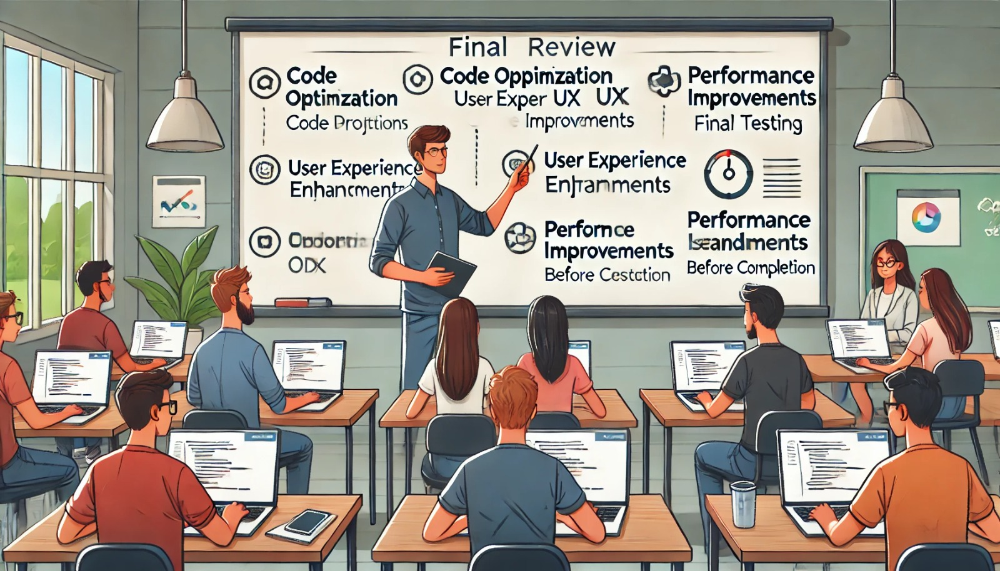

### Aula 59: Projeto Integrador – Revisão Final e Melhorias

#### Introdução

Nesta aula, vamos realizar uma **revisão final do Projeto Integrador** e identificar possíveis melhorias. A revisão final é uma etapa importante para garantir a qualidade do projeto, verificar a consistência entre funcionalidades, corrigir possíveis problemas e aprimorar a experiência do usuário. Vamos focar na otimização do código, aprimoramento de funcionalidades, melhorias de desempenho e usabilidade, além de revisar o design e a segurança.

---

### 1. Revisão Geral do Projeto

Começaremos com uma verificação completa do projeto, validando a presença e funcionamento de cada funcionalidade e avaliando se todos os requisitos do projeto foram atendidos.

#### Passo 1: Revisão das Funcionalidades

1. **Cadastro e Login de Usuário**: Verifique se o fluxo de cadastro e login funciona sem problemas e se as mensagens de erro estão sendo exibidas corretamente para entradas inválidas.
2. **Pré-Matrícula**: Confirme que os usuários conseguem visualizar as vagas, acessar a página de pré-matrícula e concluir a inscrição sem erros.
3. **Área Administrativa**: Teste as funcionalidades administrativas, como criação, edição e exclusão de vagas, e aprovação de pré-matrículas.
4. **Notificações por E-mail**: Verifique se os e-mails automáticos (de confirmação, por exemplo) estão sendo enviados e recebidos corretamente.

#### Passo 2: Revisão da Segurança

1. **Autenticação e Autorização**: Certifique-se de que apenas usuários autenticados têm acesso à área de pré-matrículas e que a área administrativa está restrita a administradores.
2. **Proteção Contra CSRF e SQL Injection**: Verifique se os formulários têm proteção contra CSRF e se há validação nas entradas de dados para prevenir SQL Injection.
3. **Cookies e Sessões**: Confirme se os cookies estão configurados corretamente (`HttpOnly`, `Secure` e `SameSite`) e se as sessões encerram após o logout.

---

### 2. Melhorias de Código

Para tornar o código mais claro, eficiente e modular, considere as seguintes melhorias:

#### Refatoração e Organização

1. **Modularização do Código**: Verifique se funções e trechos de código que realizam tarefas semelhantes estão organizados em funções ou classes separadas. Isso facilita a manutenção e reutilização do código.
2. **Redução de Repetições**: Identifique e remova código duplicado, substituindo por funções reutilizáveis.
3. **Comentário e Docstrings**: Assegure-se de que as funções principais tenham comentários e docstrings explicativos, especialmente em trechos mais complexos.

#### Melhoria de Desempenho

1. **Otimização de Consultas ao Banco de Dados**: Verifique se as consultas ao banco de dados são eficientes e otimizadas. Considere o uso de `lazy loading` para carregar dados somente quando necessário.
2. **Minimização de Arquivos Estáticos**: Comprimir e minificar arquivos CSS e JavaScript para reduzir o tempo de carregamento da página.

---

### 3. Melhorias na Experiência do Usuário (UX)

Uma boa experiência de usuário é essencial para facilitar a navegação e a interação dos usuários com o sistema. Considere as seguintes melhorias:

1. **Feedback Visual**: Garanta que o sistema forneça feedback ao usuário em cada ação importante, como uma notificação de sucesso após a pré-matrícula ou uma mensagem de erro em caso de dados inválidos.
2. **Design Responsivo**: Verifique se o layout está ajustado para diferentes tamanhos de tela (desktop, tablet, smartphone), garantindo que a interface seja totalmente responsiva.
3. **Aprimoramento do Layout**: Considere ajustes no design, como espaçamento, fontes e cores, para melhorar a legibilidade e a estética da aplicação.

---

### 4. Otimização de Desempenho

Melhorar o desempenho é importante para garantir uma experiência rápida e sem interrupções. Abaixo estão algumas sugestões:

1. **Carregamento Assíncrono**: Para partes do sistema que demandam carregamento de dados, considere a implementação de carregamento assíncrono com JavaScript, como a atualização de listas de vagas.
2. **Cache de Dados**: Utilize cache para armazenar dados acessados com frequência, reduzindo a carga sobre o banco de dados.
3. **Compressão de Imagens e Arquivos Estáticos**: Verifique se os arquivos de imagem e outros ativos estáticos estão otimizados para carregar rapidamente.

---

### 5. Revisão Final de Testes

Realize uma nova rodada de testes para garantir que o projeto esteja completamente funcional:

1. **Testes Unitários e de Integração**: Execute todos os testes unitários e de integração para garantir que cada componente funciona isoladamente e em conjunto com o restante da aplicação.
2. **Testes de Front-End**: Utilize o Playwright para verificar a interface e testar as interações dos usuários. Realize testes manuais para validar as interações mais comuns.
3. **Testes de Segurança**: Verifique novamente os controles de acesso e a proteção de dados sensíveis.

---

### 6. Melhorias Baseadas em Feedback

Se possível, obtenha feedback de usuários ou de outros desenvolvedores para identificar melhorias adicionais. Pergunte sobre:

- **Usabilidade**: Se o sistema é fácil de navegar e intuitivo.
- **Desempenho**: Se o sistema carrega rapidamente e responde bem às interações.
- **Confiabilidade**: Se todas as funcionalidades são consistentes e estão funcionando como esperado.

---

### Conclusão

A revisão final e as melhorias são etapas essenciais para garantir que o Projeto Integrador seja um sistema robusto, seguro, eficiente e fácil de usar. Com essa aula, concluímos o projeto com um sistema de alta qualidade e preparado para atender às necessidades dos usuários e administradores.