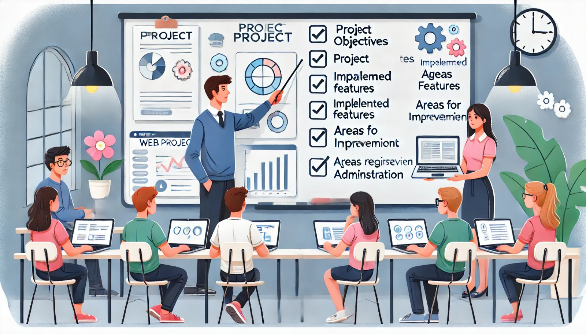

### Aula 60: Apresentação Parcial do Projeto Integrador

#### Introdução

Nesta aula, vamos realizar uma **apresentação parcial do Projeto Integrador**. Esta etapa permite que os alunos compartilhem o progresso feito até o momento, demonstrem as funcionalidades implementadas e recebam feedback para ajustes finais. A apresentação parcial é uma oportunidade para avaliar o desenvolvimento do projeto, corrigir eventuais problemas e aprimorar aspectos importantes antes da entrega final.

---

### 1. Preparação para a Apresentação

Antes de iniciar a apresentação, organize o material e planeje o que será apresentado. 

1. **Organização das Funcionalidades**: Liste as funcionalidades que já foram implementadas e identifique aquelas que ainda estão em desenvolvimento.
2. **Roteiro da Apresentação**: Estruture a apresentação para cobrir as principais áreas do projeto, incluindo introdução, funcionalidades, e áreas a serem finalizadas.
3. **Demonstração Prática**: Prepare exemplos práticos para demonstrar o uso de cada funcionalidade principal, como cadastro de usuário, pré-matrícula e área administrativa.

---

### 2. Estrutura da Apresentação

A apresentação deve ser clara, objetiva e organizada. A seguir, um roteiro sugerido para a apresentação parcial:

#### 1. Introdução ao Projeto

1. **Nome do Projeto**: Informe o nome do projeto e o propósito geral.
2. **Objetivo Principal**: Descreva brevemente o objetivo do sistema (ex.: facilitar o processo de pré-matrícula em instituições de ensino).
3. **Público-Alvo**: Explique quem são os usuários do sistema (pais e responsáveis, administradores de instituições).

#### 2. Funcionalidades Implementadas

A seguir, demonstre as principais funcionalidades que já estão completas. Para cada funcionalidade, faça uma breve explicação e uma demonstração.

1. **Cadastro e Login**: Mostre como o usuário pode se cadastrar e fazer login. Explique como foi implementada a segurança de senha e a proteção de formulários.
2. **Pré-Matrícula**: Demonstre a funcionalidade de pré-matrícula, mostrando como os usuários podem visualizar vagas e registrar interesse.
3. **Área Administrativa**: Apresente a área administrativa, mostrando como é possível gerenciar as vagas, aprovar pré-matrículas e visualizar informações.
4. **Envio de E-mails**: Explique e demonstre, se possível, o sistema de envio de e-mails de confirmação e notificações aos usuários.
5. **Segurança Implementada**: Discuta as medidas de segurança implementadas, como proteção contra CSRF e autenticação de usuários.

#### 3. Funcionalidades em Desenvolvimento

1. **Melhorias na Interface**: Mencione as melhorias de layout e design que estão sendo trabalhadas.
2. **Testes e Validações Finais**: Explique que estão sendo realizados testes de integração, unitários e de front-end para garantir a qualidade da aplicação.
3. **Documentação do Projeto**: Informe que a documentação está sendo elaborada, incluindo o README, descrição das rotas e instruções de uso.

---

### 3. Demonstração Prática

Durante a demonstração prática, mostre o sistema em funcionamento para que todos possam visualizar a aplicação. Siga este guia para uma apresentação eficiente:

1. **Login e Cadastro**: Demonstre o fluxo de cadastro de um novo usuário e o login. Mostre as mensagens de feedback (sucesso ou erro) ao usuário.
2. **Visualização de Vagas e Pré-Matrícula**: Navegue pela área de vagas, selecione uma vaga e complete o processo de pré-matrícula.
3. **Gestão Administrativa**: Mostre como um administrador acessa a área administrativa, gerencia as vagas, aprova uma pré-matrícula e visualiza as listas de usuários e vagas.
4. **Notificações por E-mail**: Mostre exemplos dos e-mails de confirmação recebidos, se possível, para ilustrar o processo de comunicação.

---

### 4. Recebendo Feedback

A apresentação parcial também é uma excelente oportunidade para receber feedback dos colegas e do professor. Ao final da apresentação:

1. **Solicite Comentários**: Pergunte aos colegas e ao professor se há sugestões para melhorias, dúvidas ou pontos que podem ser ajustados.
2. **Anote os Feedbacks**: Registre todo o feedback recebido para analisá-lo e, se necessário, realizar ajustes antes da entrega final.
3. **Planeje Melhorias**: Considere os comentários recebidos e planeje melhorias práticas, dividindo as tarefas entre os membros da equipe, se aplicável.

---

### 5. Próximos Passos

Após a apresentação e recebimento de feedback, defina os passos finais para concluir o projeto:

1. **Finalizar Funcionalidades Restantes**: Completar qualquer funcionalidade que ainda esteja pendente.
2. **Implementar Melhorias Sugeridas**: Baseando-se no feedback recebido, ajuste e melhore o que for necessário.
3. **Concluir a Documentação**: Finalize o README e a documentação completa do projeto, incluindo instruções detalhadas de instalação e uso.
4. **Revisar e Realizar Testes Finais**: Realize testes completos para garantir que o sistema esteja funcional e livre de erros para a entrega final.

---

### Conclusão

A apresentação parcial do Projeto Integrador é uma etapa importante para avaliar o progresso do projeto, receber feedback e realizar ajustes antes da entrega final. Com uma apresentação clara e objetiva, os alunos podem garantir que o sistema está em um bom caminho e identificar melhorias importantes para uma versão final de alta qualidade.