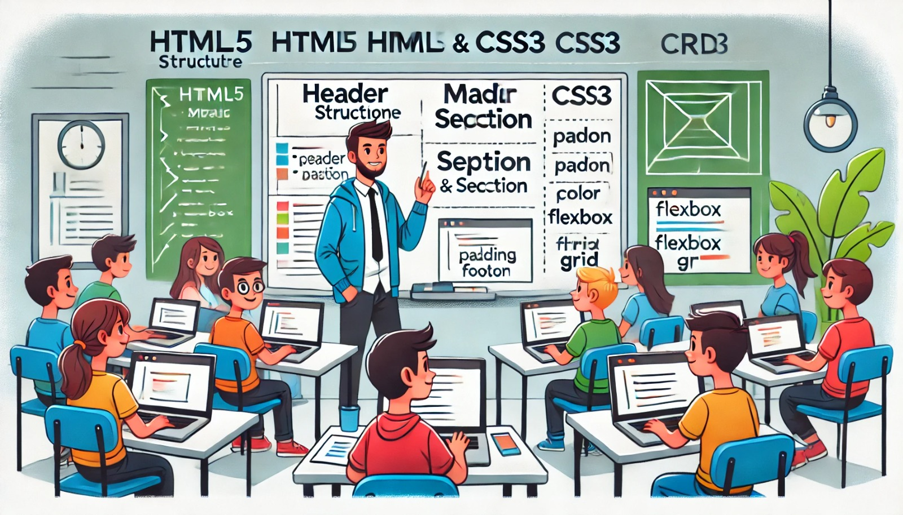

### Aula 61: Revisão de HTML5 e CSS3

#### Introdução

Nesta aula, vamos revisar os conceitos fundamentais de **HTML5** e **CSS3**, que são a base para o desenvolvimento de interfaces web. O HTML5 permite estruturar o conteúdo das páginas, enquanto o CSS3 estiliza e organiza o layout, criando uma apresentação visual atraente e funcional. Essa revisão reforçará a importância de uma estrutura bem planejada e de um design responsivo para oferecer uma experiência de usuário positiva.

---

### 1. Estrutura Básica do HTML5

O HTML5 é composto por uma estrutura que organiza o conteúdo em **tags**. Cada tag tem uma função específica e ajuda a tornar o conteúdo mais acessível e bem estruturado.

#### Estrutura do Documento HTML5

A estrutura básica de uma página HTML inclui as seguintes partes:

```html
<!DOCTYPE html>
<html lang="pt-BR">
<head>
    <meta charset="UTF-8">
    <meta name="viewport" content="width=device-width, initial-scale=1.0">
    <title>Título da Página</title>
</head>
<body>
    <!-- Conteúdo da página -->
</body>
</html>
```

- **<!DOCTYPE html>**: Declara que o documento usa HTML5.
- **<html lang="pt-BR">**: Define o idioma da página (português do Brasil).
- **<meta charset="UTF-8">**: Configura a codificação de caracteres para UTF-8.
- **<meta name="viewport" content="width=device-width, initial-scale=1.0">**: Ajusta o layout para ser responsivo.
- **<title>**: Define o título da página, que aparece na aba do navegador.

#### Tags Semânticas do HTML5

Tags semânticas ajudam a identificar o papel de cada seção do conteúdo, melhorando a acessibilidade e a SEO. Algumas das principais tags semânticas incluem:

- **<header>**: Cabeçalho da página ou seção.
- **<nav>**: Navegação principal do site.
- **<main>**: Conteúdo principal da página.
- **<section>**: Seção de conteúdo relacionada.
- **<article>**: Conteúdo independente, como um artigo ou post.
- **<footer>**: Rodapé da página ou seção.

Exemplo de uso:

```html
<body>
    <header>
        <h1>Bem-vindo ao Nosso Site</h1>
        <nav>
            <ul>
                <li><a href="#home">Home</a></li>
                <li><a href="#sobre">Sobre</a></li>
            </ul>
        </nav>
    </header>
    <main>
        <section id="home">
            <h2>Introdução</h2>
            <p>Este é o conteúdo principal da nossa página.</p>
        </section>
    </main>
    <footer>
        <p>Todos os direitos reservados.</p>
    </footer>
</body>
```

---

### 2. Revisão de CSS3: Seletores e Propriedades Básicas

O CSS3 é usado para estilizar e organizar o layout de uma página web. Ele permite modificar cores, tamanhos, espaçamentos, fontes e muito mais.

#### Seletores Básicos

- **Seletores de Elemento**: Aplica estilos a todas as instâncias de um elemento HTML.
  
  ```css
  body {
      font-family: Arial, sans-serif;
      color: #333;
  }
  ```

- **Seletores de Classe**: Aplica estilos a todos os elementos com uma classe específica. 

  ```css
  .container {
      width: 80%;
      margin: auto;
  }
  ```

- **Seletores de ID**: Aplica estilos a um único elemento com um ID específico.

  ```css
  #header {
      background-color: #f5f5f5;
      padding: 10px;
  }
  ```

#### Propriedades Comuns do CSS

Algumas das propriedades CSS mais utilizadas para estilizar páginas são:

1. **Cor e Fundo**
   - **color**: Define a cor do texto.
   - **background-color**: Define a cor de fundo.
   
   ```css
   p {
       color: #555;
       background-color: #e0e0e0;
   }
   ```

2. **Espaçamento e Layout**
   - **padding**: Define o espaço interno (dentro das bordas).
   - **margin**: Define o espaço externo (fora das bordas).
   
   ```css
   .content {
       padding: 20px;
       margin: 10px 0;
   }
   ```

3. **Tamanho e Fonte**
   - **font-size**: Define o tamanho da fonte.
   - **font-family**: Define o tipo de fonte.
   
   ```css
   h1 {
       font-size: 2em;
       font-family: 'Helvetica', sans-serif;
   }
   ```

#### Layout com Flexbox e Grid

O **Flexbox** e o **Grid** são métodos modernos para organizar layouts responsivos.

- **Flexbox**: Ideal para criar layouts em linha ou coluna, alinhando elementos de forma flexível.

  ```css
  .flex-container {
      display: flex;
      justify-content: space-between;
      align-items: center;
  }
  ```

- **Grid**: Melhor para layouts em duas dimensões (linhas e colunas), permitindo controle preciso sobre a disposição dos elementos.

  ```css
  .grid-container {
      display: grid;
      grid-template-columns: repeat(3, 1fr);
      gap: 10px;
  }
  ```

---

### 3. Criando um Layout Básico com HTML5 e CSS3

Vamos criar um layout simples usando HTML5 para a estrutura e CSS3 para o estilo e organização:

#### HTML

```html
<body>
    <header>
        <h1>Meu Site</h1>
        <nav>
            <ul>
                <li><a href="#home">Home</a></li>
                <li><a href="#servicos">Serviços</a></li>
                <li><a href="#contato">Contato</a></li>
            </ul>
        </nav>
    </header>
    <main>
        <section id="home">
            <h2>Bem-vindo!</h2>
            <p>Este é o conteúdo principal.</p>
        </section>
        <section id="servicos">
            <h2>Serviços</h2>
            <p>Oferecemos vários serviços.</p>
        </section>
    </main>
    <footer>
        <p>Todos os direitos reservados.</p>
    </footer>
</body>
```

#### CSS

```css
body {
    font-family: Arial, sans-serif;
    margin: 0;
    color: #333;
}

header {
    background-color: #4CAF50;
    color: white;
    padding: 1em;
}

nav ul {
    list-style-type: none;
    padding: 0;
}

nav ul li {
    display: inline;
    margin-right: 10px;
}

section {
    padding: 20px;
    margin: 10px 0;
}

footer {
    background-color: #333;
    color: white;
    text-align: center;
    padding: 1em 0;
}
```

---

### 4. Prática: Criação de uma Página Simples

1. **Objetivo**: Crie uma página HTML com um cabeçalho, um menu de navegação, duas seções e um rodapé.
2. **Estrutura HTML**: Use tags semânticas como `<header>`, `<nav>`, `<section>`, e `<footer>`.
3. **Estilização CSS**: Adicione cores, espaçamentos e fontes para melhorar a aparência.
4. **Layout Flexível**: Aplique Flexbox para organizar o menu de navegação.

---

### Conclusão

A revisão de HTML5 e CSS3 fornece uma base sólida para o desenvolvimento web. Com HTML, podemos estruturar páginas de maneira semântica, e com CSS, podemos criar uma apresentação visual atrativa e responsiva. Essas habilidades são fundamentais para qualquer desenvolvedor web, e dominar esses conceitos torna o processo de criação de interfaces muito mais eficiente e agradável.