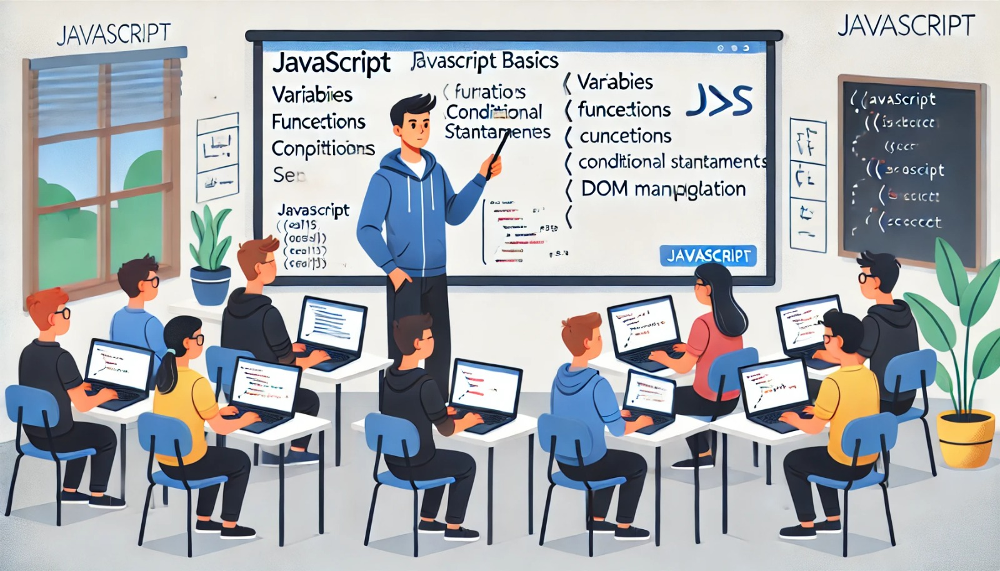

### Aula 62: Revisão de JavaScript

#### Introdução

Nesta aula, vamos revisar os fundamentos de **JavaScript**, uma linguagem de programação essencial para tornar páginas web interativas e dinâmicas. Vamos reforçar conceitos básicos como **sintaxe**, **variáveis**, **tipos de dados**, **estruturas de controle**, e **funções**, e mostrar como essas ferramentas permitem manipular elementos de uma página web.

---

### 1. Estrutura e Sintaxe Básica do JavaScript

O JavaScript possui uma estrutura de sintaxe similar a outras linguagens de programação, com variáveis, operadores e blocos de código.

#### Declarando Variáveis

As variáveis são usadas para armazenar dados que podem ser usados posteriormente. Em JavaScript, utilizamos as palavras-chave `let`, `const`, ou `var` para declarar variáveis.

- **let**: Usado para variáveis que podem ter seu valor alterado.
- **const**: Usado para variáveis constantes, cujo valor não muda.
- **var**: Uma forma mais antiga de declarar variáveis (não recomendada).

```javascript
let nome = "Maria";
const idade = 25;
var cidade = "São Paulo";
```

#### Tipos de Dados

Os principais tipos de dados em JavaScript são:

- **String**: Representa texto. Exemplo: `"Olá"`
- **Number**: Representa números. Exemplo: `42`
- **Boolean**: Representa valores verdadeiros ou falsos. Exemplo: `true` ou `false`
- **Array**: Representa uma lista de elementos. Exemplo: `[1, 2, 3]`
- **Object**: Representa uma coleção de dados com propriedades. Exemplo: `{ nome: "Maria", idade: 25 }`

```javascript
let mensagem = "Bem-vindo!";
let numero = 42;
let estaAtivo = true;
let frutas = ["maçã", "banana", "laranja"];
let pessoa = { nome: "João", idade: 30 };
```

---

### 2. Operadores e Estruturas de Controle

Operadores são símbolos usados para realizar operações em valores e variáveis. Estruturas de controle definem o fluxo do programa, permitindo que o código execute instruções específicas dependendo de certas condições.

#### Operadores Básicos

- **Aritméticos**: `+`, `-`, `*`, `/`, `%`
- **Comparação**: `==`, `===`, `!=`, `!==`, `>`, `<`, `>=`, `<=`
- **Lógicos**: `&&` (e), `||` (ou), `!` (não)

Exemplo:

```javascript
let a = 10;
let b = 5;
console.log(a + b); // Resultado: 15
console.log(a > b); // Resultado: true
```

#### Estruturas Condicionais

As estruturas condicionais permitem que o programa execute diferentes blocos de código com base em condições específicas.

- **if**: Executa um bloco de código se uma condição for verdadeira.

  ```javascript
  let idade = 20;
  if (idade >= 18) {
      console.log("Maior de idade");
  }
  ```

- **if...else**: Executa um bloco de código se a condição for verdadeira e outro se for falsa.

  ```javascript
  let nota = 6;
  if (nota >= 7) {
      console.log("Aprovado");
  } else {
      console.log("Reprovado");
  }
  ```

- **switch**: Ideal para avaliar várias condições diferentes.

  ```javascript
  let dia = 3;
  switch (dia) {
      case 1:
          console.log("Segunda-feira");
          break;
      case 2:
          console.log("Terça-feira");
          break;
      default:
          console.log("Outro dia");
  }
  ```

#### Estruturas de Repetição

- **for**: Executa um bloco de código várias vezes, com base em uma condição.

  ```javascript
  for (let i = 0; i < 5; i++) {
      console.log(i);
  }
  ```

- **while**: Executa um bloco de código enquanto uma condição for verdadeira.

  ```javascript
  let contador = 0;
  while (contador < 5) {
      console.log(contador);
      contador++;
  }
  ```

---

### 3. Funções em JavaScript

Funções são blocos de código reutilizáveis que executam uma tarefa específica. Podemos declarar funções usando a palavra-chave `function`, ou como **funções de seta**.

#### Funções Comuns

```javascript
function saudacao(nome) {
    return "Olá, " + nome;
}

console.log(saudacao("Carlos")); // Resultado: Olá, Carlos
```

#### Funções de Seta

As funções de seta são uma forma mais curta de escrever funções em JavaScript, introduzidas no ES6.

```javascript
const saudacao = (nome) => {
    return "Olá, " + nome;
};
console.log(saudacao("Carlos")); // Resultado: Olá, Carlos
```

#### Funções de Manipulação de Arrays

JavaScript oferece métodos úteis para manipular arrays:

- **forEach**: Executa uma função em cada elemento do array.

  ```javascript
  let numeros = [1, 2, 3];
  numeros.forEach(num => console.log(num * 2)); // Resultado: 2, 4, 6
  ```

- **map**: Cria um novo array aplicando uma função a cada elemento do array original.

  ```javascript
  let numeros = [1, 2, 3];
  let dobrados = numeros.map(num => num * 2);
  console.log(dobrados); // Resultado: [2, 4, 6]
  ```

---

### 4. Manipulação do DOM

O JavaScript permite que manipulamos o **DOM (Document Object Model)**, ou seja, a estrutura HTML da página, tornando-a interativa.

#### Seleção de Elementos

Para selecionar e manipular elementos do DOM, utilizamos métodos como `document.getElementById` ou `document.querySelector`.

```javascript
let titulo = document.getElementById("titulo");
let paragrafo = document.querySelector(".paragrafo");
```

#### Modificação de Conteúdo e Estilo

Podemos alterar o conteúdo e o estilo de elementos HTML.

```javascript
titulo.textContent = "Novo Título";
paragrafo.style.color = "blue";
```

#### Manipulação de Eventos

JavaScript permite que adicionemos eventos a elementos HTML para responder a interações do usuário, como cliques.

```javascript
let botao = document.querySelector("#meuBotao");
botao.addEventListener("click", () => {
    alert("Botão clicado!");
});
```

---

### 5. Prática: Criando uma Interação Simples

**Objetivo**: Crie uma página com um botão e um campo de texto. Ao clicar no botão, o conteúdo do campo de texto deve ser exibido em um parágrafo.

1. **HTML**:

    ```html
    <input type="text" id="nome" placeholder="Digite seu nome">
    <button id="exibir">Exibir Nome</button>
    <p id="resultado"></p>
    ```

2. **JavaScript**:

    ```javascript
    document.getElementById("exibir").addEventListener("click", () => {
        let nome = document.getElementById("nome").value;
        document.getElementById("resultado").textContent = "Olá, " + nome;
    });
    ```

---

### Conclusão

A revisão de JavaScript reforça conceitos fundamentais para o desenvolvimento web, como variáveis, estruturas de controle, funções e manipulação do DOM. Esses conceitos são essenciais para criar páginas web interativas e dinâmicas. Ao dominar esses fundamentos, você estará preparado para explorar funcionalidades mais avançadas e construir aplicações web completas.