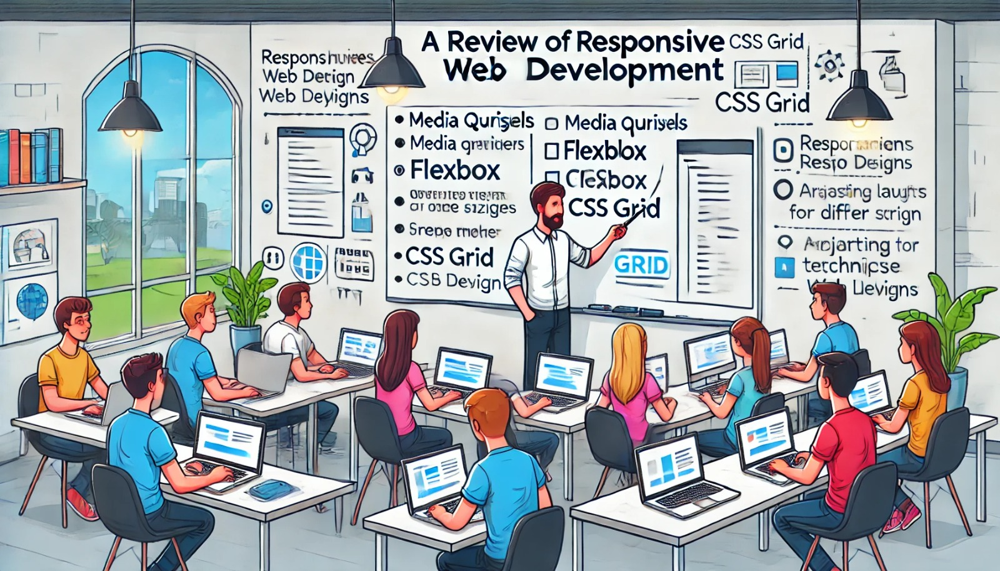

### Aula 66: Revisão de Desenvolvimento Responsivo

#### Introdução

Nesta aula, vamos revisar os conceitos fundamentais de **Desenvolvimento Responsivo**, que permitem que sites e aplicações web se adaptem a diferentes tamanhos de tela e dispositivos. Com o desenvolvimento responsivo, garantimos que o conteúdo seja exibido corretamente em smartphones, tablets e desktops, oferecendo uma experiência de usuário consistente. Vamos explorar o uso de **media queries**, **flexbox** e **CSS grid** para criar layouts responsivos e flexíveis.

---

### 1. Importância do Desenvolvimento Responsivo

A navegação em dispositivos móveis cresce cada vez mais, tornando essencial que websites e aplicações funcionem bem em telas pequenas e grandes. O desenvolvimento responsivo melhora a **experiência do usuário**, ajuda a **aumentar a acessibilidade** e **melhora o ranqueamento em motores de busca** como o Google.

---

### 2. Media Queries

**Media queries** são instruções CSS que aplicam estilos específicos para diferentes larguras de tela. Elas permitem definir pontos de interrupção (breakpoints) para ajustar o layout e o design de acordo com o dispositivo.

#### Exemplo de Media Query

```css
/* Estilos gerais (para desktops) */
.container {
    width: 80%;
    margin: auto;
}

/* Estilos específicos para telas menores que 768px (tablets) */
@media (max-width: 768px) {
    .container {
        width: 90%;
    }
}

/* Estilos específicos para telas menores que 480px (smartphones) */
@media (max-width: 480px) {
    .container {
        width: 100%;
        padding: 10px;
    }
}
```

No exemplo acima:

- **(max-width: 768px)**: Aplica estilos para dispositivos com largura máxima de 768px.
- **(max-width: 480px)**: Aplica estilos para dispositivos com largura máxima de 480px, como smartphones.

---

### 3. Flexbox para Layout Responsivo

**Flexbox** é um modelo de layout unidimensional que facilita a criação de layouts flexíveis e centralizados. Com o Flexbox, você pode alinhar, distribuir e organizar elementos horizontalmente ou verticalmente.

#### Exemplo de Layout com Flexbox

```css
.container {
    display: flex;
    justify-content: space-between;
    align-items: center;
    flex-wrap: wrap;
}

.item {
    flex: 1 1 200px; /* Cresce, encolhe e tem uma largura mínima de 200px */
    margin: 10px;
    padding: 20px;
    background-color: #f5f5f5;
}
```

Explicação:

- **display: flex**: Ativa o Flexbox na `.container`, permitindo organizar os elementos `.item`.
- **justify-content: space-between**: Distribui os itens de forma uniforme ao longo do contêiner, com espaçamento entre eles.
- **align-items: center**: Alinha os itens no centro verticalmente.
- **flex-wrap: wrap**: Permite que os elementos “quebrem” linha caso não caibam em uma única linha.

O Flexbox é útil para criar layouts que respondem bem a diferentes tamanhos de tela e se ajustam automaticamente.

---

### 4. Grid Layout para Design Responsivo

**CSS Grid** é um sistema de layout bidimensional que permite criar grades complexas para organizar o conteúdo de forma precisa em linhas e colunas.

#### Exemplo de Layout com CSS Grid

```css
.container {
    display: grid;
    grid-template-columns: repeat(3, 1fr); /* 3 colunas de tamanhos iguais */
    gap: 10px;
}

.item {
    background-color: #f5f5f5;
    padding: 20px;
}

/* Ajuste para telas menores */
@media (max-width: 768px) {
    .container {
        grid-template-columns: repeat(2, 1fr); /* 2 colunas para tablets */
    }
}

@media (max-width: 480px) {
    .container {
        grid-template-columns: 1fr; /* 1 coluna para smartphones */
    }
}
```

No exemplo acima:

- **grid-template-columns: repeat(3, 1fr)**: Cria três colunas de tamanhos iguais.
- **gap**: Define o espaçamento entre as colunas e linhas.
- **@media (max-width: 768px)**: Ajusta a grade para duas colunas em dispositivos menores.
- **@media (max-width: 480px)**: Ajusta a grade para uma coluna em smartphones.

Com CSS Grid, é possível criar layouts mais complexos e precisos, ajustando o conteúdo de acordo com o tamanho da tela.

---

### 5. Prática: Criando um Layout Responsivo

Vamos criar uma estrutura básica usando Flexbox e CSS Grid para ilustrar um layout responsivo.

1. **Estrutura HTML**:

    ```html
    <header class="header">Cabeçalho</header>
    <div class="container">
        <div class="item">Conteúdo 1</div>
        <div class="item">Conteúdo 2</div>
        <div class="item">Conteúdo 3</div>
    </div>
    <footer class="footer">Rodapé</footer>
    ```

2. **CSS Responsivo**:

    ```css
    /* Estilos gerais */
    .header, .footer {
        text-align: center;
        padding: 10px;
        background-color: #333;
        color: white;
    }

    /* Container com Grid */
    .container {
        display: grid;
        grid-template-columns: repeat(3, 1fr);
        gap: 10px;
        margin: 10px;
    }

    .item {
        padding: 20px;
        background-color: #f5f5f5;
    }

    /* Ajuste para telas menores */
    @media (max-width: 768px) {
        .container {
            grid-template-columns: repeat(2, 1fr);
        }
    }

    @media (max-width: 480px) {
        .container {
            grid-template-columns: 1fr;
        }
    }
    ```

Esse layout ajusta o número de colunas automaticamente com base na largura da tela, garantindo que o conteúdo fique organizado e legível em qualquer dispositivo.

---

### 6. Boas Práticas para Desenvolvimento Responsivo

Para garantir que o design responsivo funcione bem, siga estas boas práticas:

1. **Utilize Unidades Flexíveis**: Use `%`, `em`, `rem`, e `vh/vw` ao invés de `px`, pois são unidades mais adaptáveis.
2. **Aplique Fontes e Imagens Escaláveis**: Use fontes e imagens que se ajustem automaticamente ao tamanho da tela.
3. **Teste em Diferentes Dispositivos**: Simule o layout em diversos dispositivos para garantir que ele esteja bem ajustado.
4. **Comece com o Design para Móvel**: Adote o conceito de “mobile-first”, onde o design é inicialmente otimizado para dispositivos móveis e depois adaptado para telas maiores.

---

### Conclusão

A revisão de desenvolvimento responsivo reforça a importância de adaptar layouts para diferentes tamanhos de tela. Com media queries, Flexbox e CSS Grid, conseguimos construir interfaces que proporcionam uma boa experiência de usuário em qualquer dispositivo. Esses conceitos são fundamentais para o desenvolvimento web moderno e para garantir que seu conteúdo seja acessível a todos.