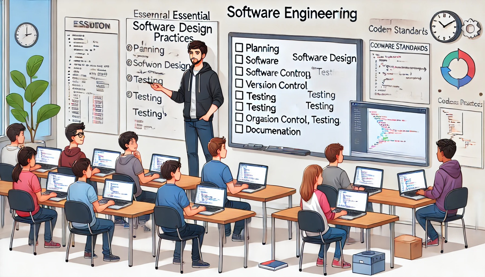

### Aula 67: Revisão de Práticas de Engenharia de Software

#### Introdução

Na aula de hoje, vamos revisar as **práticas fundamentais de Engenharia de Software**. Essas práticas ajudam a estruturar, planejar e gerenciar o desenvolvimento de sistemas, garantindo que o projeto seja de alta qualidade, sustentável e mantenha um padrão de boas práticas. Vamos abordar conceitos como **planejamento**, **design de software**, **versionamento de código**, **testes** e **documentação**.

---

### 1. Planejamento e Levantamento de Requisitos

O planejamento é a base de qualquer projeto de software bem-sucedido. Ele define objetivos, escopo, requisitos e o cronograma do projeto.

#### Passos para o Planejamento

1. **Levantamento de Requisitos**: Identificar o que o software deve fazer e para quem é destinado. Os requisitos podem ser funcionais (o que o sistema deve fazer) e não funcionais (como desempenho, segurança e usabilidade).
   
2. **Definição do Escopo**: Determinar quais funcionalidades estarão no projeto, evitando incluir funções que possam fugir do objetivo principal.

3. **Cronograma e Prazos**: Estabelecer um calendário para o desenvolvimento, organizando as tarefas e suas prioridades para cada etapa do projeto.

Exemplo de prática:
- Utilizar documentos como o **Documento de Requisitos de Software (DRS)** para registrar os requisitos e o escopo.

---

### 2. Design de Software e Arquitetura

O design de software define a estrutura e a organização do código, garantindo que ele seja fácil de entender, manter e expandir.

#### Princípios de Design

1. **Divisão em Módulos**: Dividir o sistema em partes menores (módulos) facilita o desenvolvimento e a manutenção.
   
2. **Padrão de Arquitetura MVC (Model-View-Controller)**: Muito utilizado em aplicações web, esse padrão separa a lógica do sistema em:
   - **Model**: Gerencia os dados e a lógica de negócios.
   - **View**: Exibe a interface para o usuário.
   - **Controller**: Intermedia a comunicação entre o modelo e a visualização.

3. **SOLID**: Um conjunto de cinco princípios para criação de código limpo e bem estruturado:
   - **S**ingle Responsibility: Cada classe ou módulo deve ter uma única responsabilidade.
   - **O**pen/Closed: O código deve estar aberto para extensão, mas fechado para modificação.
   - **L**iskov Substitution: Objetos de uma classe derivada devem ser substituíveis por objetos da classe base.
   - **I**nterface Segregation: Interfaces específicas são melhores que interfaces gerais.
   - **D**ependency Inversion: Depender de abstrações e não de implementações.

---

### 3. Versionamento de Código com Git

O versionamento de código é essencial para gerenciar as mudanças feitas durante o desenvolvimento. O Git é uma ferramenta poderosa para isso.

#### Práticas de Versionamento

1. **Commits Frequentes e Descritivos**: Faça commits sempre que concluir uma pequena tarefa e escreva mensagens descritivas que expliquem o que foi alterado.

2. **Uso de Branches**: Crie uma branch para cada nova funcionalidade ou correção de bug. Isso ajuda a manter o histórico do código organizado.

3. **Pull Requests**: Em projetos colaborativos, faça um pull request para que o código seja revisado por outros desenvolvedores antes de ser integrado ao projeto principal.

Exemplo:
- Criar uma branch `feature/login` para desenvolver o sistema de login, e depois fazer um pull request para revisar a integração ao código principal.

---

### 4. Testes Automatizados

Os testes automatizados são uma prática essencial para garantir a qualidade do software, permitindo verificar se cada parte do sistema funciona como esperado.

#### Tipos de Testes

1. **Testes Unitários**: Testam funções e métodos isolados para verificar se eles retornam os resultados corretos.

2. **Testes de Integração**: Avaliam a interação entre diferentes módulos do sistema.

3. **Testes de Interface**: Validam a experiência do usuário, garantindo que os componentes da interface funcionem corretamente.

Exemplo:
- Usar a biblioteca **Pytest** para escrever testes que verificam a funcionalidade de login, validando se o sistema permite ou bloqueia o acesso corretamente.

---

### 5. Documentação do Projeto

A documentação é uma prática fundamental para garantir que outras pessoas possam entender, usar e manter o projeto.

#### Principais Documentos

1. **README**: Um documento básico que explica o propósito do projeto, como configurá-lo, usá-lo e contribuir com ele.
   
2. **Documentação da API**: Descreve cada endpoint da API, explicando como ela funciona, os parâmetros e as respostas esperadas.

3. **Guia de Instalação e Configuração**: Instruções detalhadas para configurar o ambiente de desenvolvimento e as dependências.

4. **Documentação do Código**: Adicionar **docstrings** nas funções e classes para explicar o que cada parte do código faz.

Exemplo:
- Criar um arquivo `README.md` com uma descrição do projeto, instruções de instalação e exemplos de uso.

---

### 6. Manutenção e Refatoração

Com o tempo, é comum que o software precise de melhorias e ajustes. A refatoração melhora a qualidade do código sem alterar o comportamento do sistema.

#### Boas Práticas de Refatoração

1. **Eliminar Redundâncias**: Identifique e remova código duplicado, centralizando funções e componentes que realizam a mesma tarefa.

2. **Melhorar a Legibilidade**: Use nomes de variáveis e funções descritivas para que outros desenvolvedores entendam o propósito do código facilmente.

3. **Otimizar o Desempenho**: Identifique trechos de código que podem ser otimizados para melhorar a performance.

Exemplo:
- Substituir funções duplicadas por uma função única e reutilizável para evitar repetição de código.

---

### Conclusão

Revisar as práticas de Engenharia de Software é fundamental para desenvolver aplicações bem organizadas, eficientes e de fácil manutenção. Seguindo essas práticas, você pode garantir que o projeto seja claro, escalável e mais fácil de colaborar com outros desenvolvedores, promovendo a criação de um software de alta qualidade.