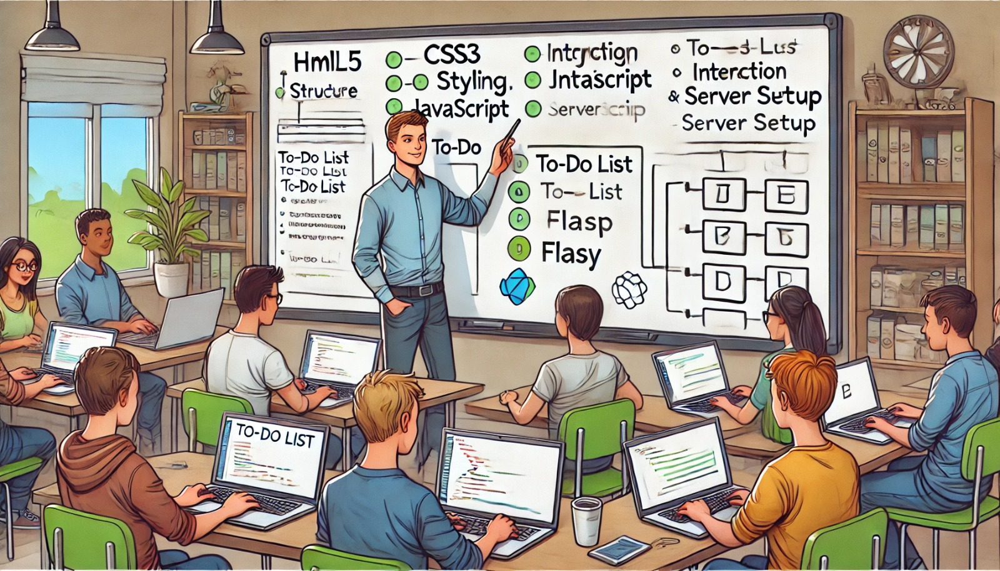

### Aula 68: Exercícios Práticos Integrados (HTML5, CSS3, JavaScript, Flask)

#### Introdução

Nesta aula, vamos colocar em prática os conceitos aprendidos ao longo do curso, integrando **HTML5, CSS3, JavaScript** e **Flask** para criar uma aplicação web completa. Este exercício prático é uma oportunidade para consolidar o conhecimento, conectar o front-end ao back-end e reforçar o desenvolvimento de aplicações web dinâmicas.

---

### Objetivo

Criar uma aplicação web simples que permita:

1. Exibir uma lista de tarefas (to-do list).
2. Adicionar, atualizar e remover tarefas.
3. Utilizar um design responsivo.
4. Conectar o front-end ao Flask, que gerenciará as rotas e manipulação do banco de dados.

---

### Estrutura da Aplicação

1. **HTML5**: Estrutura e semântica da página.
2. **CSS3**: Estilos e layout responsivo.
3. **JavaScript**: Interatividade e manipulação do DOM.
4. **Flask**: Servidor e lógica de back-end, gerenciando as rotas e o banco de dados.

---

### Passo a Passo do Exercício

#### 1. Configuração do Projeto

1. **Criação do Ambiente de Trabalho**:
   - Crie uma pasta chamada `todo_app` e navegue até ela.
   - Configure o ambiente virtual com `python -m venv venv` e ative-o.

2. **Instalação do Flask**:
   - Instale o Flask usando o comando `pip install flask`.

3. **Estrutura de Pastas**:
   - Estruture o projeto da seguinte forma:

     ```
     todo_app/
     ├── app/
     │   ├── static/
     │   │   └── style.css
     │   ├── templates/
     │   │   └── index.html
     │   ├── __init__.py
     │   ├── routes.py
     │   └── models.py
     ├── config.py
     ├── run.py
     └── requirements.txt
     ```

#### 2. Configuração do Flask e Banco de Dados

1. **Configuração Básica**:
   No `config.py`, configure a URI do banco de dados SQLite:

   ```python
   import os
   basedir = os.path.abspath(os.path.dirname(__file__))

   class Config:
       SQLALCHEMY_DATABASE_URI = 'sqlite:///' + os.path.join(basedir, 'app.db')
       SQLALCHEMY_TRACK_MODIFICATIONS = False
   ```

2. **Inicialização da Aplicação**:
   No `__init__.py` da pasta `app`, inicialize o Flask e configure o banco de dados:

   ```python
   from flask import Flask
   from flask_sqlalchemy import SQLAlchemy
   from config import Config

   db = SQLAlchemy()

   def create_app():
       app = Flask(__name__)
       app.config.from_object(Config)
       db.init_app(app)

       with app.app_context():
           db.create_all()

       from .routes import bp as routes_bp
       app.register_blueprint(routes_bp)

       return app
   ```

3. **Definição do Modelo**:
   No `models.py`, defina um modelo de tarefa simples:

   ```python
   from app import db

   class Task(db.Model):
       id = db.Column(db.Integer, primary_key=True)
       title = db.Column(db.String(200), nullable=False)
       completed = db.Column(db.Boolean, default=False)

       def __repr__(self):
           return f"<Task {self.title}>"
   ```

#### 3. Criação das Rotas no Flask

No `routes.py`, crie as rotas para exibir, adicionar e remover tarefas:

```python
from flask import Blueprint, render_template, request, redirect, url_for
from app import db
from app.models import Task

bp = Blueprint('routes', __name__)

@bp.route("/")
def index():
    tasks = Task.query.all()
    return render_template("index.html", tasks=tasks)

@bp.route("/add", methods=["POST"])
def add_task():
    title = request.form.get("title")
    if title:
        new_task = Task(title=title)
        db.session.add(new_task)
        db.session.commit()
    return redirect(url_for("routes.index"))

@bp.route("/delete/<int:task_id>")
def delete_task(task_id):
    task = Task.query.get(task_id)
    if task:
        db.session.delete(task)
        db.session.commit()
    return redirect(url_for("routes.index"))
```

#### 4. Estrutura HTML5 e Estilos com CSS3

1. **HTML (index.html)**:
   No arquivo `index.html`, crie o layout básico da aplicação:

   ```html
   <!DOCTYPE html>
   <html lang="pt-BR">
   <head>
       <meta charset="UTF-8">
       <meta name="viewport" content="width=device-width, initial-scale=1.0">
       <title>To-Do List</title>
       <link rel="stylesheet" href="{{ url_for('static', filename='style.css') }}">
   </head>
   <body>
       <div class="container">
           <h1>Lista de Tarefas</h1>
           <form action="{{ url_for('routes.add_task') }}" method="POST">
               <input type="text" name="title" placeholder="Nova tarefa">
               <button type="submit">Adicionar</button>
           </form>
           <ul>
               
                   <li>
                       <span>{{ task.title }}</span>
                       <a href="{{ url_for('routes.delete_task', task_id=task.id) }}">Excluir</a>
                   </li>
               
           </ul>
       </div>
   </body>
   </html>
   ```

2. **CSS (style.css)**:
   No arquivo `style.css`, estilize a aplicação com um layout responsivo:

   ```css
   body {
       font-family: Arial, sans-serif;
       display: flex;
       justify-content: center;
       align-items: center;
       height: 100vh;
       margin: 0;
   }

   .container {
       max-width: 600px;
       width: 100%;
       padding: 20px;
       background-color: #f9f9f9;
       border-radius: 8px;
       box-shadow: 0 4px 8px rgba(0, 0, 0, 0.1);
   }

   h1 {
       text-align: center;
       color: #333;
   }

   form {
       display: flex;
       justify-content: space-between;
       margin-bottom: 20px;
   }

   input[type="text"] {
       width: 80%;
       padding: 10px;
   }

   button {
       padding: 10px 20px;
       cursor: pointer;
   }

   ul {
       list-style-type: none;
       padding: 0;
   }

   li {
       display: flex;
       justify-content: space-between;
       padding: 10px;
       border-bottom: 1px solid #ddd;
   }
   ```

#### 5. Adicionando Interatividade com JavaScript

Adicione interatividade para marcar uma tarefa como concluída.

```html
<script>
    document.addEventListener("DOMContentLoaded", () => {
        document.querySelectorAll(".task-item").forEach(item => {
            item.addEventListener("click", () => {
                item.classList.toggle("completed");
            });
        });
    });
</script>
```

CSS para diferenciar as tarefas concluídas:

```css
.completed {
    text-decoration: line-through;
    color: #888;
}
```

---

### Conclusão

Com esta prática integrada, revisamos os principais conceitos de HTML5, CSS3, JavaScript e Flask, conectando front-end e back-end em uma aplicação completa. Esses fundamentos são essenciais para a construção de aplicações web dinâmicas e interativas, preparadas para atender as necessidades dos usuários.