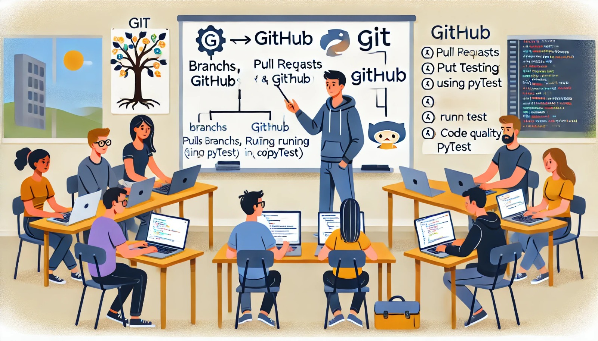

### Aula 69: Exercícios Práticos Integrados (Git, GitHub, Testes Automatizados)

#### Introdução

Nesta aula, vamos aplicar os conceitos de **Git**, **GitHub** e **Testes Automatizados** em um exercício prático integrado. Esses elementos são fundamentais para o desenvolvimento colaborativo e para garantir a qualidade do software. Vamos praticar o fluxo de trabalho de versionamento com Git e GitHub, além de criar testes automatizados para verificar a funcionalidade do código e assegurar que as mudanças não introduzam erros.

---

### Objetivo

O objetivo deste exercício é:

1. **Gerenciar o Projeto com Git e GitHub**: Usar Git para controlar as versões do projeto e GitHub para colaborar e compartilhar o código.
2. **Implementar Testes Automatizados**: Escrever testes unitários e de integração para garantir que as funcionalidades principais do projeto funcionem corretamente.
3. **Utilizar Pull Requests e Revisão de Código**: Simular um ambiente colaborativo onde as mudanças são revisadas antes de serem integradas ao projeto principal.

---

### Passo a Passo do Exercício

#### 1. Configuração do Repositório Git

1. **Inicializar o Repositório**:
   - Crie uma pasta para o projeto, navegue até ela no terminal e inicialize um repositório Git.
   
   ```bash
   git init
   ```

2. **Criar um Repositório no GitHub**:
   - Acesse o GitHub, crie um novo repositório e siga as instruções para conectar o repositório local ao remoto:

   ```bash
   git remote add origin URL_DO_REPOSITORIO
   ```

3. **Primeiro Commit e Push**:
   - Adicione e faça o commit dos arquivos iniciais.
   
   ```bash
   git add .
   git commit -m "Primeiro commit - Configuração inicial do projeto"
   git push -u origin main
   ```

---

#### 2. Criar Branches e Funcionalidades

No Git, é uma boa prática criar uma nova branch para cada nova funcionalidade ou correção de bug.

1. **Criar uma Nova Branch**:
   - Crie uma branch chamada `feature/testes` para desenvolver os testes automatizados.
   
   ```bash
   git checkout -b feature/testes
   ```

2. **Adicionar Funcionalidades**:
   - Dentro desta branch, adicione ou modifique funcionalidades do projeto. Neste exemplo, vamos criar uma função de exemplo para adicionar duas variáveis e salvar no repositório.

---

#### 3. Implementação de Testes Automatizados

Os testes automatizados ajudam a garantir que o código funcione conforme o esperado. Vamos criar testes unitários usando **Pytest**.

1. **Instalar o Pytest**:
   - Certifique-se de que o Pytest esteja instalado em seu ambiente.

   ```bash
   pip install pytest
   ```

2. **Criar o Arquivo de Teste**:
   - Na pasta do projeto, crie uma pasta `tests` e dentro dela um arquivo `test_funcionalidades.py` para armazenar os testes.

3. **Escrever Testes Unitários**:
   - No arquivo `test_funcionalidades.py`, escreva um teste para verificar a função de adição.

   ```python
   # Arquivo: tests/test_funcionalidades.py

   def adicionar(a, b):
       return a + b

   def test_adicionar():
       assert adicionar(2, 3) == 5
       assert adicionar(-1, 1) == 0
       assert adicionar(0, 0) == 0
   ```

4. **Executar os Testes**:
   - No terminal, execute o Pytest para verificar se o teste está funcionando.

   ```bash
   pytest
   ```

   Se os testes estiverem corretos, o terminal indicará que todos os testes passaram. Caso contrário, ele exibirá as falhas e onde elas ocorreram.

---

#### 4. Enviar as Alterações para o Repositório no GitHub

1. **Commit na Branch de Testes**:
   - Depois de adicionar e validar os testes, faça um commit dessas alterações.

   ```bash
   git add .
   git commit -m "Implementação de testes para a função de adição"
   ```

2. **Enviar a Branch para o GitHub**:
   - Envie a branch `feature/testes` para o repositório remoto.

   ```bash
   git push origin feature/testes
   ```

---

#### 5. Criar um Pull Request e Fazer Revisão de Código

No GitHub, o Pull Request (PR) permite que você solicite a revisão de uma branch antes de mesclá-la à branch principal.

1. **Criar o Pull Request**:
   - No GitHub, acesse a branch `feature/testes` e clique em **New Pull Request** para iniciar um PR.

2. **Revisar e Aprovar o Código**:
   - No PR, revise o código e, se tudo estiver correto, aprove a solicitação.

3. **Mesclar o PR com a Branch Principal**:
   - Mescle a branch de testes (`feature/testes`) com a branch `main`.

4. **Atualizar o Repositório Local**:
   - Volte para a branch `main` no repositório local e sincronize as alterações mescladas.

   ```bash
   git checkout main
   git pull origin main
   ```

---

### 6. Expandindo os Testes

Para aumentar a cobertura de testes, vamos adicionar testes de integração que garantam o funcionamento conjunto de diferentes partes do sistema.

1. **Criar Testes de Integração**:
   - No mesmo arquivo `test_funcionalidades.py`, adicione testes que verifiquem a interação de diferentes funções ou componentes, como o armazenamento de dados e o uso de variáveis globais.

   ```python
   # Exemplo de teste de integração
   def test_operacoes_completas():
       resultado = adicionar(10, 20) * 2
       assert resultado == 60
   ```

2. **Executar os Testes de Integração**:
   - Rode novamente o Pytest para garantir que todos os testes (unitários e de integração) estejam passando.

---

### Conclusão

Esta prática integrada de Git, GitHub e testes automatizados oferece uma experiência completa no fluxo de desenvolvimento colaborativo, controle de versão e garantia de qualidade. Esse processo é essencial em projetos de software, especialmente em equipes, pois permite controlar versões, revisar mudanças e garantir a qualidade do código.