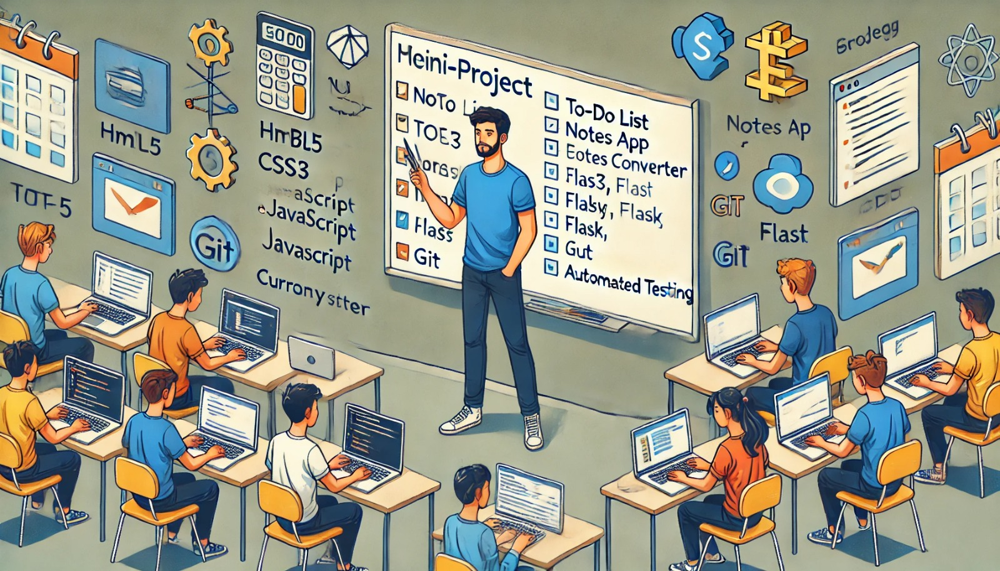

### Aula 70: Mini-Projetos de Integração (Desafios de Programação)

#### Introdução

Nesta aula, vamos aplicar todos os conceitos abordados no curso em **mini-projetos de integração**. Estes desafios de programação são projetados para testar sua habilidade de combinar HTML5, CSS3, JavaScript, Flask, Git, GitHub e testes automatizados em aplicações práticas. Os mini-projetos são uma excelente oportunidade para resolver problemas reais, experimentar abordagens criativas e fortalecer seu conhecimento em desenvolvimento web.

---

### Objetivo

Criar mini-projetos que integram habilidades de front-end e back-end, versionamento e testes. Esses projetos desafiam você a:

1. **Projetar e estruturar aplicações web completas**.
2. **Escrever código limpo e funcional** com HTML5, CSS3, JavaScript e Flask.
3. **Aplicar controle de versão e colaboração usando Git e GitHub**.
4. **Implementar testes automatizados para garantir a qualidade do código**.

---

### Descrição dos Mini-Projetos

Cada projeto aborda um desafio específico que envolve o desenvolvimento de funcionalidades com o uso de diferentes tecnologias. Escolha um dos projetos abaixo e desenvolva a solução.

---

### Projeto 1: Aplicação de Notas (Notes App)

Crie uma aplicação onde o usuário pode adicionar, visualizar, editar e excluir notas. Cada nota deve ter um título e um conteúdo.

**Funcionalidades**:
- **Adicionar Notas**: Formulário que permite ao usuário inserir um título e conteúdo.
- **Listar Notas**: Exibir todas as notas criadas em uma lista.
- **Editar e Excluir Notas**: Opções para o usuário editar ou excluir uma nota.
- **Salvar no Banco de Dados**: Salvar todas as notas em um banco de dados SQLite.

**Requisitos**:
- Front-end em HTML5 e CSS3.
- Interatividade com JavaScript (edição e exclusão no front-end).
- Back-end com Flask para manipulação de dados.
- Testes unitários para a função de adição de notas e a função de listagem.
- Controle de versão com Git e GitHub.

---

### Projeto 2: Gerenciador de Tarefas com Prioridade

Crie uma aplicação de tarefas (to-do list) onde cada tarefa tem uma prioridade (baixa, média, alta). O usuário deve poder adicionar tarefas, visualizar tarefas por prioridade, marcar tarefas como concluídas e excluir tarefas.

**Funcionalidades**:
- **Adicionar Tarefas**: Formulário para inserir a descrição e a prioridade da tarefa.
- **Filtrar por Prioridade**: Exibir tarefas de acordo com a prioridade selecionada.
- **Marcar como Concluído**: Permitir que o usuário marque uma tarefa como concluída.
- **Excluir Tarefas**: Opção para excluir uma tarefa da lista.

**Requisitos**:
- Front-end responsivo com HTML5, CSS3, e JavaScript.
- Back-end em Flask para manipulação de dados.
- Testes para validar o filtro por prioridade e a função de exclusão.
- Controle de versão usando Git e GitHub, com uso de branches para cada nova funcionalidade.

---

### Projeto 3: Aplicação de Cotação de Moedas

Crie uma aplicação onde o usuário pode visualizar a cotação de uma moeda em relação a outras moedas (por exemplo, de USD para EUR, GBP, etc.).

**Funcionalidades**:
- **Escolha de Moeda de Origem e Destino**: Interface que permite ao usuário escolher as moedas.
- **Exibir Cotação Atual**: Mostrar a cotação da moeda escolhida.
- **Atualizar Cotação**: Permitir que o usuário atualize a cotação com dados em tempo real (simulado com valores estáticos para o projeto).

**Requisitos**:
- Front-end com HTML5 e CSS3 para a interface.
- JavaScript para atualizar a cotação e simular a obtenção dos valores.
- Flask para gerenciar as rotas e a lógica de back-end.
- Testes para verificar o cálculo da conversão e a funcionalidade de atualização.
- Controle de versão com Git e GitHub.

---

### Dicas para Desenvolvimento

1. **Planeje Antes de Codar**: Defina claramente o que cada funcionalidade deve fazer e esboce uma estrutura antes de começar a codificar.
2. **Use Commits Frequentes e Descritivos**: Mantenha o controle do seu progresso com commits que expliquem cada alteração ou adição ao projeto.
3. **Teste o Código Regularmente**: Escreva testes para funcionalidades principais e rode-os sempre que fizer uma mudança significativa.
4. **Desenvolva em Branches**: Para cada nova funcionalidade, crie uma branch para evitar conflitos e facilitar a organização.

---

### Exemplo Prático: Iniciando o Projeto de Gerenciador de Tarefas

1. **Inicializar o Repositório**:
   - Crie uma pasta para o projeto, inicialize o Git e configure o repositório no GitHub.

   ```bash
   git init
   git remote add origin URL_DO_REPOSITORIO
   ```

2. **Estruturar o Projeto**:
   - Crie a estrutura de pastas, como `static`, `templates`, `app`, e os arquivos iniciais.

3. **Implementar Funcionalidades**:
   - Implemente o front-end básico e adicione as funcionalidades gradualmente.
   - Use Flask para configurar as rotas de adição, listagem, e exclusão de tarefas.

4. **Adicionar Testes Automatizados**:
   - Utilize o Pytest para escrever testes unitários e de integração para a aplicação.
   - Verifique se as funcionalidades principais, como adição e exclusão de tarefas, estão funcionando corretamente.

5. **Criar um Pull Request no GitHub**:
   - Suba a branch com a nova funcionalidade e crie um pull request para revisão.

---

### Conclusão

Esses mini-projetos de integração oferecem um desafio prático e completo, consolidando seus conhecimentos em HTML5, CSS3, JavaScript, Flask, Git e testes automatizados. Essa experiência prática é essencial para desenvolver sua habilidade em resolver problemas e construir aplicações robustas e funcionais.