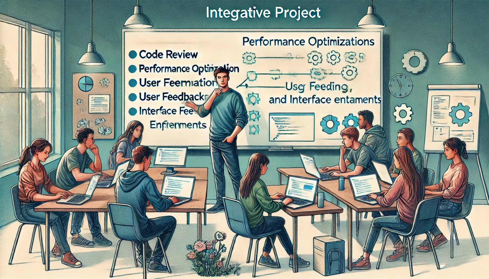

### Aula 71: Projeto Integrador: Ajustes e Melhorias

#### Introdução

Nesta aula, vamos focar nos **ajustes finais** e **melhorias** do Projeto Integrador. Esta é uma etapa importante onde refinamos o projeto, corrigimos possíveis erros, otimizamos o desempenho e melhoramos a experiência do usuário. Esses ajustes finais garantem que o projeto esteja pronto para ser apresentado e utilizado, atendendo a todos os requisitos definidos.

---

### Objetivo

O objetivo desta aula é:

1. **Realizar Correções e Ajustes**: Revisar o código, corrigir erros e garantir que todas as funcionalidades estejam funcionando corretamente.
2. **Melhorar a Usabilidade e Desempenho**: Implementar melhorias na interface e na eficiência do código.
3. **Refatorar o Código**: Organizar e simplificar o código para torná-lo mais legível e fácil de manter.
4. **Adicionar Funcionalidades Extras (Opcional)**: Implementar funcionalidades adicionais que enriqueçam o projeto.

---

### Etapas de Ajustes e Melhorias

#### 1. Revisão Completa do Código

Faça uma revisão completa do código, analisando cada módulo e verificando a consistência de cada funcionalidade.

- **Correção de Erros (Bugs)**: Teste cada funcionalidade para identificar possíveis erros e corrigi-los. 
- **Verificação de Compatibilidade**: Teste o projeto em diferentes navegadores e dispositivos para garantir que funcione em qualquer plataforma.
- **Otimização do Código**: Verifique o código em busca de trechos que podem ser simplificados ou otimizados.

#### Checklist para Revisão de Código:

- **Funções e Variáveis Descritivas**: Use nomes claros e descritivos para variáveis e funções.
- **Remoção de Código Inútil**: Apague código não utilizado, funções duplicadas e comentários desnecessários.
- **Organização em Módulos**: Separe o código em módulos bem definidos, seguindo as boas práticas de estrutura de projetos.

---

#### 2. Melhoria de Usabilidade e Interface

Avalie a interface do projeto e implemente melhorias para que o usuário tenha uma experiência mais intuitiva e agradável.

- **Estilos e Responsividade**: Verifique se o design está responsivo e bem adaptado para dispositivos móveis.
- **Organização Visual**: Melhore a disposição dos elementos na interface, utilizando margens, espaçamentos e alinhamento adequado.
- **Feedback Visual**: Adicione feedback visual em botões e ações para que o usuário saiba quando uma ação foi executada com sucesso.

Exemplo de Melhorias de Interface:
- **Botão de Carregamento**: Adicione um indicador de carregamento para ações que demoram mais tempo, como envio de formulários.
- **Confirmações para Ações Importantes**: Exiba mensagens de confirmação para ações críticas, como exclusão de dados.

---

#### 3. Otimização de Desempenho

Otimize o desempenho do projeto para garantir que ele funcione de forma rápida e eficiente, especialmente se houver processamento ou carregamento de dados.

- **Minimizar Requisições ao Servidor**: Reduza as chamadas desnecessárias ao servidor, utilizando cache quando possível.
- **Otimização de Imagens**: Comprima imagens para que carreguem mais rapidamente e use formatos adequados.
- **Carregamento Assíncrono de Recursos**: Utilize o carregamento assíncrono (AJAX) para melhorar a velocidade de carregamento de elementos dinâmicos.

Exemplo de Melhoria de Desempenho:
- **Lazy Loading de Imagens**: Carregue imagens somente quando elas aparecem na tela do usuário, reduzindo o tempo de carregamento inicial.

---

#### 4. Testes Finais e Validação

Realize uma rodada final de testes para validar que tudo funciona como esperado.

- **Testes de Funcionalidade**: Revise cada funcionalidade do sistema, executando testes para garantir que tudo esteja correto.
- **Testes de Interface**: Verifique se todos os elementos visuais estão bem alinhados e funcionam como deveriam em diferentes dispositivos e tamanhos de tela.
- **Testes de Usuário**: Peça para que colegas ou amigos testem o projeto e coletar feedback sobre a experiência de uso.

---

#### 5. Refatoração do Código

A refatoração do código envolve melhorar a estrutura sem alterar o funcionamento do sistema. Isso torna o código mais limpo, fácil de entender e de manter.

- **Organize em Funções/Módulos**: Divida trechos longos de código em funções menores e mais específicas.
- **Elimine Repetições**: Identifique padrões e agrupe trechos duplicados de código em funções reutilizáveis.
- **Comente Funções e Classes Complexas**: Adicione docstrings explicativas para funções que realizam operações mais complexas.

---

#### 6. Adicionar Funcionalidades Extras (Opcional)

Se houver tempo disponível, considere adicionar pequenas melhorias ou novas funcionalidades para enriquecer o projeto.

- **Funcionalidade de Pesquisa**: Adicione uma barra de pesquisa para facilitar a navegação no conteúdo.
- **Filtros de Conteúdo**: Permita que o usuário filtre conteúdo por categorias, tags ou datas.
- **Relatórios ou Análises**: Caso aplicável, adicione relatórios que mostrem métricas do sistema, como o total de usuários, tarefas concluídas, etc.

---

### Conclusão

Com a aula de ajustes e melhorias, completamos o Projeto Integrador, preparando-o para ser apresentado e utilizado. Essa etapa final garante que o projeto esteja bem estruturado, funcional, de fácil manutenção e com uma experiência de usuário aprimorada.