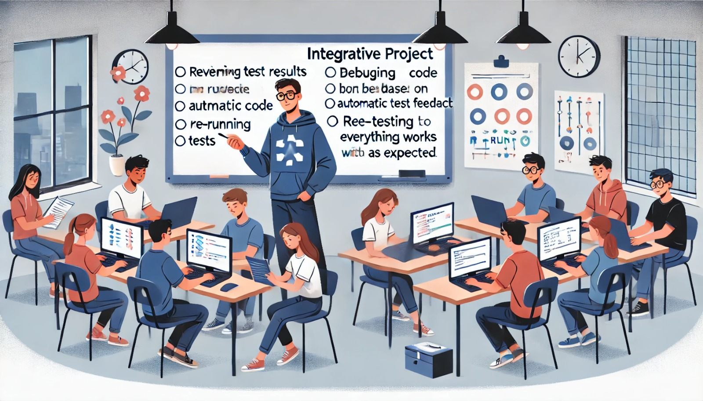

### Aula 72: Projeto Integrador: Implementação de Feedback dos Testes

#### Introdução

Na fase final do Projeto Integrador, vamos focar na **implementação do feedback dos testes**. Esta etapa envolve revisar os resultados dos testes automatizados e dos testes manuais realizados no projeto. Baseado nos resultados dos testes, faremos ajustes e melhorias no código para garantir que o projeto esteja completamente funcional e livre de problemas.

---

### Objetivo

O objetivo desta aula é:

1. **Analisar os Resultados dos Testes**: Revisar os feedbacks dos testes automatizados e manuais.
2. **Implementar Correções e Ajustes**: Corrigir erros encontrados nos testes e otimizar o código, se necessário.
3. **Melhorar a Robustez do Código**: Garantir que o projeto esteja resistente a erros e funcionando corretamente em todas as funcionalidades.
4. **Reexecutar os Testes**: Validar se as correções foram bem-sucedidas e se o sistema está livre de erros.

---

### Etapas para Implementação do Feedback dos Testes

#### 1. Revisão dos Feedbacks dos Testes Automatizados

Os testes automatizados fornecem feedback sobre a funcionalidade e a robustez do código. Revise os logs e mensagens de erro gerados pelos testes para identificar problemas.

- **Erros de Função**: Verifique se há funções que não retornam os resultados esperados.
- **Inconsistências em Inputs/Outputs**: Confirme que todas as entradas e saídas estão formatadas corretamente e que não ocorrem erros com entradas inesperadas.
- **Cobertura de Testes**: Verifique se todas as funcionalidades foram testadas. Caso algo tenha sido ignorado, adicione novos testes.

**Exemplo**: Se o teste de uma função de login falhou, verifique os parâmetros e a lógica de autenticação. Certifique-se de que a função manipule erros de autenticação de maneira adequada.

---

#### 2. Revisão dos Feedbacks dos Testes Manuais

Além dos testes automatizados, é importante revisar os resultados dos testes manuais realizados pelos usuários ou colegas de equipe. Esses testes oferecem uma visão prática de como o sistema está funcionando na experiência real.

- **Funcionalidades Principais**: Verifique se funcionalidades críticas, como login, cadastro, edição e exclusão, estão funcionando como esperado.
- **Interface e Navegação**: Teste se todos os elementos da interface estão acessíveis e se a navegação está intuitiva.
- **Usabilidade e Feedback Visual**: Certifique-se de que o sistema está fornecendo feedback claro para as ações do usuário, como confirmações de sucesso e mensagens de erro.

**Exemplo**: Se um usuário relata que não conseguiu excluir um item, revise a lógica de exclusão e garanta que o botão está funcional e que a ação é refletida no banco de dados.

---

#### 3. Implementação de Correções e Melhorias

Com base nos feedbacks obtidos, implemente as correções e melhorias necessárias para resolver os problemas identificados.

- **Corrigir Erros Identificados**: Ajuste o código para resolver erros específicos reportados nos testes.
- **Adicionar Validações**: Se necessário, adicione validações adicionais para garantir que os dados inseridos sejam corretos e no formato esperado.
- **Refinar a Interface**: Melhore a experiência do usuário com ajustes visuais, simplificação de formulários e organização dos elementos na tela.

**Exemplo**: Se uma funcionalidade de filtro de dados está apresentando falhas, revise a lógica de filtragem e garanta que ela esteja aplicando os filtros corretamente.

---

#### 4. Reexecução dos Testes Automatizados

Após as correções, reexecute os testes automatizados para garantir que os problemas foram resolvidos e que não surgiram novos erros.

- **Executar Testes Unitários e de Integração**: Teste cada função individualmente e a interação entre diferentes partes do sistema.
- **Verificar Cobertura Completa dos Testes**: Certifique-se de que todas as funcionalidades principais estão sendo testadas.
- **Documentar Resultados dos Testes**: Registre os resultados para acompanhar as melhorias e garantir a estabilidade do código.

**Exemplo**: Se um teste de integração falhou anteriormente por um erro de comunicação entre o front-end e o back-end, execute novamente para verificar se o problema foi resolvido.

---

#### 5. Revisão Final e Preparação para Entrega

Após a implementação das correções, faça uma revisão final de todas as funcionalidades e prepare o projeto para a entrega.

- **Revisão de Código**: Verifique se o código está limpo, organizado e documentado.
- **Últimos Ajustes de Interface**: Certifique-se de que a interface esteja apresentável e que todos os elementos