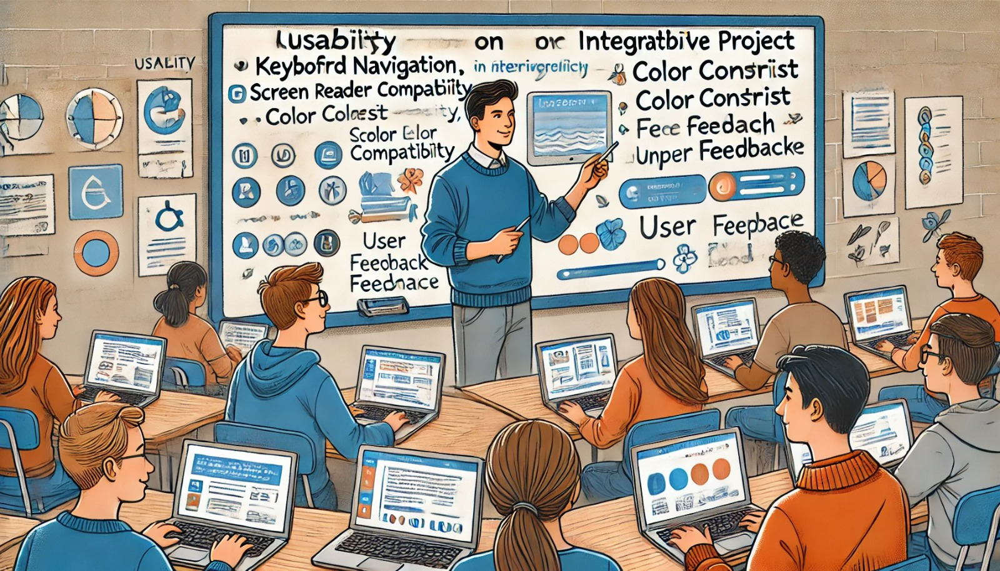

### Aula 73: Projeto Integrador: Testes de Usabilidade e Acessibilidade

#### Introdução

Na aula de hoje, vamos focar nos **testes de usabilidade e acessibilidade** para o Projeto Integrador. Estes testes são essenciais para garantir que a aplicação não apenas funcione corretamente, mas também seja intuitiva e acessível para todos os usuários, incluindo aqueles com deficiências ou necessidades especiais. A usabilidade verifica se a interface é fácil de usar e entender, enquanto a acessibilidade se preocupa em garantir que a aplicação seja acessível para todos.

---

### Objetivo

O objetivo desta aula é:

1. **Avaliar a Usabilidade da Aplicação**: Testar a facilidade de uso e intuitividade da interface.
2. **Verificar a Acessibilidade**: Identificar e corrigir possíveis barreiras de acessibilidade para diferentes usuários.
3. **Coletar Feedback dos Usuários**: Realizar testes com usuários para coletar insights e identificar melhorias.
4. **Implementar Melhorias Baseadas no Feedback**: Aplicar ajustes que aumentem a acessibilidade e a usabilidade do sistema.

---

### 1. Testes de Usabilidade

Os testes de usabilidade ajudam a garantir que a aplicação seja intuitiva e fácil de usar. Eles focam em aspectos como navegação, clareza dos textos, disposição dos elementos e resposta às ações do usuário.

#### Componentes Importantes na Usabilidade

1. **Navegação**: A estrutura de navegação é intuitiva? O usuário consegue encontrar as informações e funcionalidades facilmente?
2. **Feedback Visual**: A aplicação fornece feedback visual claro, como mensagens de confirmação e alertas de erro?
3. **Organização da Interface**: A interface é organizada e os elementos estão dispostos de forma lógica?
4. **Facilidade de Uso**: O sistema é fácil de aprender e operar, mesmo para usuários iniciantes?

#### Exemplos de Testes de Usabilidade

1. **Teste de Navegação**:
   - Peça para um usuário navegar por diferentes páginas e realizar ações comuns, como adicionar ou editar um item. Observe se ele encontra alguma dificuldade.

2. **Teste de Clareza de Feedback Visual**:
   - Verifique se os botões de ação fornecem feedback visual quando clicados e se os alertas de erro ou sucesso são claros e informativos.

3. **Organização e Layout**:
   - Revise a disposição dos elementos na interface, garantindo que informações e botões importantes estejam visíveis e acessíveis.

---

### 2. Testes de Acessibilidade

Acessibilidade é a prática de tornar a aplicação utilizável por pessoas com diferentes habilidades e necessidades, como pessoas com deficiências visuais, auditivas ou motoras. Seguir boas práticas de acessibilidade ajuda a criar uma experiência inclusiva.

#### Componentes Importantes na Acessibilidade

1. **Uso de Marcação Semântica (HTML5)**: Utilize tags semânticas, como `<header>`, `<nav>`, `<main>`, e `<footer>`, que ajudam tecnologias assistivas a interpretar a estrutura da página.
2. **Texto Alternativo para Imagens**: Adicione `alt` nas imagens para descrever seu conteúdo a pessoas que utilizam leitores de tela.
3. **Teclas de Acesso e Navegação por Teclado**: Garanta que o sistema possa ser navegado usando apenas o teclado.
4. **Contraste e Legibilidade**: Use cores contrastantes para melhorar a leitura e permitir que o texto seja legível para pessoas com dificuldades de visão.

#### Exemplos de Testes de Acessibilidade

1. **Navegação com Teclado**:
   - Tente navegar pelo sistema usando apenas o teclado. Verifique se todas as ações e links são acessíveis sem a necessidade do mouse.

2. **Testes com Leitores de Tela**:
   - Se possível, utilize um leitor de tela (como o NVDA ou o VoiceOver) para testar a navegação e garantir que todas as informações importantes sejam anunciadas.

3. **Verificação de Contraste**:
   - Use ferramentas como o WebAIM Contrast Checker para garantir que o texto e o fundo tenham contraste suficiente para serem lidos facilmente.

4. **Verificação de Elementos Interativos**:
   - Certifique-se de que todos os elementos interativos (botões, links, campos de formulário) tenham descrições claras e sejam facilmente acionados.

---

### 3. Coletando Feedback dos Usuários

Uma das melhores formas de melhorar a usabilidade e acessibilidade de um sistema é coletar feedback direto de usuários reais.

- **Sessões de Testes com Usuários**: Convide usuários para testar a aplicação e observe suas interações, tomando nota de qualquer dificuldade que enfrentem.
- **Questionários e Formulários de Feedback**: Após o teste, peça que os usuários respondam a um breve questionário sobre a experiência de uso.
- **Entrevistas**: Converse com os usuários para entender melhor suas necessidades e sugestões para melhorias.

#### Exemplos de Perguntas para Feedback

1. Qual foi sua impressão inicial da interface? A aplicação parece intuitiva?
2. Houve alguma parte da aplicação que foi confusa ou difícil de entender?
3. Você se sentiu limitado em algum momento ao usar a aplicação com um teclado ou outra tecnologia assistiva?
4. Quais melhorias você sugeriria para tornar a experiência mais acessível?

---

### 4. Implementando Melhorias Baseadas no Feedback

Com o feedback dos testes de usabilidade e acessibilidade, faça os ajustes necessários para otimizar a experiência do usuário.

- **Ajuste de Layout e Navegação**: Se os usuários relataram dificuldade em navegar, reorganize os elementos para tornar a interface mais intuitiva.
- **Melhorias de Acessibilidade**: Adicione descrições de acessibilidade onde necessário e ajuste o contraste ou o tamanho do texto conforme o feedback.
- **Aprimoramento do Feedback Visual**: Ajuste os alertas e confirmações para que sejam mais claros e forneçam informações úteis ao usuário.

#### Exemplo de Implementação

Se um usuário relatou dificuldade para encontrar o botão de salvar, reavalie o posicionamento e destaque o botão para facilitar a localização. Se o feedback indicou baixo contraste, ajuste as cores para melhorar a visibilidade.

---

### Conclusão

Os testes de usabilidade e acessibilidade são essenciais para garantir que a aplicação seja acessível, intuitiva e inclusiva para todos os tipos de usuários. Melhorar esses aspectos do projeto não só amplia o alcance da aplicação, mas também contribui para uma experiência de usuário positiva e para o sucesso do projeto. Ao incorporar o feedback, você aprimora a aplicação e se aproxima das melhores práticas de desenvolvimento web.