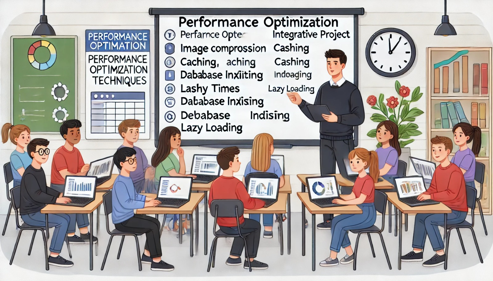

### Aula 74: Projeto Integrador: Otimização de Performance

#### Introdução

Nesta aula, vamos focar na **otimização de performance** do Projeto Integrador. A otimização de performance é essencial para que a aplicação funcione de forma rápida e eficiente, especialmente em dispositivos de baixa potência ou com conexões de internet lentas. Aplicações rápidas melhoram a experiência do usuário, reduzem a taxa de abandono e ajudam a manter o projeto competitivo e acessível para todos.

---

### Objetivo

O objetivo desta aula é:

1. **Identificar Gargalos de Performance**: Detectar elementos ou funcionalidades que estão consumindo muitos recursos ou tempo de processamento.
2. **Aplicar Técnicas de Otimização**: Implementar melhorias para reduzir o tempo de carregamento e melhorar o desempenho geral.
3. **Monitorar e Avaliar as Melhorias**: Utilizar ferramentas para medir o impacto das otimizações implementadas.

---

### Etapas de Otimização de Performance

#### 1. Identificação de Gargalos de Performance

Antes de otimizar, é importante identificar quais elementos estão afetando o desempenho da aplicação. Existem várias áreas comuns que podem causar lentidão:

- **Tempo de Carregamento da Página**: Imagens grandes e muitos scripts podem aumentar o tempo de carregamento.
- **Consultas ao Banco de Dados**: Consultas não otimizadas ou excesso de chamadas ao banco de dados podem tornar o sistema lento.
- **Renderização de Componentes Front-end**: Processamento pesado no JavaScript ou renderização excessiva de componentes afeta a fluidez da interface.

**Ferramentas para Identificar Gargalos**:

- **Google Lighthouse**: Avalia a performance, acessibilidade e SEO, fornecendo sugestões de melhoria.
- **DevTools do Navegador**: Mostra o tempo de carregamento de cada recurso (imagens, scripts, etc.) e permite inspecionar o consumo de memória.
- **Profiler de Banco de Dados**: Ajuda a monitorar o desempenho de consultas SQL, identificando consultas lentas.

---

#### 2. Otimização de Imagens e Recursos Estáticos

Imagens grandes e arquivos estáticos pesados são um dos principais fatores que afetam o tempo de carregamento de uma página.

- **Redução do Tamanho das Imagens**: Comprima as imagens usando ferramentas como TinyPNG ou Squoosh.
- **Lazy Loading de Imagens**: Carregue imagens apenas quando o usuário rolar a página até elas, evitando o carregamento desnecessário.
- **Uso de Formatos Otimizados**: Formatos como WebP são mais leves que JPEG ou PNG e mantêm boa qualidade visual.
- **Compactação de Arquivos Estáticos**: Minifique arquivos CSS e JavaScript para reduzir o tamanho, removendo espaços e comentários desnecessários.

**Exemplo de Lazy Loading**:

```html

```

---

#### 3. Otimização de Consultas e Banco de Dados

Um banco de dados lento pode afetar toda a aplicação, especialmente em sistemas que realizam muitas consultas.

- **Indexação**: Adicione índices às colunas que são frequentemente usadas em filtros ou consultas. Isso reduz o tempo de busca.
- **Consulta Paginada**: Em listagens grandes, use paginação para exibir apenas uma parte dos dados de cada vez, reduzindo a carga de processamento e o tempo de resposta.
- **Consultas Otimizadas**: Revise as consultas para garantir que elas sejam eficientes e retornem apenas os dados necessários.

**Exemplo de Paginação com SQLAlchemy**:

```python
from flask import request
page = request.args.get('page', 1, type=int)
items = Model.query.paginate(page=page, per_page=10)
```

---

#### 4. Minificação e Compactação de Arquivos

Minifique arquivos CSS, JavaScript e HTML para reduzir o tamanho total dos recursos que precisam ser baixados pelo navegador.

- **Minificação**: Remova espaços, comentários e outros caracteres desnecessários dos arquivos.
- **Compactação com Gzip**: Configure o servidor para compactar os arquivos com Gzip, reduzindo o tamanho total dos dados transmitidos.

**Exemplo de Configuração de Gzip no Flask**:

```python
from flask_compress import Compress
app = Flask(__name__)
Compress(app)
```

---

#### 5. Uso de Cache

O cache é uma técnica poderosa para melhorar a performance ao reduzir o número de requisições ao servidor e ao banco de dados.

- **Cache de Navegador**: Configure o cache de navegador para que arquivos estáticos sejam armazenados localmente pelo usuário.
- **Cache no Back-End**: Utilize cache para armazenar resultados de consultas frequentes, especialmente se os dados não mudam com frequência.
- **Cache de Dados em Memória (Redis)**: Em aplicações de maior escala, use Redis para armazenar dados em cache e melhorar o tempo de resposta.

**Exemplo de Cache com Flask-Caching**:

```python
from flask_caching import Cache
app = Flask(__name__)
cache = Cache(app, config={'CACHE_TYPE': 'simple'})

@app.route('/')
@cache.cached(timeout=60)
def index():
    return render_template('index.html')
```

---

#### 6. Carregamento Assíncrono e Deferido de Scripts

Carregue scripts JavaScript de forma assíncrona ou diferida para que eles não bloqueiem o carregamento da página.

- **Async**: O script é carregado de forma assíncrona e executado assim que termina de carregar.
- **Defer**: O script é carregado de forma assíncrona, mas será executado apenas após o carregamento completo do HTML.

**Exemplo**:

```html
<script src="script.js" async></script>
<script src="outro-script.js" defer></script>
```

---

### 7. Monitoramento e Avaliação das Melhorias

Após aplicar as otimizações, é importante medir novamente a performance para verificar o impacto das mudanças.

- **Executar Testes com Lighthouse**: Use o Lighthouse para medir novamente o desempenho e observar as melhorias na pontuação.
- **Acompanhamento em Ferramentas de Análise**: Se possível, utilize ferramentas como Google Analytics para monitorar o tempo de carregamento em diferentes dispositivos e conexões.
- **Testes com Usuários**: Peça para alguns usuários testarem a aplicação após as melhorias e recolha feedback sobre o tempo de carregamento e fluidez da interface.

---

### Conclusão

A otimização de performance é um processo contínuo que melhora a eficiência e a experiência do usuário em uma aplicação. Ao reduzir o tempo de carregamento, otimizar consultas, compactar arquivos e aplicar cache, garantimos que a aplicação seja acessível e rápida para todos os usuários. A prática dessas técnicas também fortalece o projeto, deixando-o preparado para lidar com um maior volume de acessos e uso diário.