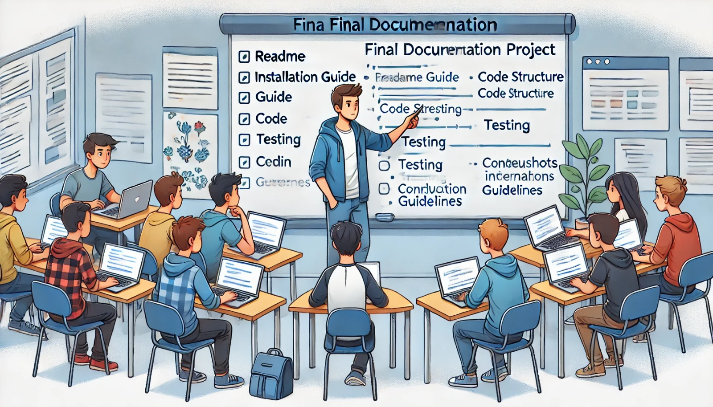

### Aula 75: Projeto Integrador: Documentação Final

#### Introdução

Na aula de hoje, vamos preparar a **documentação final** do Projeto Integrador. A documentação é um elemento essencial para que outros desenvolvedores, usuários e futuros colaboradores possam entender e utilizar o projeto de maneira eficiente. Documentar um projeto de forma completa e organizada garante que o trabalho seja compreendido e mantido no futuro, além de demonstrar profissionalismo e atenção aos detalhes.

---

### Objetivo

O objetivo desta aula é:

1. **Criar Documentação Completa**: Registrar informações sobre a instalação, configuração e uso do projeto.
2. **Descrever Funcionalidades e Estrutura do Código**: Explicar cada funcionalidade principal e a organização dos módulos no código.
3. **Incluir Instruções para Contribuições e Manutenção**: Fornecer orientações para que outras pessoas possam colaborar ou expandir o projeto.
4. **Gerar um Documento de Referência Fácil de Usar**: Criar uma documentação que seja clara, direta e fácil de consultar.

---

### Estrutura da Documentação Final

A documentação final deve cobrir diversos aspectos do projeto, incluindo descrição geral, instalação, uso, estrutura do código e instruções para desenvolvedores. A seguir está um guia para a estrutura ideal da documentação.

#### 1. README

O arquivo `README.md` é a porta de entrada para o projeto. Ele deve fornecer uma visão geral completa e incluir as instruções mais importantes.

- **Nome e Descrição do Projeto**: Apresente o nome do projeto e uma descrição resumida de seu propósito.
- **Funcionalidade Principal**: Explique o que o projeto faz, para quem é destinado e quais problemas ele resolve.
- **Tecnologias Utilizadas**: Liste as principais tecnologias e ferramentas usadas, como Flask, SQLAlchemy, HTML5, CSS3, e JavaScript.

Exemplo de introdução no README:

```markdown
# Projeto Integrador: Sistema de Gerenciamento de Creches

Este projeto é um sistema de gerenciamento de pré-matrículas para creches, permitindo que pais e responsáveis registrem e acompanhem o status de vagas disponíveis. O sistema foi desenvolvido com Flask para o back-end, HTML5 e CSS3 para o front-end e SQLAlchemy para o gerenciamento de dados.
```

#### 2. Guia de Instalação e Configuração

Inclua um guia passo a passo para que outros desenvolvedores possam configurar o ambiente e rodar o projeto localmente.

- **Pré-requisitos**: Liste as dependências necessárias, como Python, Git e um banco de dados (SQLite ou PostgreSQL).
- **Instruções de Instalação**: Explique como clonar o repositório, instalar dependências e configurar variáveis de ambiente.
- **Configuração do Banco de Dados**: Detalhe os passos para configurar o banco de dados e rodar as migrações.

Exemplo:

```markdown
## Instalação

1. Clone o repositório:
   ```bash
   git clone https://github.com/seu_usuario/projeto-integrador.git
   cd projeto-integrador
   ```

2. Crie e ative o ambiente virtual:
   ```bash
   python -m venv venv
   source venv/bin/activate  # no Windows, use venv\Scripts\activate
   ```

3. Instale as dependências:
   ```bash
   pip install -r requirements.txt
   ```

4. Configure o banco de dados:
   - Crie o banco de dados e aplique as migrações.
   ```bash
   flask db upgrade
   ```

5. Rode o servidor:
   ```bash
   flask run
   ```

```

---

#### 3. Descrição das Funcionalidades e Interface

Descreva as funcionalidades principais e como a interface do usuário foi projetada.

- **Funcionalidades**: Liste cada funcionalidade, como login, cadastro de pré-matrículas, listagem de vagas, entre outras.
- **Fluxo de Uso**: Explique o fluxo de uso básico para ajudar os usuários a entenderem como navegar no sistema.
- **Capturas de Tela**: Inclua imagens da interface para ilustrar cada funcionalidade, tornando a documentação mais visual.

Exemplo:

```markdown
## Funcionalidades

- **Cadastro de Usuários**: Permite que novos usuários criem uma conta para acessar o sistema.
- **Gerenciamento de Vagas**: Lista as vagas disponíveis nas creches e permite filtragem por localidade.
- **Pré-matrícula**: Usuários podem registrar interesse em uma vaga específica para seus filhos.
```

---

#### 4. Estrutura do Código

Explique a estrutura do código para que outros desenvolvedores entendam a organização do projeto e como os módulos estão conectados.

- **Estrutura de Pastas**: Descreva as pastas principais e seus conteúdos (ex.: `app/` para a aplicação principal, `templates/` para os arquivos HTML, `static/` para os recursos CSS e JavaScript).
- **Principais Módulos e Funções**: Explique os módulos e suas responsabilidades, especialmente os arquivos mais importantes, como `routes.py`, `models.py` e `config.py`.
- **Dependências Externas**: Liste e explique as bibliotecas e dependências principais utilizadas.

Exemplo:

```markdown
## Estrutura do Código

- `app/`: Contém o código principal da aplicação.
  - `routes.py`: Define as rotas e lógica de controle.
  - `models.py`: Define os modelos de dados para o banco de dados.
  - `templates/`: Contém os arquivos HTML.
  - `static/`: Inclui os arquivos de estilo CSS e JavaScript.

- `config.py`: Arquivo de configuração do projeto.
- `requirements.txt`: Lista de bibliotecas e dependências do projeto.
```

---

#### 5. Testes Automatizados

Descreva como os testes estão estruturados e como executá-los.

- **Tipos de Testes**: Explique os testes automatizados implementados, como testes unitários e testes de integração.
- **Como Rodar os Testes**: Inclua comandos para executar os testes, como `pytest` ou `flask test`.
- **Cobertura dos Testes**: Descreva as áreas do sistema que foram testadas e o objetivo dos testes.

Exemplo:

```markdown
## Testes

Para rodar os testes, execute o comando:

```bash
pytest
```

Os testes incluem verificações das funcionalidades de autenticação, pré-matrícula e filtros de listagem de vagas.
```

---

#### 6. Instruções para Contribuição e Manutenção

Se o projeto estiver aberto para contribuição, inclua instruções para que outros desenvolvedores possam colaborar de forma organizada.

- **Guia para Contribuição**: Explique como fazer um fork, criar uma branch, realizar mudanças e abrir um pull request.
- **Padrões de Código**: Defina padrões de estilo e convenções de nomeação a serem seguidos (ex.: PEP8 para Python).
- **Contato para Dúvidas**: Inclua um e-mail ou canal de contato para eventuais dúvidas sobre o projeto.

Exemplo:

```markdown
## Contribuindo para o Projeto

1. Faça um fork do repositório.
2. Crie uma nova branch para a sua funcionalidade (`git checkout -b feature/nome-da-funcionalidade`).
3. Faça as alterações necessárias e commit (`git commit -m 'Descrição do commit'`).
4. Envie para o repositório remoto (`git push origin feature/nome-da-funcionalidade`).
5. Abra um Pull Request para revisão.
```

---

### Conclusão

A documentação final é uma parte essencial do Projeto Integrador, pois facilita o entendimento, uso e manutenção do projeto a longo prazo. Ao seguir as etapas desta aula, você garantirá que sua aplicação seja clara, acessível e fácil de ser utilizada e expandida por outros desenvolvedores.