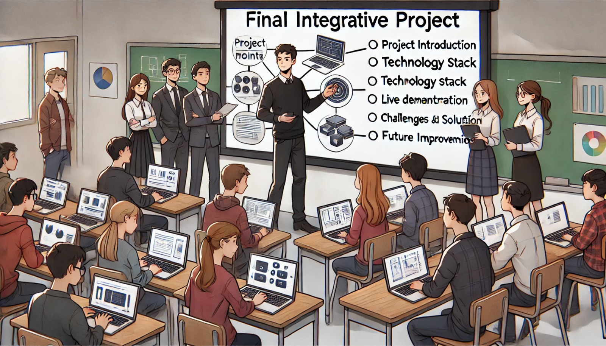

### Aula 76: Projeto Integrador: Preparação para Apresentação Final

#### Introdução

Na aula de hoje, vamos focar na **preparação para a apresentação final** do Projeto Integrador. Apresentar o projeto de forma clara e objetiva é essencial para comunicar o valor do trabalho realizado, as funcionalidades implementadas e as habilidades adquiridas durante o desenvolvimento. A apresentação final é uma oportunidade para demonstrar o domínio dos conceitos e práticas aprendidos ao longo do curso.

---

### Objetivo

O objetivo desta aula é:

1. **Organizar a Estrutura da Apresentação**: Planejar o conteúdo a ser apresentado, destacando os pontos mais importantes.
2. **Preparar uma Demonstração ao Vivo**: Praticar uma demonstração funcional da aplicação para mostrar suas principais características e fluxo de uso.
3. **Ensaiar a Apresentação**: Desenvolver confiança e fluidez na apresentação, garantindo que tudo funcione como esperado.
4. **Aperfeiçoar as Habilidades de Comunicação**: Trabalhar a clareza e objetividade ao explicar o projeto.

---

### Estrutura da Apresentação

Para garantir uma apresentação completa e bem organizada, siga uma estrutura lógica que ajude o público a entender o projeto e seu desenvolvimento.

#### 1. Introdução do Projeto

Comece apresentando o projeto de forma resumida, explicando o propósito e as funcionalidades principais.

- **Nome e Objetivo do Projeto**: Explique o que o projeto faz e qual problema ele resolve.
- **Contexto e Motivação**: Fale sobre a necessidade ou o contexto que inspirou a criação do projeto.
- **Público-Alvo**: Descreva quem se beneficiará com o uso da aplicação.

Exemplo:

"Este projeto é um sistema de gerenciamento de pré-matrículas para creches, que permite que pais e responsáveis registrem interesse por vagas disponíveis. Ele foi desenvolvido para atender à demanda de organizar e facilitar o acesso às vagas em instituições de ensino infantil."

---

#### 2. Tecnologias Utilizadas

Explique as principais tecnologias utilizadas no desenvolvimento do projeto.

- **Back-End**: Ferramentas e frameworks utilizados, como Flask e SQLAlchemy.
- **Front-End**: Tecnologias usadas para a interface do usuário, como HTML5, CSS3 e JavaScript.
- **Banco de Dados**: Sistema de gerenciamento de dados (ex.: SQLite ou PostgreSQL).
- **Controle de Versão**: Ferramentas de versionamento e colaboração, como Git e GitHub.

Exemplo:

"O sistema foi desenvolvido com Flask no back-end e utiliza SQLAlchemy para gerenciar o banco de dados. No front-end, usamos HTML5, CSS3 e JavaScript para uma interface responsiva e amigável."

---

#### 3. Funcionalidades e Demonstração

Este é o ponto principal da apresentação, onde você deve demonstrar o funcionamento do projeto.

- **Demonstração ao Vivo**: Mostre o projeto funcionando, explicando cada funcionalidade conforme for navegando pela interface.
- **Funcionalidades Principais**: Demonstre o fluxo do usuário, como login, cadastro de pré-matrícula, listagem de vagas, etc.
- **Feedback Visual e Usabilidade**: Destaque elementos que melhoram a experiência do usuário, como mensagens de erro, confirmações de ação e acessibilidade.

**Dicas para a Demonstração**:
- Realize testes antes para garantir que tudo está funcionando.
- Pratique o tempo da apresentação para não se estender demais em cada funcionalidade.
- Esteja preparado para explicar qualquer detalhe do sistema, como o fluxo de navegação ou a lógica de algumas funcionalidades.

---

#### 4. Desafios e Soluções

Falar sobre os desafios enfrentados no desenvolvimento do projeto e como foram superados demonstra capacidade de resolução de problemas.

- **Principais Desafios**: Explique dificuldades técnicas ou conceituais encontradas durante o projeto, como integração de tecnologias, lógica de negócios ou configuração de ambiente.
- **Soluções Implementadas**: Descreva as soluções encontradas para superar esses desafios, como otimizações de código, uso de documentação ou ajuda de colegas.

Exemplo:

"Um dos desafios foi implementar a autenticação de usuários de forma segura. Para resolver isso, utilizamos hashing de senhas e aplicamos boas práticas de segurança no back-end."

---

#### 5. Conclusão e Próximos Passos

Finalize a apresentação com um resumo dos resultados alcançados e as possibilidades de expansão ou melhorias futuras.

- **Principais Resultados**: Enfatize os principais resultados do projeto e como eles atendem aos objetivos iniciais.
- **Possíveis Melhorias**: Fale sobre funcionalidades que poderiam ser adicionadas ou aprimoradas, como integração com APIs, mais opções de filtros ou melhorias na interface.
- **Aprendizados e Habilidades Desenvolvidas**: Reforce as habilidades adquiridas, como domínio de frameworks, versionamento de código e práticas de desenvolvimento colaborativo.

Exemplo:

"Com o desenvolvimento deste projeto, adquirimos experiência prática em todas as etapas do desenvolvimento de uma aplicação web, do planejamento à otimização de performance. Como próximos passos, pensamos em adicionar mais opções de personalização de perfis e uma integração com serviços de notificação por e-mail."

---

### Preparação para a Apresentação

Para uma apresentação bem-sucedida, siga algumas práticas que ajudarão a transmitir confiança e clareza:

1. **Pratique a Demonstração**: Realize a demonstração do projeto várias vezes para garantir que cada etapa esteja clara e funcione como esperado.
2. **Prepare-se para Perguntas**: Antecipe perguntas que possam surgir e pratique respostas concisas.
3. **Tempo da Apresentação**: Cronometre a apresentação para garantir que ela esteja dentro do tempo estimado e seja objetiva.
4. **Fale com Clareza e Confiança**: Use uma linguagem simples e direta, e mantenha contato visual com o público.

---

### Conclusão

A apresentação final é o momento de mostrar todo o esforço e dedicação investidos no Projeto Integrador. Uma apresentação bem estruturada e clara não só demonstra o valor do projeto, mas também reflete suas habilidades em desenvolvimento, comunicação e organização. Com uma preparação cuidadosa, você estará pronto para entregar uma apresentação de alto impacto e destacar suas conquistas e aprendizado.