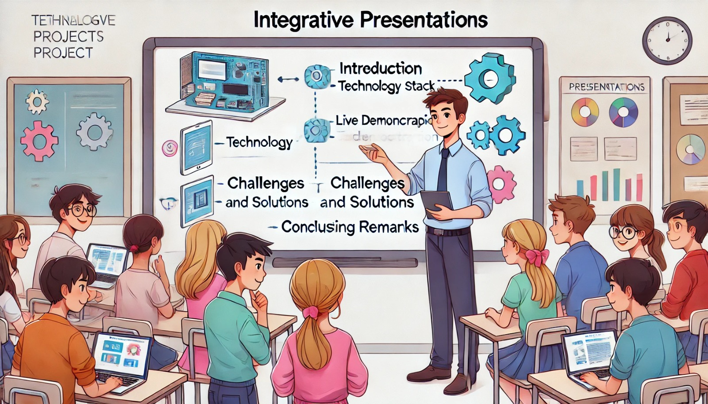

### Aula 77: Projeto Integrador: Ensaios de Apresentação

#### Introdução

Na aula de hoje, vamos realizar **ensaios de apresentação** para o Projeto Integrador. Os ensaios são uma oportunidade para praticar a apresentação e receber feedback sobre a clareza, a estrutura e o impacto do conteúdo. Este é o momento de ajustar detalhes, aprimorar a forma de comunicação e ganhar confiança para a apresentação final.

---

### Objetivo

O objetivo desta aula é:

1. **Praticar a Apresentação Completa**: Realizar um ensaio completo, passando por todas as etapas da apresentação.
2. **Aprimorar a Comunicação**: Desenvolver uma comunicação clara e objetiva, com explicações simples e diretas.
3. **Receber e Implementar Feedback**: Identificar pontos de melhoria com base no feedback dos colegas e professor.
4. **Preparar-se para Perguntas e Respostas**: Ensaiar respostas para possíveis perguntas do público.

---

### Estrutura do Ensaio

Para garantir que cada parte da apresentação seja clara e compreensível, siga uma estrutura que permita praticar todas as seções com fluidez.

#### 1. Introdução e Contexto do Projeto

Inicie a apresentação com uma breve introdução ao projeto, incluindo o objetivo e o problema que ele resolve.

- **Objetivo e Contexto**: Apresente o propósito do projeto de forma breve e direta.
- **Motivação**: Explique a necessidade de desenvolver o projeto e como ele atende ao público-alvo.
- **Resumo das Funcionalidades**: Mencione as funcionalidades principais que serão demonstradas.

**Dica**: Ensaie para que esta parte seja breve, mas completa, dando uma visão clara do que será apresentado.

---

#### 2. Tecnologias Utilizadas e Organização do Projeto

Explique as tecnologias principais e a estrutura do projeto.

- **Tecnologias**: Descreva o back-end, front-end, banco de dados e outras ferramentas usadas no desenvolvimento.
- **Organização do Código**: Comente sobre a estrutura do código e como as pastas estão organizadas (ex.: `app/`, `templates/`, `static/`).

**Dica**: Pratique a forma de apresentar a organização do projeto, destacando o uso de cada tecnologia e sua importância para o funcionamento do sistema.

---

#### 3. Demonstração ao Vivo das Funcionalidades

A demonstração ao vivo é a parte mais importante da apresentação. Mostre o sistema em funcionamento e explique cada funcionalidade.

- **Funcionalidades Principais**: Demonstre as funcionalidades centrais do projeto, como login, cadastro, listagem e edição de dados.
- **Navegação**: Mostre como navegar pela aplicação, destacando a usabilidade e a organização visual.
- **Feedback Visual**: Destaque elementos de feedback visual, como mensagens de erro, confirmações e respostas às ações do usuário.

**Dica**: Pratique várias vezes para garantir que a demonstração seja fluida e sem interrupções. Certifique-se de que todos os elementos funcionam como esperado.

---

#### 4. Principais Desafios e Soluções Implementadas

Apresente os principais desafios que surgiram durante o desenvolvimento e as soluções aplicadas para resolvê-los.

- **Desafios Técnicos**: Explique problemas técnicos ou de lógica que foram especialmente difíceis de resolver.
- **Soluções**: Destaque como cada desafio foi superado, mencionando ajustes específicos no código, configurações ou ferramentas utilizadas.

**Dica**: Pratique para explicar cada desafio de forma resumida, com foco na solução aplicada.

---

#### 5. Conclusão e Próximos Passos

Encerre a apresentação com uma visão geral dos resultados alcançados e das possíveis melhorias futuras.

- **Principais Resultados**: Destaque os principais benefícios e funcionalidades que o projeto oferece.
- **Melhorias Futuras**: Mencione funcionalidades ou otimizações que poderiam ser adicionadas ao projeto para torná-lo ainda mais completo.
- **Reflexão e Aprendizado**: Conclua com uma breve reflexão sobre o aprendizado e as habilidades desenvolvidas durante o projeto.

**Dica**: Ensaie para que essa parte tenha um tom de fechamento, demonstrando que o projeto foi um processo de aprendizado e crescimento.

---

### Recebendo e Implementando Feedback

Após cada ensaio, é importante receber feedback dos colegas e do professor para melhorar a apresentação.

- **Clareza e Organização**: Pergunte se a apresentação foi clara e se a estrutura seguiu uma linha lógica.
- **Demonstração ao Vivo**: Peça feedback sobre a clareza da demonstração e se todas as funcionalidades foram explicadas de forma completa.
- **Habilidades de Comunicação**: Receba comentários sobre a dicção, o tom de voz e a linguagem utilizada para melhorar a apresentação oral.
- **Preparação para Perguntas**: Se possível, peça aos colegas que façam perguntas sobre o projeto para que você possa ensaiar respostas diretas e claras.

---

### Dicas para Melhorar a Apresentação

1. **Fale com Confiança e Clareza**: Use uma linguagem simples e objetiva. Evite termos técnicos complexos, a menos que seja necessário.
2. **Mantenha o Contato Visual**: Olhe para o público e evite ler slides ou anotações. Isso demonstra segurança e proximidade com o conteúdo.
3. **Controle o Tempo**: Verifique o tempo de cada seção para garantir que a apresentação não seja nem muito longa, nem muito curta.
4. **Tenha um Plano de Contingência**: Em caso de problemas técnicos, esteja preparado para apresentar as funcionalidades por meio de slides ou capturas de tela.

---

### Conclusão

Os ensaios de apresentação são uma etapa fundamental para garantir uma apresentação final bem-sucedida e impactante. Ao praticar cada parte da apresentação e receber feedback, você se sentirá mais confiante e preparado para transmitir a qualidade e o valor do seu projeto. Com uma comunicação clara e uma apresentação organizada, você poderá demonstrar todas as habilidades e conhecimentos adquiridos durante o desenvolvimento do Projeto Integrador.