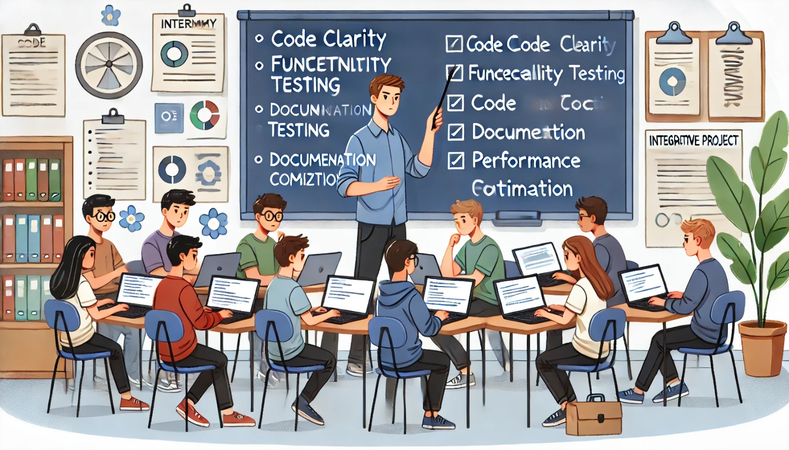

### Aula 78: Projeto Integrador: Revisão Final de Código e Documentação

#### Introdução

Na reta final do Projeto Integrador, vamos realizar uma **revisão completa do código e da documentação**. Este processo é crucial para garantir que o projeto esteja bem estruturado, funcional e compreensível, tanto para futuros desenvolvedores quanto para o público-alvo. Revisar o código e a documentação ajuda a corrigir quaisquer detalhes pendentes, garantir a clareza e a coesão e preparar o projeto para entrega.

---

### Objetivo

O objetivo desta aula é:

1. **Verificar a Qualidade do Código**: Garantir que o código esteja limpo, organizado e seguindo as melhores práticas de programação.
2. **Ajustar e Completar a Documentação**: Revisar a documentação final para que ela seja clara, completa e útil para futuros usuários e colaboradores.
3. **Corrigir Pequenos Erros e Otimizações**: Identificar e corrigir detalhes que possam ter sido esquecidos durante o desenvolvimento.
4. **Realizar uma Última Rodada de Testes**: Executar testes finais para assegurar que todas as funcionalidades estejam operando corretamente.

---

### 1. Revisão de Código

A revisão de código é essencial para garantir a qualidade e a manutenibilidade do projeto. Seguindo as diretrizes de boas práticas, vamos verificar os principais pontos do código.

#### Pontos Importantes na Revisão de Código

- **Clareza e Consistência**: O código deve ser claro, com variáveis e funções bem nomeadas, facilitando o entendimento.
- **Eliminação de Código Morto**: Remova qualquer código não utilizado ou comentários antigos que não tenham mais relevância.
- **Modularidade e Organização**: Verifique se o código está organizado em módulos/funções, evitando duplicação e excesso de lógica em uma única função.
- **Conformidade com PEP8 (para Python)**: Confirme que o código segue o padrão de estilo PEP8 para Python, garantindo uma estrutura consistente.

**Exemplo de Revisão**:
- Se houver funções longas e complexas, considere dividi-las em funções menores e mais específicas.
- Se existirem trechos repetidos de código, refatore-os para usar funções reutilizáveis.

---

### 2. Revisão da Documentação

A documentação é um guia essencial para que outras pessoas entendam o projeto, saibam como usá-lo e possam contribuir futuramente. Faça uma revisão completa do conteúdo do arquivo `README.md` e da documentação adicional.

#### Elementos da Documentação

- **Visão Geral e Objetivo**: Verifique se a introdução do projeto está clara, explicando o propósito e o público-alvo.
- **Guia de Instalação**: Certifique-se de que as instruções de instalação e configuração estejam completas e atualizadas.
- **Descrição das Funcionalidades**: Verifique se todas as funcionalidades estão listadas e descritas de maneira acessível.
- **Estrutura do Código e Instruções para Contribuição**: Garanta que a estrutura de pastas e módulos esteja bem explicada, e que existam orientações para novos colaboradores.
- **Testes e Manutenção**: Inclua instruções claras sobre como rodar os testes e quaisquer requisitos de manutenção.

**Exemplo de Melhoria na Documentação**:
- Se a documentação não inclui capturas de tela das funcionalidades, considere adicionar para ilustrar a interface.
- Verifique a ortografia e gramática para garantir que o texto esteja claro e profissional.

---

### 3. Correção de Pequenos Erros e Ajustes

Durante a revisão final, é comum encontrar pequenos erros ou detalhes que passaram despercebidos. Dedique um tempo para fazer esses ajustes.

#### Principais Itens para Verificação

- **Erros de Exibição na Interface**: Certifique-se de que todos os elementos da interface estejam alinhados e funcionais.
- **Mensagens de Erro e Feedback ao Usuário**: Revise as mensagens de erro e confirmações para garantir que sejam claras e úteis.
- **Performance e Otimização**: Verifique se as otimizações de desempenho foram implementadas e se o sistema carrega rapidamente.

**Exemplo de Ajustes**:
- Se algum botão ou funcionalidade não estiver exibindo feedback visual ao usuário, adicione para tornar o sistema mais intuitivo.
- Verifique a consistência das mensagens de erro, garantindo que todas estejam no mesmo idioma e com tom adequado.

---

### 4. Última Rodada de Testes

Realize uma última rodada de testes para garantir que todas as funcionalidades estejam funcionando perfeitamente. Teste o sistema tanto em navegadores quanto em dispositivos diferentes, se possível.

#### Tipos de Testes

- **Testes de Funcionalidade**: Execute cada funcionalidade do sistema para garantir que esteja funcionando corretamente.
- **Testes de Integração**: Verifique se todas as partes do sistema interagem conforme esperado, como o front-end e o back-end.
- **Testes de Performance**: Teste a velocidade de carregamento e o tempo de resposta do sistema.
- **Testes de Acessibilidade**: Verifique se o sistema atende aos critérios básicos de acessibilidade.

**Dica para Testes Finais**:
- Utilize ferramentas como Google Lighthouse para verificar a performance e a acessibilidade.
- Peça para um colega ou amigo testar o sistema, pois ele pode identificar problemas que passaram despercebidos.

---

### Checklist Final

Para garantir que a revisão final foi completa, verifique cada item da checklist abaixo:

1. **Código Limpo e Organizado**
   - Funções e variáveis têm nomes descritivos.
   - Código morto ou duplicado foi removido.
   - O código está organizado em módulos.

2. **Documentação Completa e Acessível**
   - README inclui introdução, guia de instalação, funcionalidades e estrutura do código.
   - Instruções de testes e contribuição estão presentes.

3. **Funcionalidades Funcionando Corretamente**
   - Todas as funcionalidades principais foram testadas e estão operando sem erros.
   - Mensagens de feedback ao usuário são claras e úteis.

4. **Performance e Acessibilidade Otimizadas**
   - Imagens, scripts e outros recursos foram otimizados para carregamento rápido.
   - O sistema atende aos critérios básicos de acessibilidade.

---

### Conclusão

A revisão final de código e documentação garante que o Projeto Integrador esteja pronto para ser entregue, com uma base sólida de código, uma documentação completa e um sistema totalmente funcional. Esta etapa final é uma demonstração do cuidado e do profissionalismo aplicados durante todo o desenvolvimento, preparando o projeto para uma apresentação de qualidade e uma utilização eficiente.