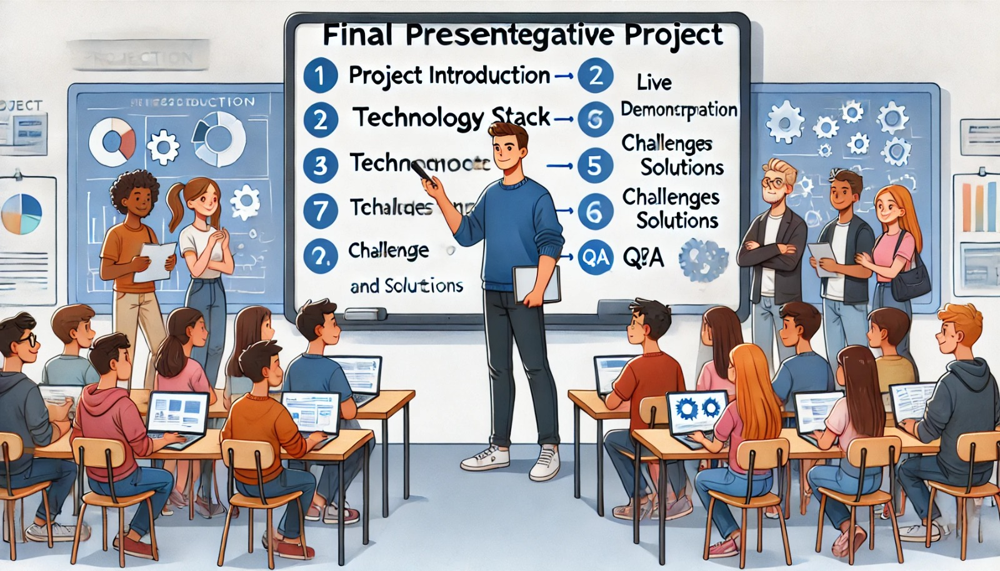

### Aula 79: Projeto Integrador: Apresentação Final

#### Introdução

Nesta aula, iniciaremos a **apresentação final do Projeto Integrador**. Este é o momento em que cada aluno ou grupo terá a oportunidade de mostrar seu projeto, explicando as funcionalidades, o processo de desenvolvimento e os desafios enfrentados. A apresentação final não só serve para demonstrar o trabalho realizado, mas também permite que os alunos pratiquem habilidades de comunicação e compartilhem suas conquistas.

---

### Objetivo

O objetivo desta aula é:

1. **Apresentar o Projeto Integrador Completo**: Demonstrar as funcionalidades e o propósito do projeto para colegas e professores.
2. **Destacar o Processo de Desenvolvimento**: Explicar o planejamento, as tecnologias utilizadas e o processo de desenvolvimento.
3. **Compartilhar Desafios e Soluções**: Falar sobre as dificuldades encontradas e como foram superadas.
4. **Responder Perguntas e Receber Feedback**: Interagir com os colegas e professor, respondendo a perguntas e recebendo sugestões construtivas.

---

### Estrutura da Apresentação

Para que a apresentação seja organizada e abrangente, siga uma estrutura que inclua as etapas principais:

#### 1. Introdução ao Projeto

Inicie a apresentação com uma introdução clara e concisa sobre o projeto.

- **Nome e Objetivo do Projeto**: Apresente o nome do projeto e seu propósito principal.
- **Motivação**: Explique o problema que o projeto resolve ou a necessidade que ele atende.
- **Público-Alvo**: Descreva para quem o projeto foi desenvolvido e como ele traz benefícios.

Exemplo de introdução:

"Nosso projeto é um sistema de gerenciamento de pré-matrículas para creches. Ele ajuda pais e responsáveis a encontrarem e se inscreverem em vagas disponíveis para seus filhos, facilitando o processo de pré-matrícula."

---

#### 2. Tecnologias e Ferramentas Utilizadas

Explique as tecnologias principais utilizadas no desenvolvimento do projeto.

- **Back-End**: Descreva o framework e as ferramentas utilizadas, como Flask e SQLAlchemy.
- **Front-End**: Explique as tecnologias de interface, como HTML5, CSS3 e JavaScript.
- **Banco de Dados**: Fale sobre o sistema de banco de dados utilizado (ex.: SQLite ou PostgreSQL).
- **Controle de Versão**: Mencione o uso de Git e GitHub para versionamento e colaboração.

---

#### 3. Demonstração das Funcionalidades

Mostre o sistema em funcionamento, destacando suas principais funcionalidades.

- **Fluxo de Uso**: Demonstre como os usuários interagem com o sistema, passando pelas principais etapas.
- **Funcionalidades Principais**: Mostre funcionalidades como login, cadastro, listagem e edição de dados.
- **Feedback Visual**: Destaque elementos que melhoram a usabilidade, como mensagens de confirmação e alertas.

**Dicas para a Demonstração**:
- Certifique-se de que todas as funcionalidades estejam funcionando corretamente antes da apresentação.
- Pratique a demonstração para garantir uma apresentação fluida e organizada.

---

#### 4. Desafios e Soluções Implementadas

Compartilhe as principais dificuldades enfrentadas e como você as solucionou.

- **Desafios Técnicos**: Explique problemas técnicos ou de lógica que surgiram durante o desenvolvimento.
- **Soluções**: Descreva as soluções aplicadas para resolver esses problemas, como otimizações de código ou reorganização da estrutura.

Exemplo:

"Um dos desafios foi implementar uma autenticação segura para os usuários. Resolvemos isso utilizando hashing de senhas e seguindo boas práticas de segurança no back-end."

---

#### 5. Conclusão e Aprendizados

Encerre a apresentação com uma reflexão sobre o aprendizado e as conquistas do projeto.

- **Principais Resultados**: Destaque o impacto e os benefícios do sistema.
- **Aprendizado**: Compartilhe as habilidades desenvolvidas durante o projeto, como programação em equipe, domínio de ferramentas e solução de problemas.
- **Possíveis Melhorias**: Mencione ideias para expandir ou melhorar o projeto no futuro.

Exemplo:

"Este projeto nos permitiu desenvolver habilidades em várias áreas, como front-end, back-end e banco de dados. Como próximos passos, gostaríamos de adicionar uma função de notificação para que os pais sejam avisados sobre vagas disponíveis."

---

### Interação com o Público

Durante a apresentação, esteja preparado para responder perguntas e interagir com o público.

- **Receba Perguntas com Confiança**: Responda de forma clara e objetiva, demonstrando domínio sobre o projeto.
- **Aceite Feedbacks Construtivos**: Esteja aberto a sugestões que possam ajudar a melhorar o projeto.
- **Agradeça o Interesse**: Mantenha uma postura positiva, agradecendo o público pelo interesse e feedback.

---

### Avaliação e Feedback

Cada apresentação será avaliada com base nos seguintes critérios:

1. **Clareza e Objetividade**: O conteúdo foi apresentado de maneira clara e organizada?
2. **Domínio do Projeto**: O apresentador demonstrou conhecimento sobre o funcionamento e as tecnologias do projeto?
3. **Qualidade da Demonstração**: A demonstração do projeto foi completa e funcional?
4. **Capacidade de Responder Perguntas**: O apresentador conseguiu responder às perguntas de forma satisfatória?

---

### Conclusão

A apresentação final é uma oportunidade para demonstrar o esforço e aprendizado ao longo do desenvolvimento do Projeto Integrador. Com uma apresentação bem estruturada e uma demonstração clara, você poderá transmitir o valor do seu trabalho e reforçar suas habilidades. Lembre-se de que este é o momento de celebrar suas conquistas e compartilhar o que aprendeu com colegas e professores.