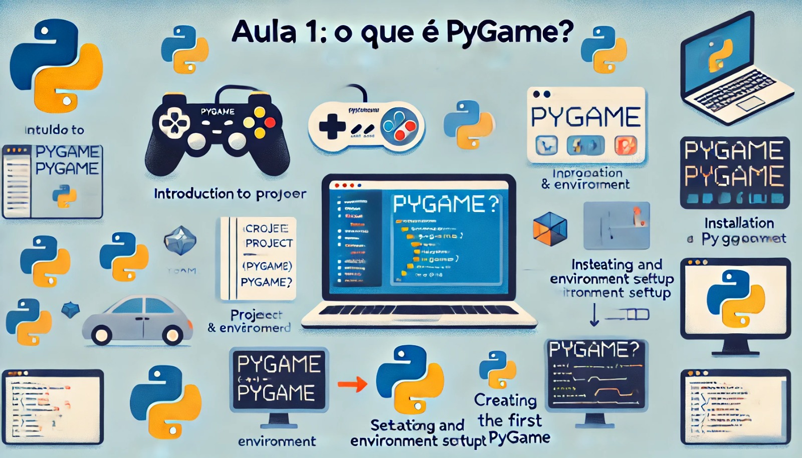

### Aula 1: O que é Pygame?

#### Objetivo da Aula:
Introduzir o Pygame, explicar seus usos, ensinar como instalar e configurar o ambiente, criar e ativar um ambiente virtual, e criar a primeira janela com Pygame.

### 1. Introdução ao Pygame e seus Usos

**O que é Pygame?**
Pygame é uma biblioteca de código aberto para a linguagem de programação Python. Ela é usada para desenvolver jogos e programas multimídia. Pygame facilita a criação de gráficos, sons e interações com o usuário, tornando o desenvolvimento de jogos mais acessível.

**Usos do Pygame:**
- Criação de jogos 2D.
- Desenvolvimento de programas interativos.
- Aprendizado de conceitos de programação de maneira divertida.

### 2. Instalação e Configuração do Ambiente

Para começar a usar o Pygame, precisamos instalá-lo em nosso computador. Vamos seguir os seguintes passos:

**Passo 1: Instalar o Python**
Certifique-se de que você tem o Python instalado em seu computador. Você pode baixar a versão mais recente do Python no site oficial: [python.org](https://www.python.org/).

**Passo 2: Criar a Pasta do Projeto**
Vamos criar uma pasta para organizar nosso projeto. Abra o terminal e execute os seguintes comandos:

```bash
mkdir ~/meu_projeto_pygame
cd ~/meu_projeto_pygame
```

**Passo 3: Criar um Ambiente Virtual**
Um ambiente virtual é uma maneira de manter as dependências do projeto isoladas das de outros projetos. Para criar um ambiente virtual, siga estes passos:

1. No terminal, estando dentro da pasta do projeto criada no passo anterior, digite:
   ```bash
   python3 -m venv venv
   ```
2. Ative o ambiente virtual:
   - No macOS/Linux:
     ```bash
     source venv/bin/activate
     ```

Você saberá que o ambiente virtual está ativo porque o nome do ambiente (venv) aparecerá no início da linha do terminal.

**Passo 4: Instalar o Pygame no Ambiente Virtual**
Com o ambiente virtual ativo, instale o Pygame usando o pip:
```bash
pip install pygame
```

**Passo 5: Verificar a Instalação**
Para verificar se o Pygame foi instalado corretamente, abra o terminal e digite:
```bash
python -m pygame.examples.aliens
```
Se uma janela com um jogo aparecer, significa que a instalação foi bem-sucedida!

### 3. Criar e Abrir o Projeto no VSCode

**Passo 1: Instalar o Visual Studio Code (VSCode)**
Se ainda não tiver o VSCode instalado, você pode baixá-lo no site oficial: [code.visualstudio.com](https://code.visualstudio.com/).

**Passo 2: Abrir o Projeto no VSCode**
1. Abra o VSCode.
2. Vá até o menu **File** e selecione **Open Folder...**.
3. Navegue até a pasta do seu projeto (`~/meu_projeto_pygame`) e clique em **Select Folder** (ou **Open** no macOS).

**Passo 3: Configurar o VSCode para Usar o Ambiente Virtual**
1. No VSCode, pressione `Ctrl+Shift+P` (ou `Cmd+Shift+P` no macOS) para abrir a paleta de comandos.
2. Digite **Python: Select Interpreter** e selecione a opção correspondente ao seu ambiente virtual (deve ter o caminho para a pasta `venv`).

### 4. Criação da Primeira Janela com Pygame

Agora que temos o Pygame instalado e o ambiente configurado, vamos criar nosso primeiro programa simples que abre uma janela.

**Passo 1: Criar um Arquivo Python**
No VSCode, crie um novo arquivo chamado `primeira_janela.py`.

**Passo 2: Escrever o Código**
No arquivo `primeira_janela.py`, digite o seguinte código:

```python
import pygame
import sys

# Inicializa o Pygame
pygame.init()

# Configurações da janela
screen = pygame.display.set_mode((800, 600))
pygame.display.set_caption("Minha Primeira Janela com Pygame")

# Loop principal
running = True
while running:
    for event in pygame.event.get():
        if event.type == pygame.QUIT:
            running = False
    
    # Define a cor de fundo (RGB)
    screen.fill((0, 128, 255))
    
    # Atualiza a tela
    pygame.display.flip()

# Encerra o Pygame
pygame.quit()
sys.exit()
```

**Passo 3: Executar o Código**
Para executar o código, abra o terminal integrado do VSCode (`Ctrl+`` ou `Cmd+`` no macOS) e digite:
```bash
python primeira_janela.py
```
Você verá uma janela azul com o título "Minha Primeira Janela com Pygame".

### Conclusão

Parabéns! Você criou sua primeira janela com Pygame. Nesta aula, aprendemos o que é Pygame, como instalá-lo e configurá-lo, criar e ativar um ambiente virtual, verificar a instalação, e criar um programa simples para abrir uma janela. Nos próximos encontros, vamos explorar mais funcionalidades do Pygame e começar a desenvolver nosso jogo de nave estelar.