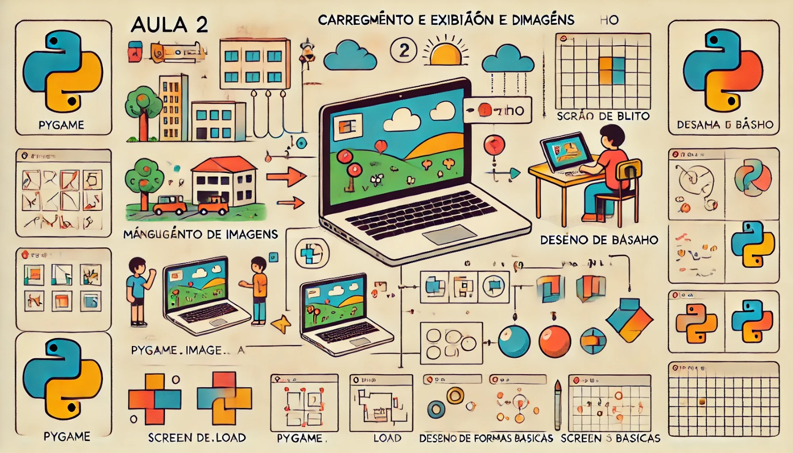

### Aula 2: Manipulação de Imagens e Desenho

#### Objetivo da Aula:
Aprender como carregar, exibir e manipular imagens, além de desenhar formas básicas usando o Pygame.

### 1. Carregamento e Exibição de Imagens

**Carregar Imagens no Pygame**
Imagens são uma parte essencial de muitos jogos. Com o Pygame, é fácil carregar e exibir imagens na tela. Vamos começar com um exemplo simples:

1. **Passo 1: Preparar a Imagem**
   - Certifique-se de que você tem uma imagem (como um arquivo `.png`) que deseja usar. Coloque essa imagem na pasta do seu projeto.

2. **Passo 2: Carregar a Imagem**
   - No Pygame, usamos a função `pygame.image.load()` para carregar uma imagem. Vamos adicionar isso ao nosso código:
   
   ```python
   import pygame
   import sys

   # Inicializa o Pygame
   pygame.init()

   # Configurações da janela
   screen = pygame.display.set_mode((800, 600))
   pygame.display.set_caption("Exibindo Imagem com Pygame")

   # Carrega a imagem
   imagem = pygame.image.load('minha_imagem.png')

   # Loop principal
   running = True
   while running:
       for event in pygame.event.get():
           if event.type == pygame.QUIT:
               running = False

       # Desenha a imagem na tela
       screen.blit(imagem, (100, 100))

       # Atualiza a tela
       pygame.display.flip()

   # Encerra o Pygame
   pygame.quit()
   sys.exit()
   ```

   - **Explicação:** Neste código, a imagem é carregada com `pygame.image.load()` e exibida na tela com `screen.blit()`. A posição `(100, 100)` define onde a imagem será desenhada na janela.

### 2. Desenho de Formas Básicas

Além de exibir imagens, o Pygame permite que você desenhe formas simples como retângulos, círculos e linhas. Vamos ver como fazer isso:

**Desenhar um Retângulo**
Um retângulo pode ser desenhado usando a função `pygame.draw.rect()`.

```python
# Desenha um retângulo na tela
pygame.draw.rect(screen, (255, 0, 0), (50, 50, 200, 100))
```

- **Explicação:** O código acima desenha um retângulo vermelho na tela. `(255, 0, 0)` é a cor em RGB, e `(50, 50, 200, 100)` define a posição e o tamanho do retângulo.

**Desenhar um Círculo**
Para desenhar um círculo, usamos `pygame.draw.circle()`.

```python
# Desenha um círculo na tela
pygame.draw.circle(screen, (0, 255, 0), (400, 300), 50)
```

- **Explicação:** Este código desenha um círculo verde na posição `(400, 300)` com um raio de 50 pixels.

**Desenhar uma Linha**
Linhas são desenhadas com `pygame.draw.line()`.

```python
# Desenha uma linha na tela
pygame.draw.line(screen, (0, 0, 255), (100, 100), (700, 500), 5)
```

- **Explicação:** Aqui, desenhamos uma linha azul de `(100, 100)` até `(700, 500)` com uma espessura de 5 pixels.

### 3. Combinando Imagens e Formas

Você pode combinar imagens e formas para criar gráficos mais complexos. Por exemplo, você pode desenhar uma forma sobre uma imagem ou ao redor dela.

### Exemplo Completo

Vamos combinar tudo o que aprendemos em um exemplo:

```python
import pygame
import sys

# Inicializa o Pygame
pygame.init()

# Configurações da janela
screen = pygame.display.set_mode((800, 600))
pygame.display.set_caption("Desenhando Formas e Imagens")

# Carrega a imagem
imagem = pygame.image.load('minha_imagem.png')

# Loop principal
running = True
while running:
    for event in pygame.event.get():
        if event.type == pygame.QUIT:
            running = False

    # Preenche o fundo com branco
    screen.fill((255, 255, 255))

    # Desenha a imagem na tela
    screen.blit(imagem, (100, 100))

    # Desenha um retângulo
    pygame.draw.rect(screen, (255, 0, 0), (50, 50, 200, 100))

    # Desenha um círculo
    pygame.draw.circle(screen, (0, 255, 0), (400, 300), 50)

    # Desenha uma linha
    pygame.draw.line(screen, (0, 0, 255), (100, 100), (700, 500), 5)

    # Atualiza a tela
    pygame.display.flip()

# Encerra o Pygame
pygame.quit()
sys.exit()
```

### Conclusão

Nesta aula, você aprendeu como carregar e exibir imagens no Pygame e como desenhar formas básicas como retângulos, círculos e linhas. Essas habilidades são fundamentais para criar gráficos e elementos visuais em jogos. Na próxima aula, vamos explorar como interagir com o usuário através de eventos e entradas, permitindo a criação de jogos mais dinâmicos e interativos.