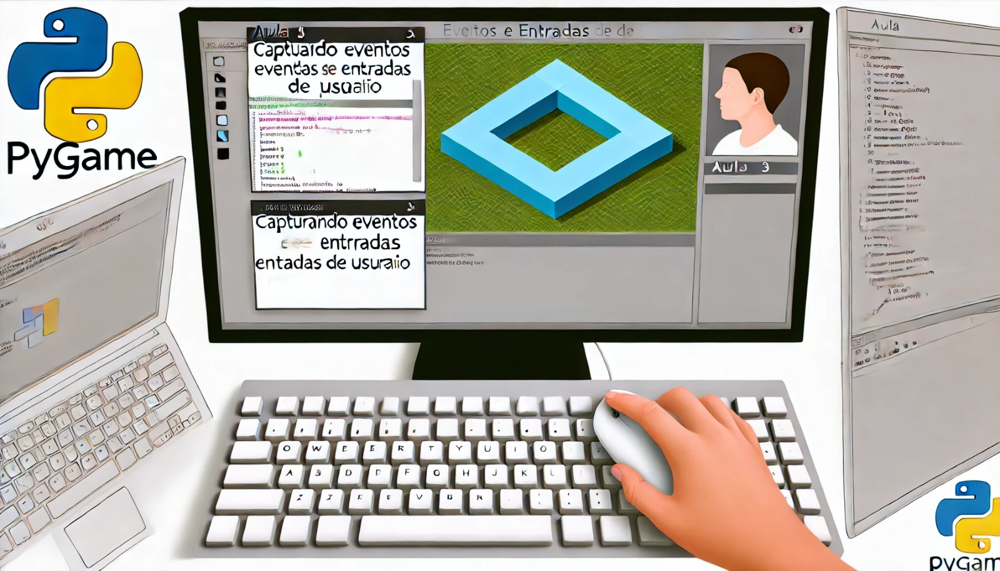

### Aula 3: Eventos e Entradas de Usuário

#### Objetivo da Aula:
Aprender a capturar e responder a eventos de teclado e mouse no Pygame, permitindo que o jogador interaja com o jogo.

### 1. O que são Eventos?

No contexto de jogos e programas interativos, um **evento** é algo que acontece enquanto o programa está rodando, como um clique do mouse, uma tecla pressionada ou o fechamento da janela. No Pygame, os eventos são usados para detectar essas ações e responder a elas. Por exemplo, mover um personagem quando uma tecla é pressionada ou fechar o jogo quando o usuário clica no botão de fechar a janela.

### 2. Capturando Eventos no Pygame

O Pygame nos permite capturar eventos usando a função `pygame.event.get()`, que retorna uma lista de todos os eventos que aconteceram desde a última vez que essa função foi chamada. Podemos então verificar o tipo de cada evento e responder de acordo.

### 3. Resposta a Eventos de Fechamento

Vamos começar com um exemplo simples: responder ao evento de fechamento da janela do jogo. Se o usuário clicar no botão de fechar a janela, queremos que o jogo seja encerrado corretamente.

```python
import pygame
import sys

# Inicializa o Pygame
pygame.init()

# Configurações da janela
screen = pygame.display.set_mode((800, 600))
pygame.display.set_caption("Eventos no Pygame")

# Loop principal
running = True
while running:
    for event in pygame.event.get():
        if event.type == pygame.QUIT:  # Evento de fechamento da janela
            running = False

    # Atualiza a tela
    pygame.display.flip()

# Encerra o Pygame
pygame.quit()
sys.exit()
```

- **Explicação:** No loop principal do jogo, usamos `pygame.event.get()` para obter a lista de eventos. Se o evento for `pygame.QUIT`, que acontece quando o usuário clica para fechar a janela, o loop é interrompido, encerrando o jogo.

### 4. Capturando Eventos de Teclado

Agora, vamos aprender a capturar eventos de teclado. Isso nos permitirá fazer coisas como mover um personagem na tela quando uma tecla é pressionada.

**Exemplo: Movendo um Quadrado com as Setas do Teclado**

Vamos criar um exemplo onde um quadrado se move na tela usando as setas do teclado.

```python
import pygame
import sys

# Inicializa o Pygame
pygame.init()

# Configurações da janela
screen = pygame.display.set_mode((800, 600))
pygame.display.set_caption("Movendo o Quadrado")

# Posição inicial do quadrado
x, y = 100, 100
velocidade = 5

# Loop principal
running = True
while running:
    for event in pygame.event.get():
        if event.type == pygame.QUIT:
            running = False

    # Captura as teclas pressionadas
    keys = pygame.key.get_pressed()

    # Movimenta o quadrado
    if keys[pygame.K_LEFT]:
        x -= velocidade
    if keys[pygame.K_RIGHT]:
        x += velocidade
    if keys[pygame.K_UP]:
        y -= velocidade
    if keys[pygame.K_DOWN]:
        y += velocidade

    # Preenche a tela com branco
    screen.fill((255, 255, 255))

    # Desenha o quadrado
    pygame.draw.rect(screen, (0, 0, 255), (x, y, 50, 50))

    # Atualiza a tela
    pygame.display.flip()

# Encerra o Pygame
pygame.quit()
sys.exit()
```

- **Explicação:** No exemplo acima, usamos `pygame.key.get_pressed()` para verificar quais teclas estão sendo pressionadas. Dependendo das teclas pressionadas (setas do teclado), a posição do quadrado é atualizada, movendo-o na tela.

### 5. Capturando Eventos de Mouse

Além do teclado, também podemos capturar eventos do mouse, como cliques e movimento.

**Exemplo: Mudando a Cor de um Quadrado ao Clicar**

Vamos modificar o exemplo anterior para que o quadrado mude de cor quando clicamos nele.

```python
import pygame
import sys

# Inicializa o Pygame
pygame.init()

# Configurações da janela
screen = pygame.display.set_mode((800, 600))
pygame.display.set_caption("Clique para Mudar de Cor")

# Posição e cor do quadrado
x, y = 100, 100
cor = (0, 0, 255)
largura, altura = 50, 50

# Loop principal
running = True
while running:
    for event in pygame.event.get():
        if event.type == pygame.QUIT:
            running = False
        if event.type == pygame.MOUSEBUTTONDOWN:  # Evento de clique do mouse
            mouse_x, mouse_y = event.pos
            if x <= mouse_x <= x + largura and y <= mouse_y <= y + altura:
                cor = (255, 0, 0)  # Muda a cor para vermelho

    # Preenche a tela com branco
    screen.fill((255, 255, 255))

    # Desenha o quadrado com a cor atual
    pygame.draw.rect(screen, cor, (x, y, largura, altura))

    # Atualiza a tela
    pygame.display.flip()

# Encerra o Pygame
pygame.quit()
sys.exit()
```

- **Explicação:** Quando o evento `pygame.MOUSEBUTTONDOWN` ocorre, ele verifica se o clique do mouse está dentro da área do quadrado. Se estiver, a cor do quadrado muda para vermelho.

### Conclusão

Nesta aula, você aprendeu como capturar e responder a eventos de teclado e mouse no Pygame. Esses conceitos são fundamentais para tornar seus jogos interativos e responsivos às ações do usuário. Na próxima aula, vamos continuar a construir sobre esses fundamentos, criando elementos mais dinâmicos e interativos no nosso jogo.