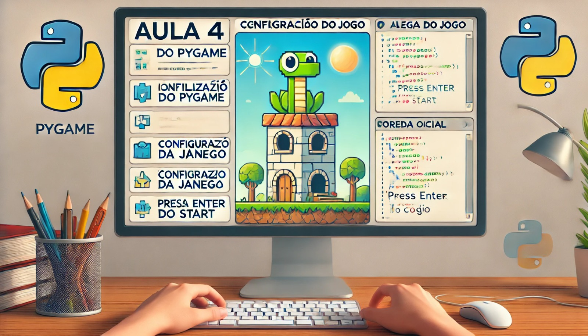

### Aula 4: Configuração do Jogo

#### Objetivo da Aula:
Aprender a estruturar e configurar um jogo no Pygame, incluindo a criação da tela inicial, definição de variáveis globais e organização do código.

### 1. Estrutura Básica de um Jogo no Pygame

Todo jogo no Pygame segue uma estrutura básica que inclui:
- **Inicialização do Pygame:** Configura o Pygame e prepara o ambiente.
- **Configuração da Janela:** Define as dimensões e o título da janela do jogo.
- **Loop Principal do Jogo:** Um loop que mantém o jogo rodando até que o jogador o encerre.
- **Eventos e Atualizações:** Dentro do loop principal, o jogo captura eventos, atualiza a lógica do jogo e desenha os gráficos na tela.

Vamos começar montando essa estrutura básica.

### 2. Criando a Tela Inicial do Jogo

A tela inicial é o primeiro contato do jogador com o jogo. Ela geralmente contém o título do jogo e instruções básicas, como “Pressione ENTER para começar”. Vamos configurar uma tela inicial simples.

**Exemplo de Código para a Tela Inicial:**

```python
import pygame
import sys

# Inicializa o Pygame
pygame.init()

# Configurações da janela
largura_tela, altura_tela = 800, 600
screen = pygame.display.set_mode((largura_tela, altura_tela))
pygame.display.set_caption("Meu Jogo de Nave")

# Cores
BRANCO = (255, 255, 255)
PRETO = (0, 0, 0)

# Fontes
fonte = pygame.font.SysFont(None, 74)

# Função para exibir a tela inicial
def tela_inicial():
    while True:
        screen.fill(PRETO)
        texto = fonte.render("Meu Jogo de Nave", True, BRANCO)
        screen.blit(texto, (150, 250))

        # Verifica os eventos
        for event in pygame.event.get():
            if event.type == pygame.QUIT:
                pygame.quit()
                sys.exit()
            if event.type == pygame.KEYDOWN:
                if event.key == pygame.K_RETURN:  # Pressione ENTER para começar
                    return

        # Atualiza a tela
        pygame.display.flip()

# Exibe a tela inicial
tela_inicial()

# Loop principal do jogo (vazio por enquanto)
running = True
while running:
    for event in pygame.event.get():
        if event.type == pygame.QUIT:
            running = False

    # Atualiza a tela
    pygame.display.flip()

# Encerra o Pygame
pygame.quit()
sys.exit()
```

- **Explicação:** Este código cria uma tela inicial simples com o título “Meu Jogo de Nave”. O jogo aguarda que o usuário pressione a tecla ENTER para começar. A função `tela_inicial()` exibe a tela inicial, enquanto o loop principal do jogo está vazio por enquanto, pois adicionaremos mais funcionalidades nas próximas aulas.

### 3. Definindo Variáveis Globais

No desenvolvimento de um jogo, é comum precisar de variáveis que armazenem informações importantes, como a pontuação, a posição do jogador, ou o status do jogo. Essas variáveis são chamadas de **variáveis globais** porque podem ser acessadas de qualquer lugar do código.

**Exemplo de Variáveis Globais:**

```python
# Variáveis globais
pontuacao = 0
posicao_jogador = (largura_tela // 2, altura_tela - 50)
jogo_rodando = True
```

Essas variáveis são definidas fora de qualquer função, de modo que possam ser utilizadas e atualizadas ao longo do jogo.

### 4. Organização do Código

À medida que o jogo se torna mais complexo, é importante manter o código organizado. Aqui estão algumas dicas para ajudar nisso:

1. **Use Funções:** Separe diferentes partes do jogo em funções. Por exemplo, você pode criar funções para desenhar o jogador, verificar colisões, ou atualizar a pontuação.

2. **Comentários:** Adicione comentários ao código para explicar o que cada parte faz. Isso facilita a manutenção e o entendimento do código, tanto para você quanto para outras pessoas que possam trabalhar nele.

3. **Módulos:** Se o jogo crescer muito, você pode dividir o código em múltiplos arquivos (módulos) e importá-los conforme necessário. Por exemplo, um arquivo pode conter a lógica do jogo e outro pode conter as funções de desenho.

### Exemplo de Organização:

```python
def desenha_jogador(screen, posicao):
    pygame.draw.rect(screen, BRANCO, (*posicao, 50, 50))

def atualiza_pontuacao(pontuacao):
    texto = fonte.render(f"Pontuação: {pontuacao}", True, BRANCO)
    screen.blit(texto, (10, 10))
```

- **Explicação:** Aqui, `desenha_jogador()` é uma função que desenha o jogador na tela, e `atualiza_pontuacao()` é uma função que exibe a pontuação do jogador na tela.

### Conclusão

Nesta aula, aprendemos a criar a estrutura básica de um jogo no Pygame, incluindo a criação de uma tela inicial, definição de variáveis globais e algumas dicas para manter o código organizado. Com essa base, estamos prontos para adicionar mais funcionalidades ao jogo, como a movimentação da nave e o sistema de pontuação, que exploraremos nas próximas aulas.