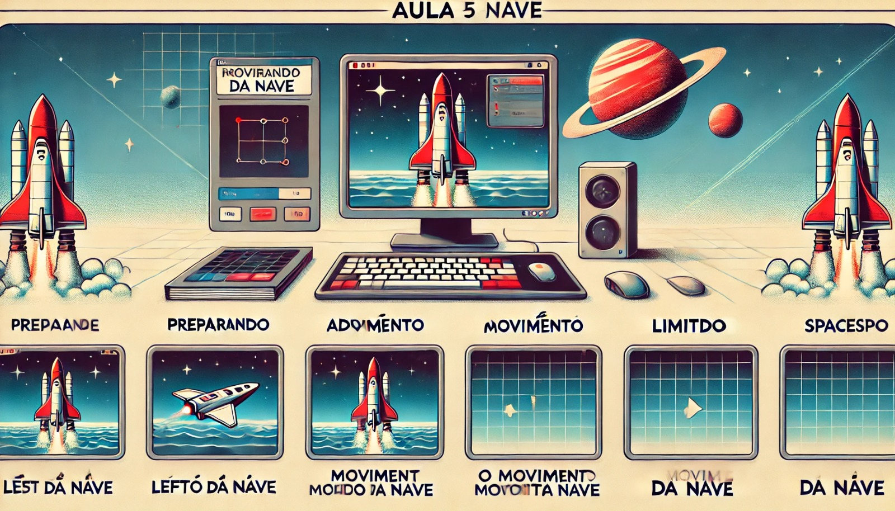

### Aula 5: Movimentação da Nave

#### Objetivo da Aula:
Aprender a criar a movimentação da nave no jogo usando o teclado, permitindo que o jogador controle a nave de forma suave e responsiva.

### 1. Preparando a Nave

Antes de começarmos a mover a nave, precisamos garantir que ela esteja desenhada na tela. Vamos usar uma imagem simples para representar a nave.

**Passo 1: Carregar a Imagem da Nave**
Primeiro, precisamos carregar a imagem da nave no Pygame, assim como fizemos nas aulas anteriores.

```python
import pygame
import sys

# Inicializa o Pygame
pygame.init()

# Configurações da janela
largura_tela, altura_tela = 800, 600
screen = pygame.display.set_mode((largura_tela, altura_tela))
pygame.display.set_caption("Movimentação da Nave")

# Carrega a imagem da nave
nave = pygame.image.load('nave.png')

# Posição inicial da nave
x, y = largura_tela // 2, altura_tela - 100
velocidade = 5

# Loop principal
running = True
while running:
    for event in pygame.event.get():
        if event.type == pygame.QUIT:
            running = False

    # Preenche o fundo com preto
    screen.fill((0, 0, 0))

    # Desenha a nave na tela
    screen.blit(nave, (x, y))

    # Atualiza a tela
    pygame.display.flip()

# Encerra o Pygame
pygame.quit()
sys.exit()
```

- **Explicação:** Este código carrega a imagem da nave e a desenha na posição inicial na parte inferior da tela. Ainda não há movimentação, mas agora temos a nave pronta para ser controlada.

### 2. Adicionando Movimento à Nave

Agora que a nave está na tela, vamos permitir que o jogador a mova para a esquerda e para a direita usando as teclas de seta.

**Passo 2: Detectar Teclas Pressionadas**

Podemos usar `pygame.key.get_pressed()` para detectar quais teclas estão sendo pressionadas e mover a nave de acordo.

```python
while running:
    for event in pygame.event.get():
        if event.type == pygame.QUIT:
            running = False

    # Detecta as teclas pressionadas
    keys = pygame.key.get_pressed()

    # Move a nave para a esquerda ou direita
    if keys[pygame.K_LEFT]:
        x -= velocidade
    if keys[pygame.K_RIGHT]:
        x += velocidade

    # Preenche o fundo com preto
    screen.fill((0, 0, 0))

    # Desenha a nave na nova posição
    screen.blit(nave, (x, y))

    # Atualiza a tela
    pygame.display.flip()
```

- **Explicação:** O código agora verifica se as teclas de seta esquerda ou direita estão sendo pressionadas. Se a seta esquerda é pressionada, a nave se move para a esquerda, diminuindo o valor de `x`. Se a seta direita é pressionada, a nave se move para a direita, aumentando o valor de `x`.

### 3. Limitando o Movimento da Nave

Para garantir que a nave não saia da tela, podemos adicionar limites ao movimento. Isso significa que a nave só poderá se mover dentro dos limites da janela do jogo.

```python
# Move a nave para a esquerda ou direita, limitando os movimentos
if keys[pygame.K_LEFT] and x > 0:
    x -= velocidade
if keys[pygame.K_RIGHT] and x < largura_tela - nave.get_width():
    x += velocidade
```

- **Explicação:** Aqui, verificamos se `x > 0` antes de mover a nave para a esquerda, garantindo que ela não saia pela esquerda da tela. Da mesma forma, verificamos se `x < largura_tela - nave.get_width()` antes de mover a nave para a direita, garantindo que ela não saia pela direita.

### 4. Melhorando a Experiência de Movimento

Podemos melhorar a experiência de movimento adicionando aceleração, desaceleração ou outros efeitos, mas para manter as coisas simples, vamos focar em garantir que o movimento seja suave e responda imediatamente às entradas do jogador.

### Exemplo Completo

Aqui está o código completo para a movimentação básica da nave:

```python
import pygame
import sys

# Inicializa o Pygame
pygame.init()

# Configurações da janela
largura_tela, altura_tela = 800, 600
screen = pygame.display.set_mode((largura_tela, altura_tela))
pygame.display.set_caption("Movimentação da Nave")

# Carrega a imagem da nave
nave = pygame.image.load('nave.png')

# Posição inicial da nave
x, y = largura_tela // 2, altura_tela - 100
velocidade = 5

# Loop principal
running = True
while running:
    for event in pygame.event.get():
        if event.type == pygame.QUIT:
            running = False

    # Detecta as teclas pressionadas
    keys = pygame.key.get_pressed()

    # Move a nave para a esquerda ou direita, limitando os movimentos
    if keys[pygame.K_LEFT] and x > 0:
        x -= velocidade
    if keys[pygame.K_RIGHT] and x < largura_tela - nave.get_width():
        x += velocidade

    # Preenche o fundo com preto
    screen.fill((0, 0, 0))

    # Desenha a nave na nova posição
    screen.blit(nave, (x, y))

    # Atualiza a tela
    pygame.display.flip()

# Encerra o Pygame
pygame.quit()
sys.exit()
```

### Conclusão

Nesta aula, você aprendeu como permitir que o jogador mova a nave no jogo usando as teclas de seta. Este é um passo fundamental para tornar o jogo interativo e divertido. Na próxima aula, vamos explorar como adicionar disparos de projéteis, permitindo que a nave atire nos inimigos!