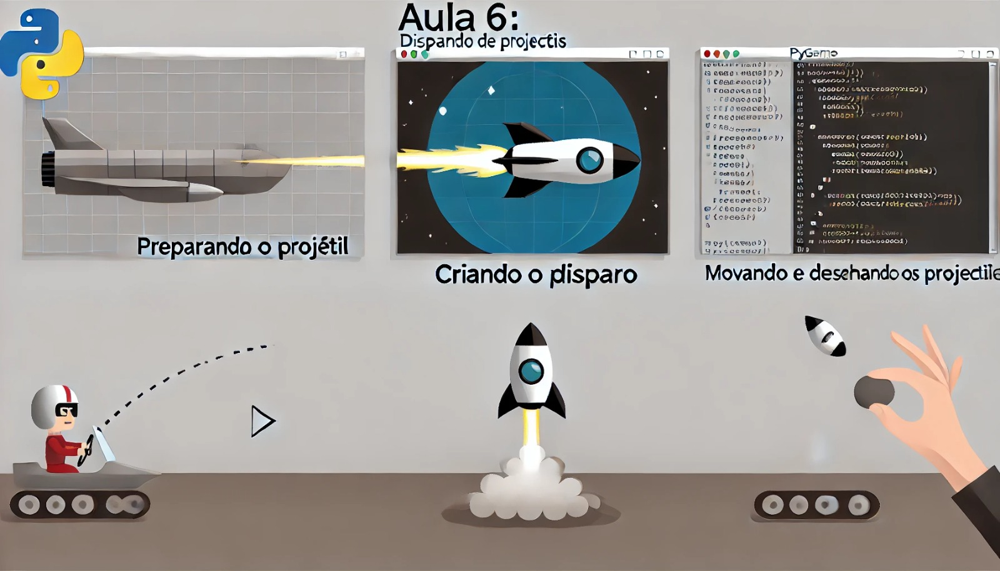

### Aula 6: Disparo de Projetéis

#### Objetivo da Aula:
Aprender a implementar o disparo de projéteis no jogo, permitindo que a nave atire contra inimigos ou obstáculos.

### 1. Preparando o Projétil

Para começar, precisamos de uma imagem para representar o projétil que a nave irá disparar. Assim como fizemos com a nave, vamos carregar a imagem do projétil e definir a posição inicial.

**Passo 1: Carregar a Imagem do Projétil**
Carregue a imagem do projétil no Pygame.

```python
# Carrega a imagem do projétil
projetil = pygame.image.load('projetil.png')
```

- **Explicação:** Este código carrega a imagem do projétil que será usada para os tiros da nave.

### 2. Criando o Disparo

Agora que temos a imagem do projétil, precisamos criar uma maneira de disparar o projétil quando o jogador pressionar uma tecla, como a barra de espaço.

**Passo 2: Detectar a Tecla de Disparo**

Vamos usar a tecla **espaço** (`pygame.K_SPACE`) para disparar o projétil.

```python
# Lista para armazenar os projéteis
projeteis = []

while running:
    for event in pygame.event.get():
        if event.type == pygame.QUIT:
            running = False
        if event.type == pygame.KEYDOWN:
            if event.key == pygame.K_SPACE:
                projeteis.append([x + nave.get_width() // 2, y])
```

- **Explicação:** Quando a barra de espaço é pressionada, criamos um novo projétil na posição atual da nave e o adicionamos à lista `projeteis`. Cada projétil é representado por uma lista com suas coordenadas `[x, y]`.

### 3. Movendo os Projetéis

Após disparar, o projétil precisa se mover para cima na tela. Vamos atualizar a posição de cada projétil dentro do loop principal do jogo.

**Passo 3: Atualizar a Posição dos Projetéis**

```python
# Atualiza a posição dos projéteis e remove os que saem da tela
for p in projeteis:
    p[1] -= 10  # Move o projétil para cima
    if p[1] < 0:
        projeteis.remove(p)
```

- **Explicação:** Para cada projétil na lista `projeteis`, subtraímos 10 da coordenada `y` para movê-lo para cima. Se o projétil sair da tela (quando `y < 0`), ele é removido da lista.

### 4. Desenhando os Projetéis

Agora que os projéteis estão sendo disparados e se movendo, precisamos desenhá-los na tela para que o jogador possa vê-los.

**Passo 4: Desenhar os Projetéis na Tela**

```python
# Desenha cada projétil na tela
for p in projeteis:
    screen.blit(projetil, p)
```

- **Explicação:** Para cada projétil na lista, desenhamos a imagem do projétil na sua posição atual.

### Exemplo Completo

Aqui está o código completo que adiciona o disparo de projéteis ao jogo:

```python
import pygame
import sys

# Inicializa o Pygame
pygame.init()

# Configurações da janela
largura_tela, altura_tela = 800, 600
screen = pygame.display.set_mode((largura_tela, altura_tela))
pygame.display.set_caption("Disparo de Projetéis")

# Carrega a imagem da nave e do projétil
nave = pygame.image.load('nave.png')
projetil = pygame.image.load('projetil.png')

# Posição inicial da nave
x, y = largura_tela // 2, altura_tela - 100
velocidade = 5

# Lista para armazenar os projéteis
projeteis = []

# Loop principal
running = True
while running:
    for event in pygame.event.get():
        if event.type == pygame.QUIT:
            running = False
        if event.type == pygame.KEYDOWN:
            if event.key == pygame.K_SPACE:
                projeteis.append([x + nave.get_width() // 2, y])

    # Detecta as teclas pressionadas
    keys = pygame.key.get_pressed()

    # Move a nave para a esquerda ou direita, limitando os movimentos
    if keys[pygame.K_LEFT] and x > 0:
        x -= velocidade
    if keys[pygame.K_RIGHT] and x < largura_tela - nave.get_width():
        x += velocidade

    # Preenche o fundo com preto
    screen.fill((0, 0, 0))

    # Atualiza a posição dos projéteis e remove os que saem da tela
    for p in projeteis:
        p[1] -= 10  # Move o projétil para cima
        if p[1] < 0:
            projeteis.remove(p)

    # Desenha a nave na nova posição
    screen.blit(nave, (x, y))

    # Desenha cada projétil na tela
    for p in projeteis:
        screen.blit(projetil, p)

    # Atualiza a tela
    pygame.display.flip()

# Encerra o Pygame
pygame.quit()
sys.exit()
```

### Conclusão

Nesta aula, você aprendeu a implementar o disparo de projéteis no seu jogo. Agora, a nave pode atirar em inimigos ou obstáculos, adicionando mais ação ao jogo. Na próxima aula, vamos aprender a criar e movimentar os inimigos, para que a nave tenha algo para atirar!