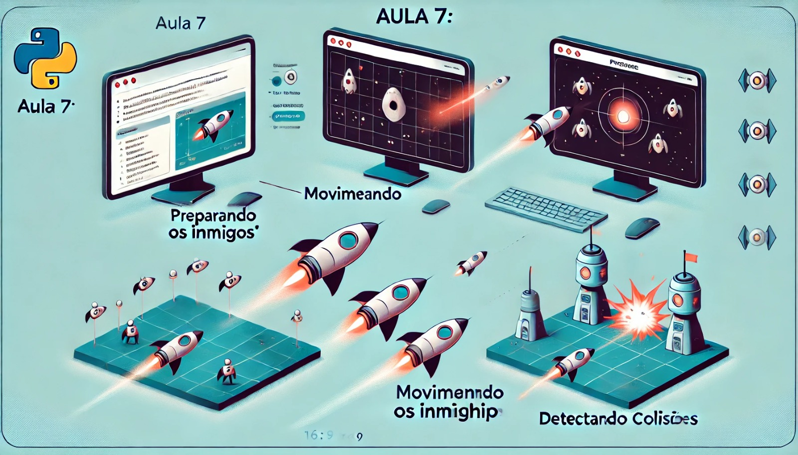

### Aula 7: Inimigos

#### Objetivo da Aula:
Aprender a criar e movimentar inimigos no jogo, tornando-o mais desafiador e divertido.

### 1. Preparando os Inimigos

Assim como fizemos com a nave do jogador, vamos começar carregando uma imagem para representar os inimigos.

**Passo 1: Carregar a Imagem do Inimigo**
Vamos carregar a imagem do inimigo no Pygame.

```python
# Carrega a imagem do inimigo
inimigo = pygame.image.load('inimigo.png')
```

- **Explicação:** Este código carrega a imagem do inimigo que será usada para representá-lo no jogo.

### 2. Criando Múltiplos Inimigos

Em vez de ter apenas um inimigo na tela, vamos criar vários inimigos. Podemos fazer isso usando uma lista que armazenará as posições de cada inimigo.

**Passo 2: Definir Posições Iniciais dos Inimigos**

Vamos definir posições iniciais aleatórias para os inimigos na parte superior da tela.

```python
import random

# Lista para armazenar os inimigos
inimigos = []

# Cria 5 inimigos em posições aleatórias
for i in range(5):
    x_inimigo = random.randint(0, largura_tela - inimigo.get_width())
    y_inimigo = random.randint(-100, -40)
    inimigos.append([x_inimigo, y_inimigo])
```

- **Explicação:** Aqui, criamos 5 inimigos e os posicionamos aleatoriamente na parte superior da tela. A função `random.randint()` é usada para gerar posições aleatórias.

### 3. Movimentando os Inimigos

Agora que os inimigos estão na tela, precisamos movê-los para baixo, em direção à nave do jogador.

**Passo 3: Atualizar a Posição dos Inimigos**

Vamos fazer os inimigos se moverem para baixo na tela.

```python
# Velocidade dos inimigos
velocidade_inimigos = 1

while running:
    for event in pygame.event.get():
        if event.type == pygame.QUIT:
            running = False

    # Preenche o fundo com preto
    screen.fill((0, 0, 0))

    # Movimenta os inimigos
    for inimigo_pos in inimigos:
        inimigo_pos[1] += velocidade_inimigos  # Move o inimigo para baixo

        # Se o inimigo sair da tela, reposiciona-o no topo
        if inimigo_pos[1] > altura_tela:
            inimigo_pos[0] = random.randint(0, largura_tela - inimigo.get_width())
            inimigo_pos[1] = random.randint(-100, -40)

        # Desenha o inimigo na tela
        screen.blit(inimigo, inimigo_pos)

    # Atualiza a tela
    pygame.display.flip()
```

- **Explicação:** O código move cada inimigo para baixo, e se um inimigo sair da tela (quando `y_inimigo > altura_tela`), ele é reposicionado no topo, em uma nova posição horizontal aleatória.

### 4. Detectando Colisões

Um jogo de nave geralmente envolve evitar colisões com inimigos ou destruí-los. Vamos adicionar detecção de colisão simples entre a nave do jogador e os inimigos.

**Passo 4: Verificar Colisões**

Vamos verificar se a nave do jogador colide com algum inimigo.

```python
# Função para verificar colisão
def colisao(x1, y1, largura1, altura1, x2, y2, largura2, altura2):
    if (x1 < x2 + largura2 and
        x1 + largura1 > x2 and
        y1 < y2 + altura2 and
        y1 + altura1 > y2):
        return True
    return False

# No loop principal, verificamos colisões
for inimigo_pos in inimigos:
    if colisao(x, y, nave.get_width(), nave.get_height(), inimigo_pos[0], inimigo_pos[1], inimigo.get_width(), inimigo.get_height()):
        running = False  # Se houver colisão, encerra o jogo

    screen.blit(inimigo, inimigo_pos)
```

- **Explicação:** A função `colisao()` verifica se dois retângulos (nave e inimigo) estão se sobrepondo. Se uma colisão for detectada, o jogo termina.

### Exemplo Completo

Aqui está o código completo que adiciona inimigos ao jogo:

```python
import pygame
import sys
import random

# Inicializa o Pygame
pygame.init()

# Configurações da janela
largura_tela, altura_tela = 800, 600
screen = pygame.display.set_mode((largura_tela, altura_tela))
pygame.display.set_caption("Inimigos")

# Carrega a imagem da nave e do inimigo
nave = pygame.image.load('nave.png')
inimigo = pygame.image.load('inimigo.png')

# Posição inicial da nave
x, y = largura_tela // 2, altura_tela - 100
velocidade = 1

# Lista para armazenar os inimigos
inimigos = []

# Cria 5 inimigos em posições aleatórias
for i in range(5):
    x_inimigo = random.randint(0, largura_tela - inimigo.get_width())
    y_inimigo = random.randint(-100, -40)
    inimigos.append([x_inimigo, y_inimigo])

# Velocidade dos inimigos
velocidade_inimigos = 1

# Função para verificar colisão
def colisao(x1, y1, largura1, altura1, x2, y2, largura2, altura2):
    if (x1 < x2 + largura2 and
        x1 + largura1 > x2 and
        y1 < y2 + altura2 and
        y1 + altura1 > y2):
        return True
    return False

# Loop principal
running = True
while running:
    for event in pygame.event.get():
        if event.type == pygame.QUIT:
            running = False

    # Detecta as teclas pressionadas
    keys = pygame.key.get_pressed()

    # Move a nave para a esquerda ou direita, limitando os movimentos
    if keys[pygame.K_LEFT] and x > 0:
        x -= velocidade
    if keys[pygame.K_RIGHT] and x < largura_tela - nave.get_width():
        x += velocidade

    # Preenche o fundo com preto
    screen.fill((0, 0, 0))

    # Movimenta e desenha os inimigos
    for inimigo_pos in inimigos:
        inimigo_pos[1] += velocidade_inimigos  # Move o inimigo para baixo

        # Se o inimigo sair da tela, reposiciona-o no topo
        if inimigo_pos[1] > altura_tela:
            inimigo_pos[0] = random.randint(0, largura_tela - inimigo.get_width())
            inimigo_pos[1] = random.randint(-100, -40)

        # Verifica colisão com a nave
        if colisao(x, y, nave.get_width(), nave.get_height(), inimigo_pos[0], inimigo_pos[1], inimigo.get_width(), inimigo.get_height()):
            running = False  # Se houver colisão, encerra o jogo

        # Desenha o inimigo na tela
        screen.blit(inimigo, inimigo_pos)

    # Desenha a nave na nova posição
    screen.blit(nave, (x, y))

    # Atualiza a tela
    pygame.display.flip()

# Encerra o Pygame
pygame.quit()
sys.exit()
```

### Conclusão

Nesta aula, você aprendeu a criar inimigos no jogo, fazer com que eles se movam e detectar colisões entre eles e a nave do jogador. Isso torna o jogo mais desafiador e envolvente. Na próxima aula, vamos adicionar pontuação ao jogo, permitindo que o jogador acumule pontos ao derrotar inimigos!