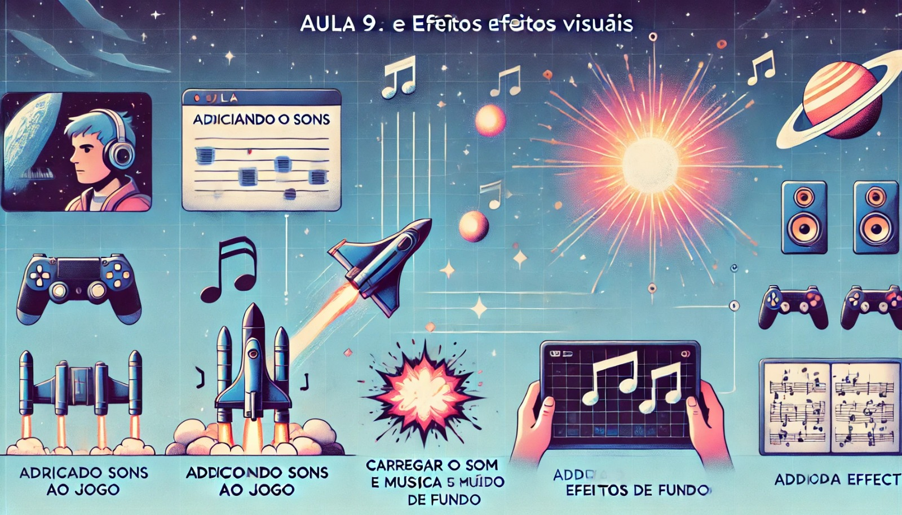

### Aula 9: Sons e Efeitos Visuais

#### Objetivo da Aula:
Aprender a adicionar sons e efeitos visuais ao jogo, tornando-o mais imersivo e divertido.

### 1. Adicionando Sons ao Jogo

Os sons são uma parte importante de qualquer jogo, pois melhoram a experiência do jogador. No Pygame, podemos adicionar sons como explosões, disparos ou música de fundo.

**Passo 1: Carregar um Som**
Para começar, precisamos carregar o arquivo de som que será usado no jogo.

```python
# Inicializa o mixer de som do Pygame
pygame.mixer.init()

# Carrega o som do disparo
som_disparo = pygame.mixer.Sound('disparo.wav')
```

- **Explicação:** A função `pygame.mixer.Sound()` é usada para carregar o arquivo de som. Neste caso, estamos carregando um som de disparo, que será reproduzido sempre que a nave atirar.

**Passo 2: Reproduzir o Som**
Agora que o som está carregado, podemos reproduzi-lo sempre que o jogador pressionar a tecla de disparo.

```python
if event.type == pygame.KEYDOWN:
    if event.key == pygame.K_SPACE:
        projeteis.append([x + nave.get_width() // 2, y])
        som_disparo.play()  # Reproduz o som de disparo
```

- **Explicação:** O som é reproduzido sempre que o jogador pressiona a barra de espaço para disparar um projétil. A função `play()` é usada para tocar o som.

**Passo 3: Música de Fundo**
Além dos efeitos sonoros, também podemos adicionar música de fundo que toca continuamente durante o jogo.

```python
# Carrega e toca a música de fundo
pygame.mixer.music.load('musica_fundo.mp3')
pygame.mixer.music.play(-1)  # O -1 faz a música tocar em loop
```

- **Explicação:** A função `pygame.mixer.music.load()` carrega a música de fundo, e a função `play()` com o parâmetro `-1` faz a música tocar repetidamente.

### 2. Adicionando Efeitos Visuais

Efeitos visuais, como explosões e animações, tornam o jogo mais interessante visualmente. Vamos adicionar uma explosão quando o projétil atingir um inimigo.

**Passo 1: Carregar a Imagem da Explosão**
Primeiro, precisamos de uma imagem ou uma sequência de imagens para representar a explosão.

```python
# Carrega a imagem da explosão
explosao = pygame.image.load('explosao.png')
```

- **Explicação:** Aqui estamos carregando uma imagem simples de explosão, que será desenhada na tela quando um inimigo for destruído.

**Passo 2: Desenhar a Explosão**
Vamos desenhar a explosão na posição do inimigo destruído.

```python
# Desenha a explosão na tela
screen.blit(explosao, (inimigo_pos[0], inimigo_pos[1]))
```

- **Explicação:** Quando um inimigo é atingido por um projétil, a imagem da explosão é desenhada na posição do inimigo.

**Passo 3: Remover a Explosão Após um Tempo**
Para que a explosão não fique permanentemente na tela, podemos exibi-la apenas por um curto período de tempo.

```python
# Tempo de exibição da explosão
tempo_explosao = 30  # 30 quadros

# Se o projétil atingir um inimigo
if colisao(p[0], p[1], projetil.get_width(), projetil.get_height(), inimigo_pos[0], inimigo_pos[1], inimigo.get_width(), inimigo.get_height()):
    projeteis.remove(p)
    inimigos.remove(inimigo_pos)
    pontuacao += 10
    screen.blit(explosao, (inimigo_pos[0], inimigo_pos[1]))
    tempo_explosao -= 1
    if tempo_explosao <= 0:
        explosao = None  # Remove a explosão
```

- **Explicação:** O código desenha a explosão por um tempo limitado (30 quadros), após o qual a explosão é removida.

### 3. Onde Encontrar Sons Gratuitos

Aqui estão alguns sites onde você pode baixar arquivos de sons gratuitos para adicionar ao seu jogo:

1. **Freesound** – [freesound.org](https://freesound.org/)
   - Um dos maiores sites de sons gratuitos, com uma ampla variedade de efeitos sonoros. A maioria dos sons está disponível sob licenças Creative Commons.
   
2. **Zapsplat** – [zapsplat.com](https://www.zapsplat.com/)
   - Oferece uma vasta coleção de efeitos sonoros gratuitos, incluindo disparos, explosões e música ambiente. O site também tem uma versão paga para acessar sons de maior qualidade.

3. **FreeSoundEffects** – [freesoundeffects.com](https://www.freesoundeffects.com/)
   - Um site com uma grande variedade de efeitos sonoros, como tiros, explosões e efeitos futuristas. Muitos sons são gratuitos para uso em jogos.

4. **SoundBible** – [soundbible.com](http://soundbible.com/)
   - Oferece milhares de efeitos sonoros gratuitos em diferentes categorias, como armas, passos e veículos. Arquivos disponíveis em formatos WAV e MP3.

5. **Orange Free Sounds** – [orangefreesounds.com](https://orangefreesounds.com/)
   - Disponibiliza sons gratuitos, incluindo música de fundo e efeitos sonoros para jogos, como explosões e sons de laser.

### Exemplo Completo

Aqui está o código completo que inclui sons e efeitos visuais no jogo:

```python
import pygame
import sys
import random

# Inicializa o Pygame
pygame.init()

# Inicializa o mixer de som
pygame.mixer.init()

# Configurações da janela
largura_tela, altura_tela = 800, 600
screen = pygame.display.set_mode((largura_tela, altura_tela))
pygame.display.set_caption("Sons e Efeitos Visuais")

# Carrega a imagem da nave, do inimigo, do projétil e da explosão
nave = pygame.image.load('nave.png')
inimigo = pygame.image.load('inimigo.png')
projetil = pygame.image.load('projetil.png')
explosao = pygame.image.load('explosao.png')

# Carrega o som do disparo e a música de fundo
som_disparo = pygame.mixer.Sound('disparo.wav')
pygame.mixer.music.load('musica_fundo.mp3')
pygame.mixer.music.play(-1)  # Música em loop

# Posição inicial da nave
x, y = largura_tela // 2, altura_tela - 100
velocidade = 5

# Lista para armazenar os inimigos e projéteis
inimigos = []
projeteis = []

# Cria 5 inimigos em posições aleatórias
for i in range(5):
    x_inimigo = random.randint(0, largura_tela - inimigo.get_width())
    y_inimigo = random.randint(-100, -40)
    inimigos.append([x_inimigo, y_inimigo])

# Velocidade dos inimigos
velocidade_inimigos = 5

# Loop principal
running = True
while running:
    for event in pygame.event.get():
        if event.type == pygame.QUIT:
            running = False
        if event.type == pygame.KEYDOWN:
            if event.key == pygame.K_SPACE:
                projeteis.append([x + nave.get_width() // 2, y])
                som_disparo.play()  # Reproduz o som de disparo

    # Detecta as teclas pressionadas
    keys = pygame.key.get_pressed()

    # Move a nave para a esquerda ou direita, limitando os movimentos
    if keys[pygame.K_LEFT] and x > 0:
        x -= velocidade
    if keys[pygame.K_RIGHT] and x < largura_tela - nave.get_width():
        x += velocidade

    # Preenche o fundo com preto
    screen.fill((0, 0, 0))

    # Atualiza a posição dos projéteis e remove os que saem da tela
    for p in projeteis:
        p[1] -= 10  # Move o projétil para cima
        if p[1] < 0:
            projeteis.remove(p)

    # Movimenta e desenha os inimigos
    for inimigo_pos in inimigos:
        inimigo_pos[1] += velocidade_inimigos  # Move o inimigo para baixo

        # Se o inimigo sair da tela, reposiciona-o no topo
        if inimigo_pos[1] > altura_tela:
            inimigo_pos[0] = random.randint(0, largura_tela - inimigo.get_width())
            inimigo_pos[1] = random.randint(-100, -40)

        # Verifica colisões entre projéteis e inimigos
        for p in projeteis:
            if colisao(p[0], p[1], projetil.get_width(), projetil.get_height(), inimigo_pos[0], inimigo_pos[1], inimigo.get_width(), inimigo.get_height()):
                projeteis.remove(p)
                inimigos.remove(inimigo_pos)
                pont

uacao += 10
                # Desenha a explosão
                screen.blit(explosao, (inimigo_pos[0], inimigo_pos[1]))

        # Desenha o inimigo na tela
        screen.blit(inimigo, inimigo_pos)

    # Desenha a nave na nova posição
    screen.blit(nave, (x, y))

    # Desenha cada projétil na tela
    for p in projeteis:
        screen.blit(projetil, p)

    # Atualiza a tela
    pygame.display.flip()

# Encerra o Pygame
pygame.quit()
sys.exit()
```

### Conclusão

Nesta aula, você aprendeu a adicionar sons e efeitos visuais ao jogo, tornando-o mais dinâmico e divertido. Com música de fundo, efeitos sonoros e visuais como explosões, o jogo se torna muito mais imersivo. Na próxima aula, vamos refinar o jogo, adicionando telas de início e fim, e polir a experiência do jogador!