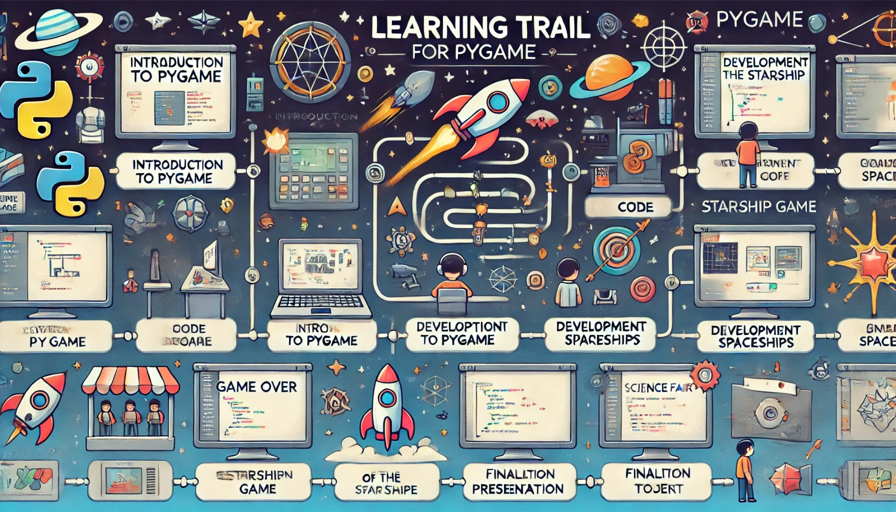

### Trilhas de Aprendizado em Pygame: Desenvolvendo um Jogo de Nave Estelar

**Objetivo da Trilha:**
Guiar os alunos na criação de um jogo de nave estelar utilizando Pygame, culminando em um projeto prático que será apresentado em uma feira de ciências.

### Estrutura da Trilha

#### Módulo 1: Introdução ao Pygame
1. **Aula 1: O que é Pygame?**
   - Introdução ao Pygame e seus usos.
   - Instalação e configuração do ambiente.
   - Criação da primeira janela com Pygame.

2. **Aula 2: Manipulação de Imagens e Desenho**
   - Carregamento e exibição de imagens.
   - Desenho de formas básicas (retângulos, círculos, linhas).

3. **Aula 3: Eventos e Entradas de Usuário**
   - Manipulação de eventos de teclado e mouse.
   - Implementação de movimentação básica de um objeto na tela.

#### Módulo 2: Desenvolvimento do Jogo de Nave Estelar
1. **Aula 4: Configuração do Jogo**
   - Criação da tela inicial e loop do jogo.
   - Estruturação do projeto e organização dos arquivos.

2. **Aula 5: Movimentação da Nave**
   - Implementação do controle da nave pelo jogador.
   - Introdução ao conceito de sprites.

3. **Aula 6: Disparo de Projetéis**
   - Implementação de disparos da nave.
   - Gerenciamento de múltiplos projetéis na tela.

4. **Aula 7: Inimigos**
   - Criação de inimigos básicos.
   - Movimentação e comportamento dos inimigos.

5. **Aula 8: Colisões e Pontuação**
   - Detecção de colisões entre nave, projetéis e inimigos.
   - Implementação do sistema de pontuação.

6. **Aula 9: Sons e Efeitos Visuais**
   - Adição de efeitos sonoros e música de fundo.
   - Implementação de explosões e outros efeitos visuais.

#### Módulo 3: Finalização e Apresentação
1. **Aula 10: Tela de Game Over e Reinício**
   - Implementação de tela de Game Over.
   - Função de reiniciar o jogo após o término.

2. **Aula 11: Polimento e Testes**
   - Revisão e polimento do código.
   - Testes finais e correção de bugs.

3. **Aula 12: Preparação para a Feira de Ciências**
   - Preparação do jogo para apresentação.
   - Dicas de apresentação e criação de material de apoio (slides, pôsteres, etc).

### Projeto Final: Jogo de Nave Estelar

**Título:** 
Galaxy Defender

**Descrição:**
No jogo "Galaxy Defender", os jogadores controlam uma nave estelar que deve defender a galáxia contra hordas de inimigos espaciais. O jogador deve mover a nave, disparar contra os inimigos e desviar de obstáculos. O objetivo é sobreviver o maior tempo possível e alcançar a maior pontuação.

**Características:**
- Movimentação fluida da nave utilizando as teclas de seta.
- Disparo de projetéis com a barra de espaço.
- Inimigos com diferentes padrões de movimento.
- Sistema de pontuação baseado no tempo de sobrevivência e número de inimigos destruídos.
- Sons de tiro, explosões e música de fundo.

### Plano de Aula Básico para Cada Módulo

**Título da Aula:** [Título da Aula]

**Objetivo da Aula:** 
- [Objetivo claro da aula]

**Conteúdo Programático:** 
- Introdução ao tópico
- Conceitos principais
- Exemplos práticos
- Exercícios práticos

**Metodologia:** 
- Exposição teórica com conteúdo impresso
- Demonstração prática ao vivo
- Sessão de perguntas e respostas
- Exercícios práticos

**Materiais Necessários:** 
- Computador com Pygame instalado
- Projetor
- Acesso à internet

**Estrutura da Aula:** 
1. Introdução (10 minutos)
2. Exposição Teórica (20 minutos)
3. Demonstração Prática (10 minutos)
4. Exercícios Práticos (20 minutos)
5. Discussão e Encerramento (10 minutos)

**Avaliação:** 
- Observação durante exercícios
- Participação nas discussões
- Entendimento nas perguntas e respostas

**Recursos Adicionais:** 
- Links para leituras complementares
- Tutoriais e documentação online

### Recursos Adicionais
- [Documentação Oficial do Pygame](https://www.pygame.org/docs/)
- [Tutoriais em Vídeo no YouTube](https://www.youtube.com/results?search_query=pygame+tutorial)
- [Comunidade Pygame no Reddit](https://www.reddit.com/r/pygame/)